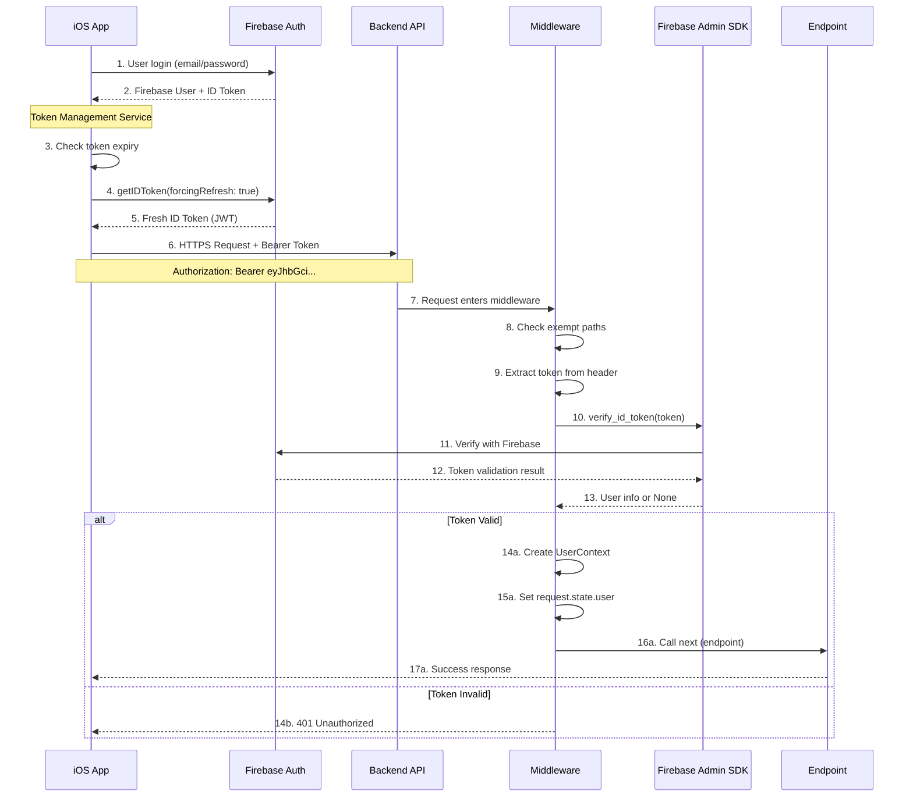
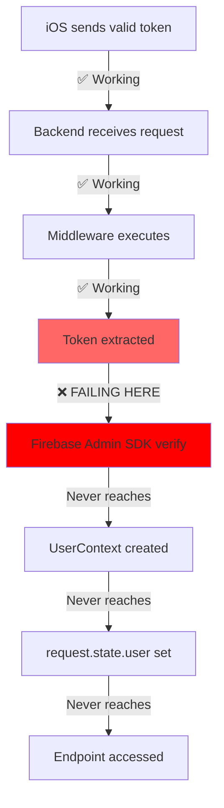
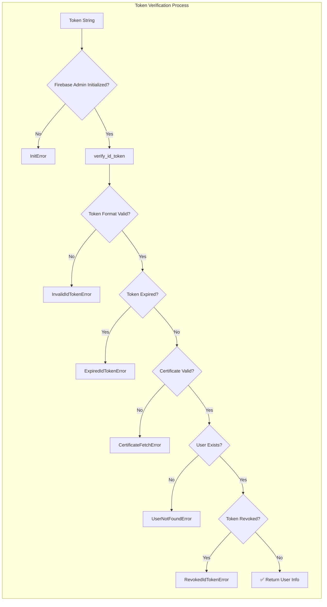
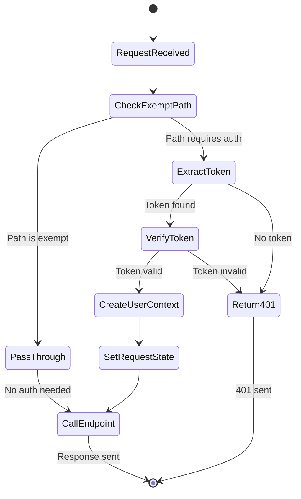
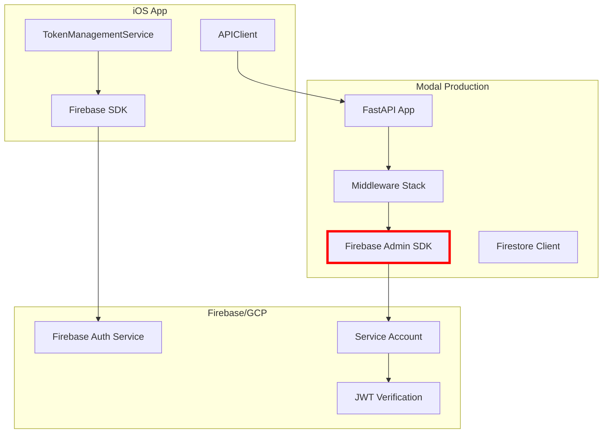
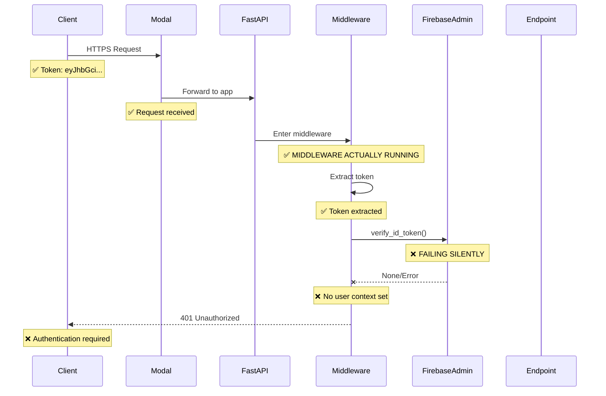

# Complete Authentication Data Flow Analysis

> **Purpose**: Establish the "social truth" between frontend and backend agents about authentication flows, failure points, and data transformations.

## 1. Complete iOS to Backend Authentication Flow

## 2. Current Breaking Point

## 3. Firebase Token Verification Deep Dive

## 4. Middleware State Management

## 5. Current System Configuration

## 6. Request Lifecycle with Logging

## Problem Analysis

Based on these flows, the issue is at **Step 10-13** in the first diagram. The Firebase Admin SDK is:

1. **Failing to verify valid tokens**
2. **Not logging the actual error**
3. **Returning None instead of user info**

### Root Causes Could Be:

1. **Service Account Issue**: The Firebase service account JSON in Modal might be invalid or for wrong project
2. **Firebase Admin Not Initialized**: The SDK might not be properly initialized
3. **Certificate Fetch Error**: Can't download Google's public keys to verify JWT
4. **Project ID Mismatch**: Backend using different Firebase project than iOS

### The Smoking Gun:

The Modal logs show the middleware runs but `request.state.user` is never set, which means `verify_id_token()` is returning None/failing.