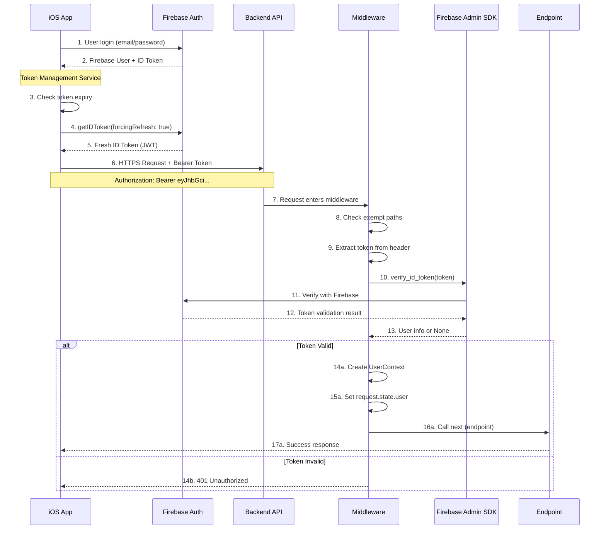
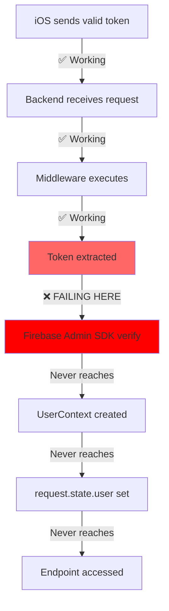
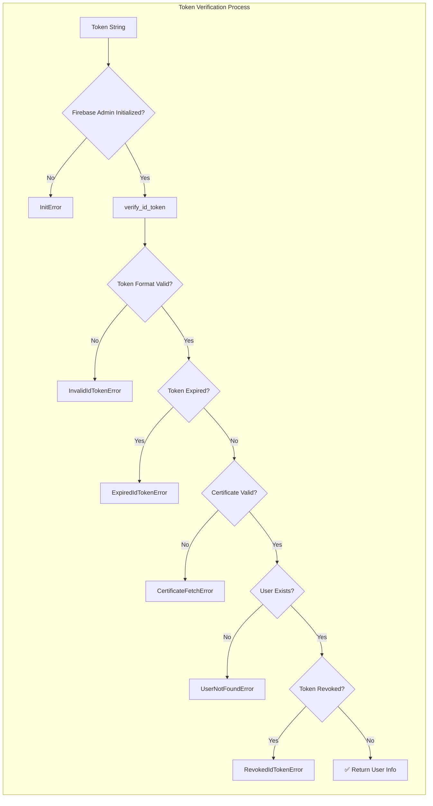
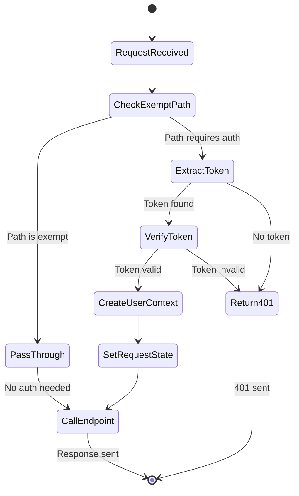
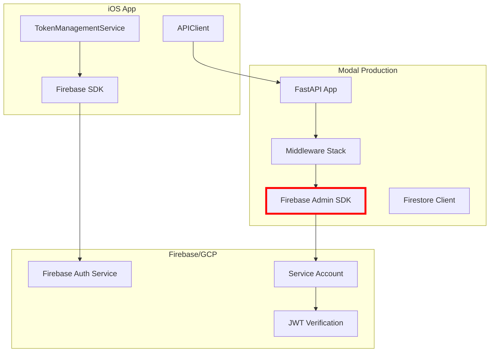
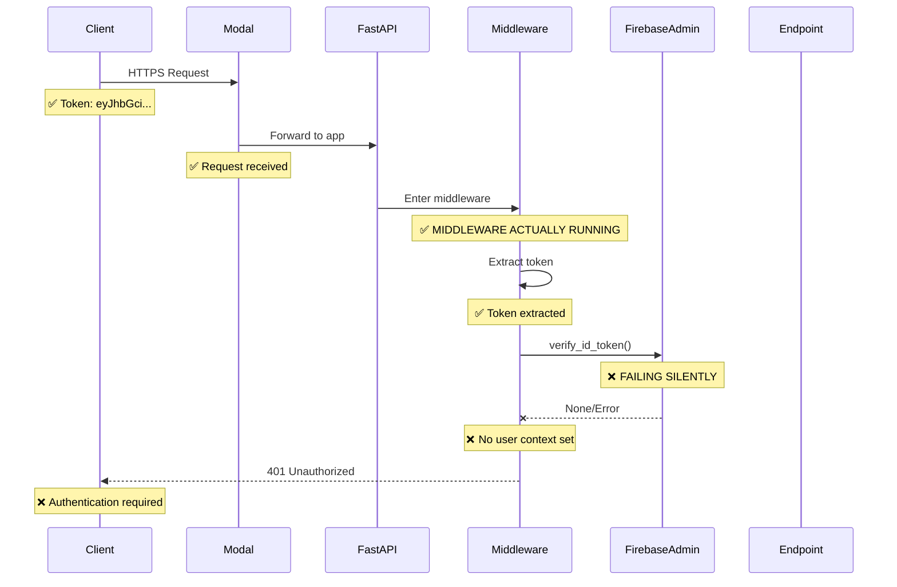
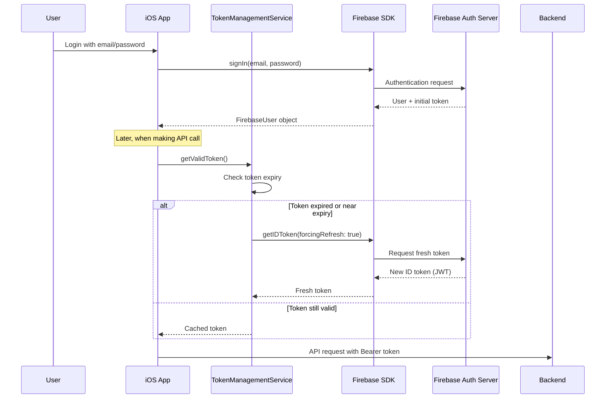
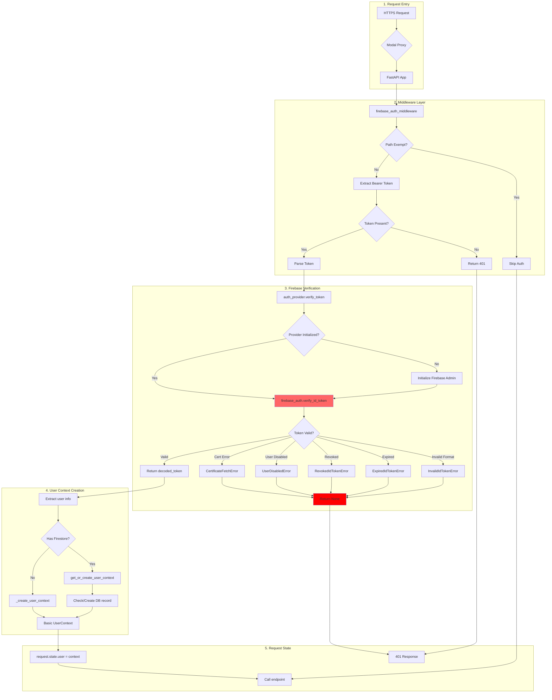
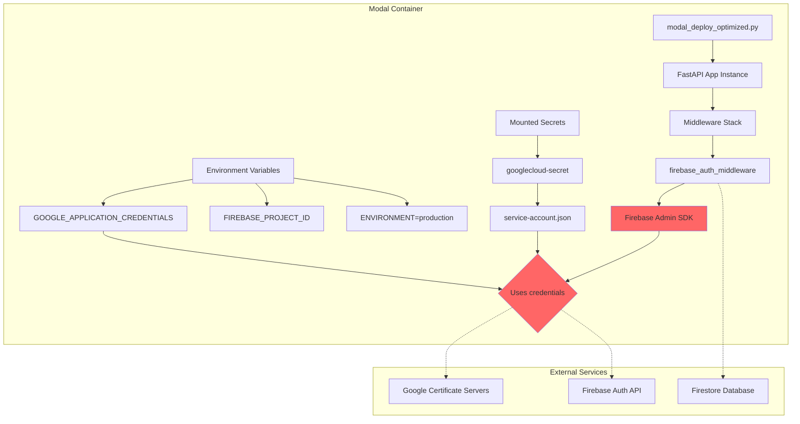

# Complete Authentication Data Flow Analysis

> **Purpose**: Establish the "source of truth" between frontend and backend agents about authentication flows, failure points, and data transformations.

## 1. Complete iOS to Backend Authentication Flow



## 2. Current Breaking Point



## 3. Firebase Token Verification Deep Dive



## 4. Middleware State Management



## 5. Current System Configuration



## 6. Request Lifecycle with Logging



## 7. iOS Token Generation Flow



## 8. Backend Token Processing Pipeline



## 9. Token Data Transformation

```mermaid
graph LR
    subgraph "iOS Token (JWT)"
        A[JWT Header] --> B[Algorithm: RS256]
        C[JWT Payload] --> D[uid: abc123]
        C --> E[email: user@example.com]
        C --> F[exp: 1736611200]
        C --> G[iat: 1736607600]
        C --> H[auth_time: 1736607600]
        I[JWT Signature] --> J[RSA Signature]
    end
    
    subgraph "Firebase Decoded Token"
        K[decoded_token dict] --> L[uid: abc123]
        K --> M[email: user@example.com]
        K --> N[email_verified: true]
        K --> O[custom_claims: {...}]
        K --> P[exp: 1736611200]
    end
    
    subgraph "User Info Dict"
        Q[user_info] --> R[user_id: abc123]
        Q --> S[email: user@example.com]
        Q --> T[verified: true]
        Q --> U[roles: ['patient']]
        Q --> V[custom_claims: {...}]
    end
    
    subgraph "UserContext Object"
        W[UserContext] --> X[user_id: abc123]
        W --> Y[email: user@example.com]
        W --> Z[role: UserRole.PATIENT]
        W --> AA[permissions: [READ_OWN_DATA, WRITE_OWN_DATA]]
        W --> AB[is_verified: true]
    end
    
    A -.-> K
    K -.-> Q
    Q -.-> W
```

## 10. Modal Deployment Environment



## Problem Analysis

Based on these comprehensive flows, the issue is at the **Firebase Admin SDK verification** step.

### Current Evidence

1. ✅ **iOS generates valid tokens** (confirmed by user)
2. ✅ **Backend receives the token** (logs show token in middleware)
3. ✅ **Middleware executes** (logs show "MIDDLEWARE ACTUALLY RUNNING")
4. ✅ **Token is extracted** (length and preview logged)
5. ❌ **Firebase Admin SDK verification fails** (returns None)
6. ❌ **No specific error logged** (need enhanced logging to see why)

### Root Causes (In Order of Likelihood)

1. **Certificate Fetch Error**:
   - Firebase Admin SDK can't download Google's public keys
   - Usually due to network issues or wrong project configuration
   - Would explain silent failure

2. **Project ID Mismatch**:
   - iOS using different Firebase project than backend
   - Tokens from project A won't verify in project B
   - Check Firebase_PROJECT_ID in Modal vs iOS

3. **Service Account Permissions**:
   - Service account might lack proper permissions
   - Needs "Firebase Authentication Admin" role

4. **Token Format Issue**:
   - Token might be malformed or truncated
   - Check full token is being sent (no length limits)

### Immediate Debugging Steps

1. **Deploy enhanced logging** (already added above)
2. **Check Modal logs** for specific Firebase error
3. **Verify environment variables** in Modal deployment
4. **Test with debug endpoint** (to be created)

### The Smoking Gun

The fact that `verify_id_token()` returns None without throwing means Firebase Admin SDK is catching an exception internally. The enhanced logging will reveal which specific exception.
