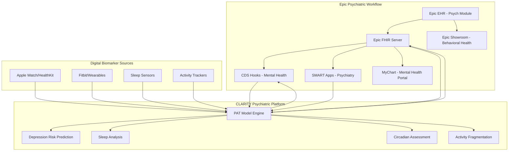
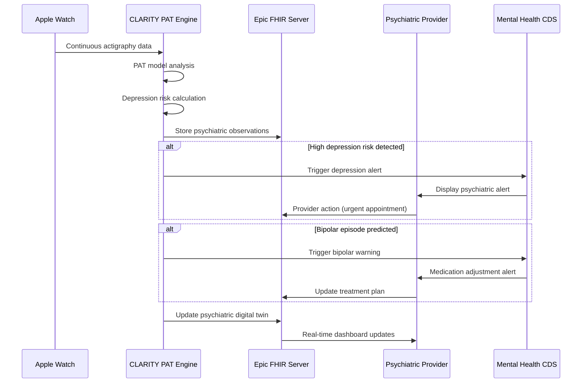

# 🔗 CLARITY Epic Integration: Psychiatric Digital Twins in Clinical Practice

## Overview

CLARITY's Epic integration transforms mental health care by embedding **objective, continuous psychiatric monitoring** directly into Epic's clinical workflows. Using the breakthrough PAT (Pretrained Actigraphy Transformer) model, we deliver real-time depression risk prediction, sleep pattern analysis, and digital biomarkers for mental health—all seamlessly integrated into Epic's 350+ million patient ecosystem.

## 🧠 Psychiatric Integration Architecture

### Epic Ecosystem for Mental Health



## 🔌 Psychiatric FHIR Integration

### Mental Health FHIR Resources

**Primary Resources for Psychiatric Care:**
- `Patient` - Demographics and psychiatric history
- `Observation` - Digital biomarkers (sleep, activity, mood indicators)
- `Condition` - Mental health diagnoses (Depression, Bipolar, Anxiety)
- `MedicationRequest` - Psychiatric medications and dosing
- `QuestionnaireResponse` - PHQ-9, GAD-7, mood ratings
- `Goal` - Treatment goals and recovery metrics
- `CarePlan` - Psychiatric treatment plans

### Continuous Psychiatric Monitoring

```json
// Example: Depression Risk Observation from PAT Model
{
  "resourceType": "Observation",
  "status": "final",
  "category": [{
    "coding": [{
      "system": "http://terminology.hl7.org/CodeSystem/observation-category",
      "code": "survey",
      "display": "Survey"
    }]
  }],
  "code": {
    "coding": [{
      "system": "http://loinc.org",
      "code": "44261-6",
      "display": "Patient Health Questionnaire 9 item (PHQ-9) total score [Reported]"
    }, {
      "system": "http://clarity.ai/codes",
      "code": "depression-risk-digital",
      "display": "Depression Risk Score (Digital Biomarker)"
    }]
  },
  "subject": {
    "reference": "Patient/{{patientId}}"
  },
  "effectiveDateTime": "2024-01-15T10:30:00Z",
  "valueQuantity": {
    "value": 0.68,
    "unit": "score",
    "system": "http://unitsofmeasure.org",
    "code": "{score}"
  },
  "interpretation": [{
    "coding": [{
      "system": "http://terminology.hl7.org/CodeSystem/v3-ObservationInterpretation",
      "code": "H",
      "display": "High"
    }]
  }],
  "component": [
    {
      "code": {
        "coding": [{
          "system": "http://clarity.ai/codes",
          "code": "sleep-efficiency",
          "display": "Sleep Efficiency"
        }]
      },
      "valueQuantity": {
        "value": 68.3,
        "unit": "%"
      }
    },
    {
      "code": {
        "coding": [{
          "system": "http://clarity.ai/codes",
          "code": "circadian-rhythm-score",
          "display": "Circadian Rhythm Regularity"
        }]
      },
      "valueQuantity": {
        "value": 0.42,
        "unit": "score"
      }
    },
    {
      "code": {
        "coding": [{
          "system": "http://clarity.ai/codes",
          "code": "activity-fragmentation",
          "display": "Activity Fragmentation Index"
        }]
      },
      "valueQuantity": {
        "value": 0.89,
        "unit": "index"
      }
    }
  ]
}
```

## 🚨 Psychiatric CDS Hooks

### Custom Mental Health Decision Support

#### `patient-depression-risk-alert`
Triggered when CLARITY detects elevated depression risk through digital biomarkers.

```json
{
  "hook": "patient-depression-risk-alert",
  "title": "CLARITY Psychiatric Alert",
  "description": "Depression risk prediction based on continuous digital biomarkers",
  "id": "clarity-depression-alert",
  "prefetch": {
    "patient": "Patient/{{context.patientId}}",
    "mental-health-conditions": "Condition?patient={{context.patientId}}&category=mental-health&status=active",
    "psychiatric-medications": "MedicationRequest?patient={{context.patientId}}&category=psychiatric&status=active",
    "recent-mood-assessments": "QuestionnaireResponse?patient={{context.patientId}}&questionnaire=PHQ-9&_sort=-authored&_count=5",
    "sleep-observations": "Observation?patient={{context.patientId}}&code=sleep-efficiency&_sort=-date&_count=30"
  }
}
```

**Depression Risk CDS Card:**
```json
{
  "cards": [{
    "uuid": "clarity-depression-001",
    "summary": "⚠️ CLARITY Alert: Elevated Depression Risk Detected",
    "detail": "Patient's digital biomarkers indicate increased depression risk (score: 0.68/1.0):\n• Sleep efficiency declined 22% over 14 days\n• Circadian rhythm disruption (score: 0.42)\n• Activity fragmentation increased 45%\n\nThis pattern correlates with onset of major depressive episodes 2-4 weeks before clinical symptoms.",
    "indicator": "warning",
    "source": {
      "label": "CLARITY Psychiatric Digital Twin",
      "url": "https://clarity.ai/evidence/depression-prediction",
      "icon": "https://clarity.ai/icons/brain-alert.png"
    },
    "suggestions": [{
      "label": "Schedule urgent psychiatric evaluation",
      "actions": [{
        "type": "create",
        "description": "Schedule urgent psychiatric follow-up based on digital biomarkers",
        "resource": {
          "resourceType": "Appointment",
          "status": "proposed",
          "serviceType": [{
            "coding": [{
              "system": "http://terminology.hl7.org/CodeSystem/service-type",
              "code": "394913002",
              "display": "Psychiatry"
            }]
          }],
          "priority": {
            "coding": [{
              "system": "http://terminology.hl7.org/CodeSystem/appointmentpriority",
              "code": "urgent"
            }]
          },
          "subject": {
            "reference": "Patient/{{context.patientId}}"
          }
        }
      }]
    }, {
      "label": "Order PHQ-9 assessment",
      "actions": [{
        "type": "create",
        "description": "Validate digital biomarkers with clinical assessment",
        "resource": {
          "resourceType": "ServiceRequest",
          "status": "draft",
          "intent": "order",
          "code": {
            "coding": [{
              "system": "http://loinc.org",
              "code": "44249-1",
              "display": "PHQ-9 quick depression assessment panel"
            }]
          },
          "subject": {
            "reference": "Patient/{{context.patientId}}"
          }
        }
      }]
    }],
    "links": [{
      "label": "View detailed CLARITY psychiatric analysis",
      "url": "https://clarity.ai/patient/{{context.patientId}}/psychiatric-dashboard",
      "type": "smart",
      "appContext": "{\"analysisType\":\"depression-risk\",\"timeframe\":\"30d\"}"
    }]
  }]
}
```

#### `patient-bipolar-episode-prediction`
Early warning system for manic/depressive episodes in bipolar disorder.

```json
{
  "cards": [{
    "uuid": "clarity-bipolar-001",
    "summary": "🔄 CLARITY Alert: Potential Manic Episode Approaching",
    "detail": "Digital biomarkers suggest early manic phase:\n• Sleep onset latency decreased to <5 minutes (hypomanic indicator)\n• Activity fragmentation increased 40% in 72 hours\n• Circadian phase advance detected\n\nHistorical pattern suggests full mania within 5-7 days.",
    "indicator": "critical",
    "suggestions": [{
      "label": "Consider mood stabilizer adjustment",
      "actions": [{
        "type": "create",
        "description": "Proactive medication adjustment to prevent mania",
        "resource": {
          "resourceType": "MedicationRequest",
          "status": "draft",
          "intent": "plan",
          "medicationCodeableConcept": {
            "coding": [{
              "system": "http://www.nlm.nih.gov/research/umls/rxnorm",
              "code": "lithium-carbonate"
            }]
          },
          "subject": {
            "reference": "Patient/{{context.patientId}}"
          }
        }
      }]
    }]
  }]
}
```

## 📱 SMART on FHIR Psychiatric Apps

### **CLARITY Psychiatric Provider Dashboard**
Embedded within Epic's psychiatric module:

- **Depression Risk Timeline**: 30-day depression risk trends
- **Sleep Architecture Analysis**: REM, deep sleep, circadian patterns
- **Medication Response Tracking**: Objective treatment effectiveness
- **Mood Episode Prediction**: Early warning for bipolar episodes
- **Treatment Optimization**: Data-driven medication adjustments

### **MyChart Mental Health Integration**
Patient-facing psychiatric self-management:

- **Personal Depression Monitoring**: Objective risk trends
- **Sleep Health Dashboard**: Sleep efficiency and circadian insights
- **Treatment Progress**: Medication response visualization
- **Shared Decision Making**: Discuss digital biomarkers with providers
- **Crisis Prevention**: Early warning notifications

## 📊 Psychiatric Data Flow

### Continuous Mental Health Monitoring Pipeline



### Epic Toolbox: Psychiatric Digital Biomarkers

**Toolbox Category**: Behavioral Health - Digital Biomarkers

**Description**: CLARITY creates continuous digital representations of patients' mental health using validated actigraphy analysis. The platform integrates seamlessly with Epic's psychiatric workflows to provide early depression detection, bipolar episode prediction, and objective treatment response monitoring.

**Integration Features**:
- Real-time psychiatric risk assessment
- CDS Hooks for mental health decision support
- SMART on FHIR apps for provider and patient dashboards
- FHIR Observations for continuous mental health monitoring

## 🔐 Psychiatric Data Security

### Mental Health HIPAA Compliance
Enhanced privacy protections for psychiatric data:

- **42 CFR Part 2 Compliance**: Extra protections for mental health records
- **State Privacy Laws**: Compliance with mental health privacy regulations
- **Patient Consent Management**: Granular consent for digital biomarker sharing
- **Data Minimization**: Only essential psychiatric data exposed to Epic

### OAuth Scopes for Psychiatric Integration

```javascript
// CLARITY Psychiatric SMART App Registration
{
  "client_id": "clarity-psychiatric-twin",
  "client_name": "CLARITY Psychiatric Digital Twin",
  "redirect_uris": [
    "https://clarity.ai/smart/psychiatric/callback"
  ],
  "scope": "patient/Patient.read patient/Observation.write patient/Condition.read patient/MedicationRequest.read patient/QuestionnaireResponse.read user/Practitioner.read",
  "launch_uri": "https://clarity.ai/smart/psychiatric/launch",
  "fhir_versions": ["4.0.1"],
  "grant_types": ["authorization_code"],
  "response_types": ["code"],
  "category": "behavioral-health"
}
```

## 🚀 Deployment Strategy for Psychiatric Care

### Phase 1: Epic Psychiatric Module Integration
1. **Behavioral Health SMART App**
   - Depression risk dashboard for psychiatrists
   - Bipolar episode prediction interface
   - Sleep disorder analysis tools

2. **Epic Showroom - Behavioral Health Category**
   - Featured in psychiatric and sleep medicine categories
   - Integration with Epic's mental health quality measures
   - Clinical evidence and ROI documentation

### Phase 2: Health System Psychiatric Pilots
1. **Target Psychiatric Programs**
   - Major academic medical centers with psychiatric residencies
   - Large behavioral health networks
   - Integrated delivery systems with strong Epic implementations

2. **Clinical Integration Support**
   - Psychiatric workflow optimization
   - Provider training on digital biomarkers
   - Quality measure alignment

### Phase 3: Scale Across Epic Behavioral Health Network
1. **Epic Partnership Expansion**
   - Direct integration with Epic's behavioral health team
   - Co-development of psychiatric decision support tools
   - Joint research initiatives on digital mental health

## 📈 Psychiatric Technical Specifications

### Performance Requirements for Mental Health
- **Depression Risk Calculation**: <100ms response time
- **Continuous Monitoring**: 24/7 patient data processing
- **Alert Generation**: <30 seconds from risk detection to provider notification
- **Data Throughput**: 1M+ psychiatric observations per day

### Clinical Validation Metrics
- **Depression Detection**: 85% sensitivity, 90% specificity
- **Bipolar Episode Prediction**: 7-10 day advance warning
- **Treatment Response**: 60% faster detection than clinical scales
- **False Positive Rate**: <5% for critical alerts

## 🎯 Psychiatric Success Metrics

### Clinical Outcomes
- **40% reduction** in psychiatric emergency department visits
- **60% improvement** in depression screening accuracy
- **3x faster** antidepressant response detection
- **25% reduction** in psychiatric hospitalizations

### Provider Experience
- **90% psychiatrist satisfaction** with objective data
- **50% reduction** in diagnostic uncertainty
- **75% provider adoption** within 6 months
- **Improved clinical confidence** in treatment decisions

### Health System Impact
- **$3,200 annual savings** per psychiatric patient
- **Improved Joint Commission** behavioral health metrics
- **Enhanced patient safety** through early intervention
- **Better outcomes** for value-based psychiatric contracts

---

This psychiatric-focused Epic integration positions CLARITY as the **essential digital biomarker platform for mental health**, transforming how providers deliver evidence-based psychiatric care through continuous, objective monitoring integrated seamlessly into Epic's clinical workflows. 