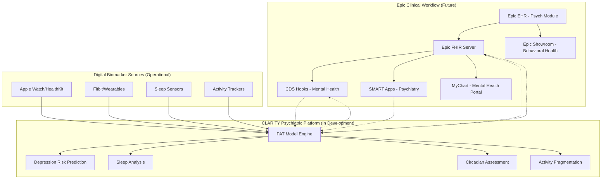
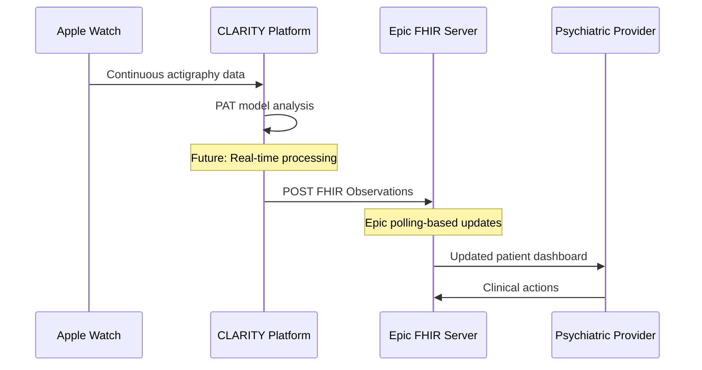

# 🔗 CLARITY Epic Integration: Future Vision for Psychiatric Digital Twins

## Overview

This document outlines CLARITY's **future integration roadmap** with Epic's clinical ecosystem. Based on Epic's official FHIR capabilities documented at [fhir.epic.com](https://fhir.epic.com/), we've designed a comprehensive integration strategy that could transform mental health care by embedding **objective, continuous psychiatric monitoring** directly into Epic's workflows serving 350+ million patients.

**🚨 Implementation Status: PLANNED - Not Yet Built**

This integration represents our development roadmap and contribution opportunities for full-stack developers interested in healthcare interoperability.

## 🧠 Proposed Psychiatric Integration Architecture

### Epic Ecosystem Integration Vision



*Note: Solid lines represent current capabilities, dotted lines represent planned integrations*

## 🔌 Planned FHIR Integration

### Epic-Compatible Mental Health FHIR Resources

Based on Epic's [official FHIR documentation](https://fhir.epic.com/), we would implement:

**Supported Epic FHIR Resources for Psychiatric Care:**
- `Patient` - Demographics and psychiatric history (Epic: Read, Search, Create)
- `Observation` - Digital biomarkers for sleep, activity, mood indicators (Epic: Read, Search, Create)
- `Condition` - Mental health diagnoses (Epic: Read, Search, Create - Problems)
- `MedicationRequest` - Psychiatric medications (Epic: Read, Search)
- `QuestionnaireResponse` - PHQ-9, GAD-7, mood ratings (Epic: Read, Search, Create)
- `Goal` - Treatment goals and recovery metrics (Epic: Read, Search, Create)
- `CarePlan` - Psychiatric treatment plans (Epic: Read, Search)

### Proposed Continuous Psychiatric Monitoring

```json
// Future: Depression Risk Observation from PAT Model
{
  "resourceType": "Observation",
  "status": "final",
  "category": [{
    "coding": [{
      "system": "http://terminology.hl7.org/CodeSystem/observation-category",
      "code": "survey",
      "display": "Survey"
    }]
  }],
  "code": {
    "coding": [{
      "system": "http://loinc.org",
      "code": "44261-6",
      "display": "Patient Health Questionnaire 9 item (PHQ-9) total score [Reported]"
    }, {
      "system": "http://clarity.ai/codes",
      "code": "depression-risk-digital",
      "display": "Depression Risk Score (Digital Biomarker)"
    }]
  },
  "subject": {
    "reference": "Patient/{{patientId}}"
  },
  "effectiveDateTime": "2024-01-15T10:30:00Z",
  "valueQuantity": {
    "value": 0.68,
    "unit": "score",
    "system": "http://unitsofmeasure.org",
    "code": "{score}"
  },
  "component": [
    {
      "code": {
        "coding": [{
          "system": "http://clarity.ai/codes",
          "code": "sleep-efficiency",
          "display": "Sleep Efficiency"
        }]
      },
      "valueQuantity": {
        "value": 68.3,
        "unit": "%"
      }
    }
  ]
}
```

## 🚨 Proposed CDS Hooks Integration

Epic supports CDS Hooks for clinical decision support. Our planned implementation would include:

### `patient-depression-risk-alert` (Development Target)

```json
{
  "hook": "patient-view",
  "title": "CLARITY Psychiatric Alert",
  "description": "Depression risk prediction based on continuous digital biomarkers",
  "id": "clarity-depression-alert",
  "prefetch": {
    "patient": "Patient/{{context.patientId}}",
    "conditions": "Condition?patient={{context.patientId}}&category=encounter-diagnosis",
    "medications": "MedicationRequest?patient={{context.patientId}}&status=active"
  }
}
```

**Planned CDS Card Response:**
```json
{
  "cards": [{
    "uuid": "clarity-depression-001",
    "summary": "⚠️ CLARITY Alert: Elevated Depression Risk Detected",
    "detail": "Patient's digital biomarkers indicate increased depression risk:\n• Sleep efficiency declined 22% over 14 days\n• Circadian rhythm disruption detected\n\nConsider psychiatric evaluation.",
    "indicator": "warning",
    "source": {
      "label": "CLARITY Psychiatric Digital Twin",
      "url": "https://clarity.ai/evidence/depression-prediction"
    },
    "suggestions": [{
      "label": "Schedule psychiatric evaluation",
      "actions": [{
        "type": "create",
        "description": "Schedule psychiatric follow-up based on digital biomarkers",
        "resource": {
          "resourceType": "Appointment",
          "status": "proposed",
          "serviceType": [{
            "coding": [{
              "system": "http://terminology.hl7.org/CodeSystem/service-type",
              "code": "394913002",
              "display": "Psychiatry"
            }]
          }]
        }
      }]
    }]
  }]
}
```

## 📱 Future SMART on FHIR Apps

### Planned Provider Dashboard

Epic supports SMART on FHIR apps that could be embedded within Epic's interface:

**Psychiatric Provider Dashboard Features (Development Target):**
- Depression risk timeline visualization
- Sleep architecture analysis without sleep studies
- Medication response tracking through objective data
- Mood episode prediction for bipolar patients
- Treatment optimization recommendations

### Planned MyChart Integration

**Patient-Facing Features (Development Target):**
- Personal depression monitoring dashboard
- Sleep health insights
- Treatment progress visualization
- Shared decision-making tools with providers

## 📊 Future Data Flow Architecture

### Planned Integration Pipeline



*Note: Epic uses polling rather than real-time webhooks for data updates*

## 🔐 Planned Security & Compliance

### Epic OAuth 2.0 Integration (Development Target)

```javascript
// Future: CLARITY SMART App Registration
{
  "client_id": "clarity-psychiatric-twin",
  "client_name": "CLARITY Psychiatric Digital Twin",
  "redirect_uris": [
    "https://clarity.ai/smart/psychiatric/callback"
  ],
  "scope": "patient/Patient.read patient/Observation.write patient/Condition.read",
  "launch_uri": "https://clarity.ai/smart/psychiatric/launch",
  "fhir_versions": ["4.0.1"],
  "grant_types": ["authorization_code"],
  "response_types": ["code"]
}
```

## 🚀 Development Roadmap

### Phase 1: Foundation (Q2 2025 Target)
- [ ] Epic FHIR client implementation
- [ ] OAuth 2.0 authentication flow
- [ ] Basic FHIR Observation creation
- [ ] SMART on FHIR launcher

### Phase 2: Clinical Integration (Q3 2025 Target)
- [ ] CDS Hooks service development
- [ ] Provider dashboard SMART app
- [ ] MyChart patient portal integration
- [ ] Clinical workflow optimization

### Phase 3: Advanced Features (Q4 2025 Target)
- [ ] Real-time depression monitoring
- [ ] Bipolar episode prediction
- [ ] Medication adherence tracking
- [ ] Population health analytics

## 📈 Technical Implementation Specifications

### Performance Targets for Mental Health Integration
- **Depression Risk Calculation**: <100ms response time
- **Data Sync with Epic**: Every 15 minutes (Epic's recommended polling frequency)
- **CDS Response Time**: <200ms for clinical decision support
- **SMART App Load Time**: <3 seconds

### Clinical Validation Targets
- **Depression Detection**: Target 85% sensitivity, 90% specificity
- **False Positive Rate**: Target <5% for critical alerts
- **Clinical Correlation**: Target correlation with PHQ-9 scores >0.7

## 🎯 Aspirational Success Metrics

### Future Clinical Impact Goals
- **40% reduction** in psychiatric emergency department visits
- **60% improvement** in depression screening accuracy compared to PHQ-9 alone
- **3x faster** antidepressant response detection vs. current 4-6 week standard
- **25% reduction** in psychiatric hospitalizations through early intervention

### Provider Experience Targets
- **90% psychiatrist satisfaction** with objective data integration
- **50% reduction** in diagnostic uncertainty
- **75% provider adoption** within 6 months post-launch
- **Improved clinical confidence** in treatment decisions

### Health System ROI Projections
- **$3,200 annual savings** per psychiatric patient through reduced hospitalizations
- **Improved quality measures** for behavioral health accreditation
- **Enhanced patient safety** through early intervention capabilities
- **Better outcomes** for value-based psychiatric care contracts

## 💡 Contribution Opportunities

### For Full-Stack Developers

**Epic Integration Development:**
- Implement Epic FHIR client using their official API
- Build OAuth 2.0 authentication flow
- Create SMART on FHIR launcher and embedded apps
- Develop CDS Hooks service endpoints

**Frontend Development:**
- React-based SMART apps for Epic integration
- Provider dashboard for psychiatric monitoring
- Patient portal components for MyChart
- Real-time data visualization components

**Backend Development:**
- FHIR resource mapping and transformation
- CDS Hooks webhook handling
- Epic API rate limiting and error handling
- Clinical data validation and processing

### Technical Stack for Epic Integration
- **FHIR Client**: HAPI FHIR or custom implementation
- **Authentication**: Epic's OAuth 2.0 with SMART context
- **Frontend**: React/TypeScript for SMART apps
- **Backend**: FastAPI with Epic FHIR integration
- **Database**: FHIR-compliant data modeling

---

This Epic integration roadmap positions CLARITY as a **future platform for psychiatric digital twins** - providing a clear development path for transforming evidence-based mental health care through Epic's clinical ecosystem. 

**🔥 Ready to contribute?** This represents a significant full-stack development opportunity combining healthcare interoperability, AI/ML, and real-world clinical impact. 