# CLARITY Digital Twin Backend

A FastAPI-based health data processing platform that analyzes Apple Health data using AI models to generate health insights.

## Overview

CLARITY processes wearable device data through machine learning models to extract health patterns and generate natural language insights. The system uses a Pretrained Actigraphy Transformer (PAT) for movement analysis and Google Gemini for generating conversational health explanations.

**Tech Stack**: Python 3.11+, FastAPI, AWS (DynamoDB/Cognito/ECS), PyTorch, Transformers

## Architecture

```mermaid
graph TB
    %% Data Sources
    AW[📱 Apple Watch] --> HK[🍎 HealthKit Export]
    IP[📱 iPhone] --> HK
    
    %% API Layer
    HK --> API[🚀 FastAPI Backend]
    API --> Auth[🔐 AWS Cognito]
    API --> Valid[✅ Data Validation]
    
    %% Processing Pipeline
    Valid --> Prep[⚙️ Preprocessing]
    Prep --> PAT[🧠 PAT Transformer<br/>Sleep & Circadian Analysis]
    Prep --> Gem[💎 Gemini AI<br/>Insight Generation]
    
    %% Storage & Analysis
    PAT --> Feat[📊 Feature Extraction]
    Gem --> NL[📝 Natural Language<br/>Insights]
    Feat --> DB[(🗄️ DynamoDB)]
    NL --> DB
    
    %% Real-time & Output
    DB --> WS[⚡ WebSocket<br/>Real-time Updates]
    DB --> Insights[🎯 Health Insights]
    
    %% Styling - Bold colors with white text like Production diagram
    classDef aiModel fill:#4caf50,stroke:#1b5e20,stroke-width:2px,color:white
    classDef storage fill:#2196f3,stroke:#0d47a1,stroke-width:2px,color:white
    classDef api fill:#ff9900,stroke:#e65100,stroke-width:2px,color:white
    classDef device fill:#9c27b0,stroke:#4a148c,stroke-width:2px,color:white
    
    class PAT,Gem aiModel
    class DB,Auth storage
    class API,Valid,WS,Prep,Feat,NL api
    class AW,IP,HK,Insights device
```



**Core Components**:
- **Data Ingestion**: HealthKit JSON processing and validation
- **ML Pipeline**: PAT transformer for temporal pattern analysis  
- **AI Integration**: Gemini for natural language insight generation
- **Real-time API**: WebSocket support for live data streaming
- **AWS Infrastructure**: Production-ready cloud deployment

## Data Flow Pipeline

```mermaid
sequenceDiagram
    participant Client as 📱 Client App
    participant API as 🚀 FastAPI
    participant Auth as 🔐 Cognito
    participant PAT as 🧠 PAT Model
    participant Gemini as 💎 Gemini AI
    participant DB as 🗄️ DynamoDB
    
    Client->>API: Upload HealthKit Data
    API->>Auth: Validate JWT Token
    Auth-->>API: ✅ Token Valid
    
    API->>API: Data Validation & Preprocessing
    Note over API: Transform to 1-min intervals<br/>Remove outliers<br/>Normalize signals
    
    par Parallel Processing
        API->>PAT: 7-day Activity Vector<br/>(10,080 points)
        PAT-->>API: Sleep Quality Scores<br/>Circadian Patterns
    and
        API->>Gemini: Health Data + Context
        Gemini-->>API: Natural Language<br/>Insights & Recommendations
    end
    
    API->>DB: Store Results
    DB-->>Client: Processing Complete ✅
    
    Note over Client,DB: Real-time updates via WebSocket
```



## Quick Start

```bash
# Setup
git clone https://github.com/your-org/clarity-loop-backend.git
cd clarity-loop-backend
make install

# Configure environment
cp .env.example .env  # Add your API keys

# Run locally
make dev

# Verify
curl http://localhost:8000/health
```

## API Overview

**44 total endpoints** across 7 main areas:

```mermaid
mindmap
  root((🚀 CLARITY API))
    🔐 Authentication
      Login/Register
      JWT Tokens
      AWS Cognito
    📊 Health Data
      Upload/Retrieve
      CRUD Operations
      Data Validation
    🍎 HealthKit
      Apple Integration
      Batch Processing
      Status Tracking
    🧠 AI Insights
      Gemini Analysis
      Chat Interface
      Recommendations
    🏃 PAT Analysis
      Sleep Patterns
      Circadian Rhythms
      Activity Analysis
    ⚡ WebSocket
      Real-time Updates
      Live Streaming
      Connection Management
    📈 System
      Health Checks
      Metrics
      Monitoring
```



### Example Usage

```bash
# Upload health data
POST /api/v1/healthkit/upload
{
  "data": [/* HealthKit JSON export */]
}

# Get AI analysis
POST /api/v1/insights/generate
{
  "user_id": "123",
  "type": "sleep_analysis"
}
```

## Data Processing Pipeline


### Supported Health Metrics
- **Activity**: Steps, distance, calories, exercise minutes
- **Sleep**: Duration, efficiency, stages, disruptions
- **Cardiovascular**: Heart rate, HRV, blood pressure
- **Respiratory**: Breathing rate, SpO2
- **Mental Health**: Mood tracking, stress indicators

## AI Models

### PAT (Pretrained Actigraphy Transformer)

```mermaid
graph LR
    subgraph Input ["📊 Input Data"]
        A[7-day Activity Data<br/>10,080 time points<br/>1-minute intervals]
    end
    
    subgraph Transformer ["🧠 PAT Architecture"]
        B[Temporal Embedding]
        C[Multi-Head Attention<br/>8 heads]
        D[Positional Encoding]
        E[Transformer Layers]
    end
    
    subgraph Output ["📈 Analysis Output"]
        F[Sleep Quality Scores]
        G[Circadian Disruption]
        H[Activity Patterns]
    end
    
    A --> B
    B --> C
    C --> D
    D --> E
    E --> F
    E --> G
    E --> H
    
    classDef input fill:#ff9900,stroke:#e65100,stroke-width:2px,color:white
    classDef model fill:#4caf50,stroke:#1b5e20,stroke-width:2px,color:white
    classDef output fill:#2196f3,stroke:#0d47a1,stroke-width:2px,color:white
    
    class A input
    class B,C,D,E model
    class F,G,H output
```



- **Purpose**: Sleep and circadian rhythm analysis from movement data
- **Input**: 10,080-point vectors (7 days × 1-minute intervals)
- **Architecture**: Transformer with temporal positional encoding
- **License**: CC BY-4.0 (Dartmouth College, Jacobson Lab)

### Google Gemini Integration
- **Purpose**: Natural language health insights
- **Input**: Processed health metrics + user context
- **Output**: Conversational explanations and recommendations

## Production Deployment


**AWS ECS Fargate** with:
- Auto-scaling based on CPU/memory
- Zero-downtime rolling deployments
- CloudWatch logging and monitoring
- Prometheus metrics collection

```bash
# Deploy to AWS
./deploy.sh production

# Monitor logs
aws logs tail /aws/ecs/clarity-backend --follow
```

## Development

```bash
# Install dependencies
make install

# Run tests (810 total, 807 passing)
make test

# Code quality
make lint      # Ruff linting
make typecheck # MyPy validation
make format    # Black formatting

# Coverage report (currently 57%, target 85%)
make coverage
```

## Current Status

```mermaid
flowchart LR
    subgraph Complete ["✅ Production Ready"]
        Tests[Tests<br/>807/810 passing<br/>99.6% success]
        AWS[AWS Migration<br/>ECS Infrastructure<br/>Complete]
        API[API Endpoints<br/>44 total endpoints<br/>All functional]
        Models[AI Models<br/>PAT + Gemini<br/>Operational]
    end
    
    subgraph InProgress ["🔄 In Progress"]
        Coverage[Test Coverage<br/>57% → 85%<br/>Target Q1]
        Docs[Documentation<br/>Technical specs<br/>Complete Q1]
    end
    
    subgraph Roadmap ["🚀 Future Roadmap"]
        Enhanced[Enhanced ML<br/>Additional models<br/>Q3 2025]
        Realtime[Real-time Features<br/>Live streaming<br/>Q4 2025]
    end
    
    Complete --> InProgress
    InProgress --> Roadmap
    
    classDef complete fill:#4caf50,stroke:#1b5e20,stroke-width:2px,color:white
    classDef progress fill:#ff9900,stroke:#e65100,stroke-width:2px,color:white
    classDef future fill:#2196f3,stroke:#0d47a1,stroke-width:2px,color:white
    
    class Tests,AWS,API,Models complete
    class Coverage,Docs progress
    class Enhanced,Realtime future
```



- **Tests**: 807/810 passing (99.6% success rate)
- **Coverage**: 57% (increasing to 85% target)
- **API**: 44 endpoints, all core functionality complete
- **AWS Migration**: Complete, production-ready infrastructure
- **AI Models**: PAT and Gemini integration functional

## Security & Compliance

- **Authentication**: JWT via AWS Cognito
- **Encryption**: End-to-end for all health data
- **HIPAA Ready**: AWS infrastructure with audit logging
- **Privacy**: User data control, configurable retention

## Documentation

- **[System Overview](docs/01-overview.md)** - Architecture details
- **[API Reference](docs/02-api-reference.md)** - Complete endpoint docs
- **[AI Models](docs/03-ai-models.md)** - ML pipeline documentation
- **[Deployment Guide](docs/operations/deployment.md)** - Production setup

## License

Apache License 2.0 - see [LICENSE](LICENSE) file for details.

**Third-party**: PAT models under CC BY-4.0 - see [THIRD_PARTY_NOTICES.md](THIRD_PARTY_NOTICES.md)

---

**CLARITY Digital Twin Backend** - Health data processing with AI-powered insights