# CLARITY-AI Digital Twin Backend

Transform your Apple Health data into actionable insights through cutting-edge AI models trained on population-scale health data.

## What Is CLARITY-AI?

CLARITY-AI is a **research-grade digital health platform** that processes Apple Watch data using state-of-the-art foundation models:

- **PAT (Pretrained Actigraphy Transformer)**: Foundation model trained on 29,307 participants from NHANES 2003-2014
- **Multi-modal Health Analysis**: Integrates activity, heart rate, sleep, and respiratory data
- **Natural Language Insights**: Google Gemini transforms technical metrics into conversational explanations

### Real Data Processing Pipeline

```mermaid
graph LR
    subgraph DataIngestion ["📱 Apple Health Data"]
        A[Step Counts<br/>Heart Rate<br/>Sleep Analysis<br/>HRV & Respiratory]
        B[1-minute sampling<br/>7-day windows<br/>NHANES normalization]
    end
    
    subgraph PAT ["🧠 PAT Foundation Model"]
        C[Pretrained on 29,307<br/>NHANES participants<br/>2003-2014 cycles]
        D[Transformer Architecture<br/>10,080 time points<br/>7-day analysis window]
        E[Sleep Quality Score<br/>Circadian Rhythm<br/>Activity Patterns]
    end
    
    subgraph Multimodal ["🔬 Multi-Modal Fusion"]
        F[Heart Rate Variability<br/>Respiratory Patterns<br/>Activity Fragmentation]
        G[Fusion Transformer<br/>Cross-modal attention<br/>Holistic health state]
    end
    
    subgraph NLG ["💬 Natural Language"]
        H[Google Gemini<br/>Clinical context<br/>Conversational insights]
        I["Your sleep efficiency<br/>was 89% last week...<br/>suggesting good recovery"]
    end
    
    A --> B --> C --> D --> E
    E --> F --> G --> H --> I
    
    classDef data fill:#e3f2fd,stroke:#1976d2,stroke-width:2px,color:black
    classDef ai fill:#f3e5f5,stroke:#7b1fa2,stroke-width:2px,color:black
    classDef output fill:#e8f5e8,stroke:#388e3c,stroke-width:2px,color:black
    
    class A,B data
    class C,D,E,F,G ai
    class H,I output
```



## Technical Architecture

**Backend**: Python 3.11+ • FastAPI • PyTorch • Transformers  
**Infrastructure**: AWS (DynamoDB, Cognito, ECS) • Docker • OAuth 2.0  
**AI Models**: PAT (Dartmouth) • Google Gemini • Custom Fusion Transformers

## Core Capabilities

### 🔬 **PAT Foundation Model Analysis**
- **Sleep Quality Metrics**: Efficiency, onset latency, wake episodes, total sleep time
- **Circadian Rhythm Assessment**: 24-hour pattern regularity and phase alignment  
- **Activity Fragmentation**: Movement pattern consistency and disruption detection
- **Population-Normalized Scores**: Individual metrics compared to NHANES population data

### 📊 **Multi-Modal Health Processing**
- **Heart Rate Analysis**: Resting HR, variability (HRV), exercise response patterns
- **Respiratory Monitoring**: Rate patterns, sleep-related breathing irregularities
- **Activity Intelligence**: Step patterns, energy expenditure, exercise recognition
- **Sleep Stage Detection**: REM, deep, light sleep proportions and timing

### 💬 **Conversational Health Insights**
- **Natural Language Explanations**: Technical metrics translated to plain English
- **Personalized Recommendations**: Actionable suggestions based on data patterns  
- **Trend Analysis**: Week-over-week changes with clinical context
- **Health Risk Indicators**: Early warning patterns for lifestyle intervention

## Current Status

**API Endpoints**: 44 routes across authentication, data processing, and analysis  
**Test Coverage**: 807/810 tests passing (99.6%) • 57% code coverage (target: 85%)  
**Production Deployment**: AWS ECS with CloudFormation infrastructure

```mermaid
graph TB
    subgraph Frontend ["🖥️ Client Applications"]
        A[iOS App<br/>React Native<br/>HealthKit Integration]
        B[Web Dashboard<br/>React/TypeScript<br/>Real-time Analytics]
    end
    
    subgraph API ["⚡ FastAPI Backend"]
        C[Authentication<br/>AWS Cognito<br/>OAuth 2.0]
        D[Data Processing<br/>Multi-modal Pipeline<br/>Quality Validation]
        E[ML Analysis<br/>PAT + Fusion Models<br/>Batch Processing]
        F[Natural Language<br/>Gemini Integration<br/>Insight Generation]
    end
    
    subgraph Storage ["💾 Data Layer"]
        G[DynamoDB<br/>Health Metrics<br/>Analysis Results]
        H[S3 Storage<br/>Model Weights<br/>Processing Cache]
    end
    
    subgraph ML ["🤖 AI Infrastructure"]
        I[PAT Models<br/>S/M/L variants<br/>CC BY-4.0 Licensed]
        J[Fusion Transformer<br/>Multi-modal Integration<br/>Custom Architecture]
        K[Google Gemini<br/>Natural Language<br/>Clinical Context]
    end
    
    A --> C
    B --> C
    C --> D --> E --> F
    D --> G
    E --> H
    E --> I --> J
    F --> K
    
    classDef frontend fill:#e1f5fe,stroke:#0288d1,stroke-width:2px,color:black
    classDef api fill:#fff3e0,stroke:#f57c00,stroke-width:2px,color:black
    classDef storage fill:#f3e5f5,stroke:#7b1fa2,stroke-width:2px,color:black
    classDef ml fill:#e8f5e8,stroke:#388e3c,stroke-width:2px,color:black
    
    class A,B frontend
    class C,D,E,F api
    class G,H storage
    class I,J,K ml
```



## Research Foundation

CLARITY leverages peer-reviewed research for clinical-grade analysis:

**PAT Model**: ["AI Foundation Models for Wearable Movement Data in Mental Health Research"](https://doi.org/10.48550/arXiv.2411.15240)  
- **Authors**: Franklin Y. Ruan, Aiwei Zhang, Jenny Oh, SouYoung Jin, Nicholas C. Jacobson (Dartmouth College)
- **Training Data**: NHANES 2003-2014 actigraphy data from 29,307 participants
- **Architecture**: Transformer-based with specialized attention for temporal health patterns
- **License**: CC BY-4.0 (properly attributed, unmodified weights)

## Quick Start

### Development Setup

```bash
# Clone and setup
git clone https://github.com/your-org/clarity-loop-backend.git
cd clarity-loop-backend

# Install dependencies
pip install -r requirements.txt

# Configure environment
cp .env.example .env
# Add your API keys: GOOGLE_API_KEY, AWS credentials

# Run development server
make dev
```

### Docker Deployment

```bash
# Build and run
docker-compose up --build

# Health check
curl http://localhost:8000/health
```

### API Authentication

```python
import httpx

# Get access token
response = httpx.post("http://localhost:8000/auth/token", 
    data={"username": "user", "password": "pass"})
token = response.json()["access_token"]

# Analyze health data
headers = {"Authorization": f"Bearer {token}"}
analysis = httpx.post("http://localhost:8000/analysis/health",
    headers=headers, json={"health_data": your_data})
```

## Data Processing Example

The platform processes your Apple Health data through this pipeline:

1. **Data Ingestion**: HealthKit step counts, heart rate, sleep analysis
2. **Normalization**: NHANES population statistics for z-score standardization  
3. **PAT Analysis**: 7-day windows (10,080 data points) through transformer model
4. **Multi-modal Fusion**: Integration across physiological signals
5. **Natural Language**: Clinical insights in conversational format

**Input**: Raw Apple Watch data (steps, HR, sleep)  
**Output**: "Your sleep efficiency averaged 87% this week, which is excellent compared to your age group. The consistent 11 PM bedtime is supporting strong circadian rhythm alignment."

## Model Performance

**PAT Foundation Model**:
- **Architecture**: Transformer with patch embeddings optimized for 1-week actigraphy windows
- **Training Scale**: 29,307 participants across multiple NHANES cycles (2003-2014)
- **Inference Speed**: <2 seconds for 7-day analysis on standard hardware
- **Model Sizes**: PAT-S (1.1MB), PAT-M (3.8MB), PAT-L (7.6MB)

## Important Disclaimers

⚠️ **NOT FDA APPROVED** - For research and educational purposes only  
⚠️ **NOT FOR MEDICAL DIAGNOSIS** - Consult healthcare providers for medical decisions  
⚠️ **RESEARCH TOOL** - Designed for health insights and lifestyle optimization

## Contributing

See [CONTRIBUTING.md](CONTRIBUTING.md) for development guidelines.

**Documentation**: [/docs](docs/) directory contains detailed technical specifications  
**API Reference**: OpenAPI spec available at `/docs` when running locally  
**Architecture**: See [docs/01-overview.md](docs/01-overview.md) for system design

## License

**Platform Code**: Apache 2.0 License  
**PAT Model Weights**: CC BY-4.0 License (Dartmouth College, unmodified)

## Research Citations

If you use this platform in research, please cite:

```bibtex
@article{ruan2024ai,
  title={AI Foundation Models for Wearable Movement Data in Mental Health Research},
  author={Ruan, Franklin Y. and Zhang, Aiwei and Oh, Jenny and Jin, SouYoung and Jacobson, Nicholas C.},
  journal={arXiv preprint arXiv:2411.15240},
  year={2024},
  doi={10.48550/arXiv.2411.15240}
}
```