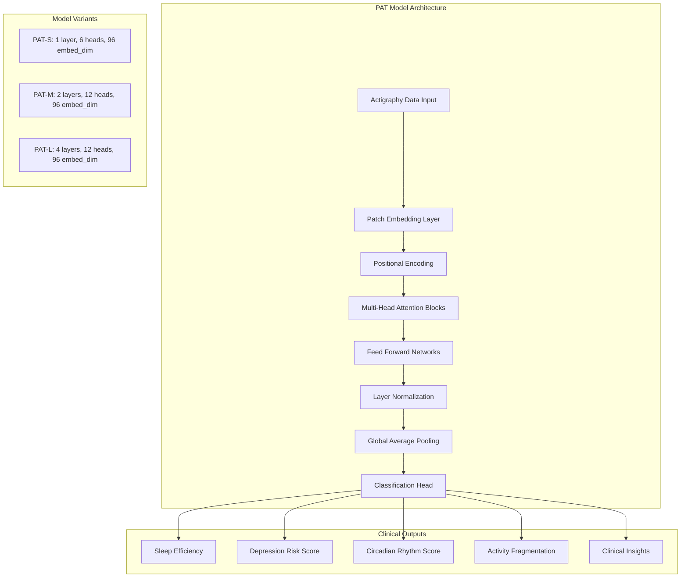

# 🏗️ CLARITY Technical Architecture: Psychiatric Digital Twin Platform

## System Overview

CLARITY is a production-ready psychiatric digital twin platform built around the breakthrough PAT (Pretrained Actigraphy Transformer) model from Dartmouth College. Our architecture seamlessly transforms wearable device data into clinically-validated digital biomarkers for mental health, with native Epic EHR integration for real-world clinical deployment.

## 🧠 Core Architecture Components

### **PAT Model Engine (Production Ready)**



### **Platform Components**

```python
# Core Platform Architecture
clarity_platform = {
    "data_ingestion": {
        "healthkit_connector": "Apple Watch, iPhone health data",
        "fitbit_api": "Fitbit device integration", 
        "generic_wearables": "Third-party device support",
        "manual_entry": "Patient-reported data backup"
    },
    "processing_engine": {
        "pat_service": "PAT model inference service",
        "preprocessor": "Data normalization and feature extraction",
        "health_data_service": "Clinical data orchestration",
        "ml_pipeline": "Real-time prediction pipeline"
    },
    "clinical_integration": {
        "epic_fhir": "FHIR R4 observation resources",
        "cds_hooks": "Real-time clinical decision support",
        "smart_apps": "Provider and patient dashboards",
        "alerts": "Risk-based notification system"
    },
    "infrastructure": {
        "aws_ecs": "Containerized microservices",
        "dynamodb": "Patient data storage",
        "cognito": "Authentication and authorization",
        "api_gateway": "RESTful API management"
    }
}
```

## 🔬 PAT Model Implementation Details

### **Model Specifications (Production)**

```python
# PAT Configuration (Aligned with Dartmouth Research)
PAT_CONFIGS = {
    "small": {
        "num_layers": 1,
        "num_heads": 6, 
        "embed_dim": 96,
        "patch_size": 18,
        "input_size": 10080,  # 1 week of minute-level data
        "ff_dim": 256,
        "dropout": 0.1
    },
    "medium": {
        "num_layers": 2,
        "num_heads": 12,
        "embed_dim": 96,
        "patch_size": 18,
        "input_size": 10080,
        "ff_dim": 256,
        "dropout": 0.1
    },
    "large": {
        "num_layers": 4,
        "num_heads": 12,
        "embed_dim": 96,
        "patch_size": 9,  # Higher resolution for complex patterns
        "input_size": 10080,
        "ff_dim": 256,
        "dropout": 0.1
    }
}
```

### **Clinical Output Pipeline**

```python
class ActigraphyAnalysis(BaseModel):
    """Clinical-grade output from PAT model analysis."""
    
    user_id: str
    analysis_timestamp: str
    
    # Sleep Architecture
    sleep_efficiency: float          # 0-100% (Clinical threshold: >85% excellent)
    sleep_onset_latency: float       # Minutes to fall asleep
    wake_after_sleep_onset: float    # WASO minutes
    total_sleep_time: float          # Hours of actual sleep
    
    # Circadian Health
    circadian_rhythm_score: float    # 0-1 (>0.8 = strong rhythm)
    
    # Activity Patterns
    activity_fragmentation: float    # Movement disruption index
    
    # Psychiatric Biomarkers
    depression_risk_score: float     # 0-1 (>0.7 = high risk, >0.4 = moderate)
    
    # Clinical Intelligence
    sleep_stages: List[str]          # Minute-by-minute sleep staging
    confidence_score: float         # Model confidence (0-1)
    clinical_insights: List[str]     # Evidence-based recommendations
    embedding: List[float]           # 96-dimensional PAT representation
```

### **Real-Time Inference Pipeline**

```python
async def analyze_patient_actigraphy(patient_data: ActigraphyInput) -> ActigraphyAnalysis:
    """Production inference pipeline for psychiatric assessment."""
    
    # 1. Data Validation & Security
    validate_input_bounds(patient_data.data_points)  # Prevent memory exhaustion
    sanitize_patient_data(patient_data)              # Remove PII from processing
    
    # 2. Preprocessing for PAT Model
    tensor = preprocessor.preprocess_for_pat_model(
        data_points=patient_data.data_points,
        target_length=10080  # 1 week standardization
    )
    
    # 3. PAT Model Inference
    with torch.no_grad():
        outputs = pat_model(tensor.unsqueeze(0))  # Add batch dimension
    
    # 4. Clinical Postprocessing
    analysis = postprocess_predictions(outputs, patient_data.user_id)
    
    # 5. Clinical Insight Generation
    analysis.clinical_insights = generate_clinical_insights(
        sleep_efficiency=analysis.sleep_efficiency,
        circadian_score=analysis.circadian_rhythm_score,
        depression_risk=analysis.depression_risk_score
    )
    
    return analysis
```

## 🏥 Epic Integration Architecture

### **FHIR Resource Mapping**

```python
# Psychiatric FHIR Observation Generation
def create_depression_risk_observation(analysis: ActigraphyAnalysis) -> dict:
    """Convert PAT analysis to FHIR Observation for Epic integration."""
    
    return {
        "resourceType": "Observation",
        "status": "final",
        "category": [{
            "coding": [{
                "system": "http://terminology.hl7.org/CodeSystem/observation-category",
                "code": "survey",
                "display": "Assessment"
            }]
        }],
        "code": {
            "coding": [{
                "system": "http://loinc.org",
                "code": "44261-6",
                "display": "Patient Health Questionnaire 9 item (PHQ-9) total score"
            }, {
                "system": "http://clarity.ai/codes",
                "code": "depression-risk-digital",
                "display": "Depression Risk Score (Digital Biomarker)"
            }]
        },
        "subject": {"reference": f"Patient/{analysis.user_id}"},
        "effectiveDateTime": analysis.analysis_timestamp,
        "valueQuantity": {
            "value": analysis.depression_risk_score,
            "unit": "score",
            "system": "http://unitsofmeasure.org",
            "code": "{score}"
        },
        "interpretation": [get_risk_interpretation(analysis.depression_risk_score)],
        "component": [
            create_sleep_efficiency_component(analysis.sleep_efficiency),
            create_circadian_component(analysis.circadian_rhythm_score),
            create_activity_fragmentation_component(analysis.activity_fragmentation)
        ]
    }
```

### **CDS Hooks Implementation**

```python
class PsychiatricCDSHooksService:
    """Clinical Decision Support for psychiatric alerts."""
    
    async def handle_depression_risk_alert(self, context: CDSContext) -> CDSResponse:
        """Generate CDS cards for elevated depression risk."""
        
        # Get latest PAT analysis
        analysis = await get_latest_analysis(context.patient_id)
        
        if analysis.depression_risk_score > 0.7:  # High risk threshold
            return CDSResponse(
                cards=[
                    create_urgent_psychiatric_referral_card(analysis),
                    create_phq9_assessment_card(analysis),
                    create_safety_assessment_card(analysis)
                ]
            )
        elif analysis.depression_risk_score > 0.4:  # Moderate risk
            return CDSResponse(
                cards=[
                    create_routine_followup_card(analysis),
                    create_sleep_hygiene_card(analysis)
                ]
            )
        
        return CDSResponse(cards=[])
    
    async def handle_bipolar_episode_prediction(self, context: CDSContext) -> CDSResponse:
        """Early warning system for bipolar episodes."""
        
        analysis = await get_latest_analysis(context.patient_id)
        trend_data = await get_trend_analysis(context.patient_id, days=7)
        
        # Check for manic episode indicators
        if (analysis.sleep_onset_latency < 5 and  # Hypomanic sleep pattern
            trend_data.activity_increase > 0.4):   # 40% activity spike
            
            return CDSResponse(
                cards=[create_manic_episode_warning_card(analysis, trend_data)]
            )
        
        return CDSResponse(cards=[])
```

### **SMART on FHIR Apps**

```typescript
// Psychiatric Provider Dashboard (SMART App)
interface PsychiatricDashboardProps {
    patient: Patient;
    observations: Observation[];
    riskTrends: DepessionRiskTrend[];
}

const PsychiatricDashboard: React.FC<PsychiatricDashboardProps> = ({
    patient,
    observations,
    riskTrends
}) => {
    return (
        <div className="psychiatric-dashboard">
            {/* Depression Risk Timeline */}
            <DepressionRiskChart 
                data={riskTrends}
                threshold={0.7}
                clinicalGuidelines={true}
            />
            
            {/* Sleep Architecture Analysis */}
            <SleepPatternVisualization 
                observations={observations}
                showREM={true}
                showCircadian={true}
            />
            
            {/* Medication Response Tracking */}
            <TreatmentResponseChart
                depressionScores={riskTrends}
                medicationEvents={getMedicationEvents(patient)}
            />
            
            {/* Clinical Insights */}
            <ClinicalInsightsPanel
                insights={getLatestInsights(observations)}
                evidenceLinks={true}
            />
        </div>
    );
};
```

## 🔐 Security & Compliance Architecture

### **HIPAA & Mental Health Privacy**

```python
class PsychiatricDataSecurity:
    """Enhanced security for mental health data."""
    
    def __init__(self):
        self.encryption = AES256Encryption()
        self.audit_logger = HIPAAAuditLogger()
        self.consent_manager = MentalHealthConsentManager()
    
    async def secure_pat_analysis(self, patient_data: ActigraphyInput) -> ActigraphyAnalysis:
        """Secure processing pipeline for psychiatric data."""
        
        # 1. Verify patient consent for digital biomarker analysis
        consent = await self.consent_manager.verify_consent(
            patient_id=patient_data.user_id,
            purpose="psychiatric-digital-biomarkers"
        )
        if not consent.is_valid():
            raise ConsentError("Patient consent required for psychiatric analysis")
        
        # 2. De-identify data for processing
        deidentified_data = self.de_identify_actigraphy_data(patient_data)
        
        # 3. Process with PAT model
        analysis = await analyze_patient_actigraphy(deidentified_data)
        
        # 4. Re-identify results
        identified_analysis = self.re_identify_analysis(analysis, patient_data.user_id)
        
        # 5. Audit logging
        await self.audit_logger.log_analysis(
            patient_id=patient_data.user_id,
            analysis_type="depression-risk",
            risk_score=identified_analysis.depression_risk_score,
            access_context="clinical-decision-support"
        )
        
        return identified_analysis
```

### **42 CFR Part 2 Compliance**

```python
class Part2ComplianceManager:
    """Specialized compliance for substance abuse and mental health records."""
    
    def __init__(self):
        self.consent_granularity = "per-analysis"  # Fine-grained consent
        self.minimum_necessary = True               # Data minimization
        self.redisclosure_protection = True        # Prevent downstream sharing
    
    async def authorize_epic_integration(self, patient_id: str, analysis_type: str) -> bool:
        """Verify authorization for Epic FHIR integration."""
        
        # Check specific consent for Epic sharing
        epic_consent = await self.get_epic_sharing_consent(patient_id)
        
        if not epic_consent.covers_analysis_type(analysis_type):
            return False
        
        # Apply minimum necessary standard
        if analysis_type == "depression-risk" and epic_consent.scope != "full-psychiatric":
            # Share only depression risk, not detailed sleep patterns
            return self.apply_minimum_necessary_filter(analysis_type)
        
        return True
```

## 📊 Production Deployment Architecture

### **AWS Infrastructure**

```yaml
# ECS Task Definition for CLARITY Production
clarity_production:
  family: clarity-backend
  networkMode: awsvpc
  requiresCompatibilities: [FARGATE]
  cpu: 2048  # 2 vCPU for PAT model inference
  memory: 4096  # 4GB RAM for model weights + batch processing
  
  containerDefinitions:
    - name: clarity-api
      image: clarity-backend:latest
      essential: true
      portMappings:
        - containerPort: 8000
          protocol: tcp
      
      environment:
        - name: PAT_MODEL_SIZE
          value: medium  # Production balance of accuracy vs. speed
        - name: MODEL_PATH
          value: /models/pat/PAT-M_29k_weights.h5
        - name: EPIC_FHIR_ENDPOINT
          value: ${EPIC_FHIR_BASE_URL}
        - name: CDS_HOOKS_ENDPOINT
          value: ${EPIC_CDS_HOOKS_URL}
      
      secrets:
        - name: EPIC_CLIENT_SECRET
          valueFrom: arn:aws:secretsmanager:us-east-1:account:secret:epic-credentials
        - name: ANTHROPIC_API_KEY
          valueFrom: arn:aws:secretsmanager:us-east-1:account:secret:ai-keys
      
      healthCheck:
        command: ["CMD-SHELL", "curl -f http://localhost:8000/health || exit 1"]
        interval: 30
        timeout: 10
        retries: 3
      
      logConfiguration:
        logDriver: awslogs
        options:
          awslogs-group: /ecs/clarity-backend
          awslogs-region: us-east-1
          awslogs-stream-prefix: ecs
```

### **Scalability & Performance**

```python
# Production Performance Configuration
class ProductionConfig:
    """Production-optimized configuration for psychiatric digital twins."""
    
    # PAT Model Configuration
    PAT_MODEL_SIZE = "medium"  # Balance accuracy vs. latency
    BATCH_SIZE = 8            # Process multiple patients simultaneously
    MAX_SEQUENCE_LENGTH = 10080  # 1 week of minute-level data
    
    # API Performance
    MAX_CONCURRENT_ANALYSES = 50    # Concurrent PAT inferences
    ANALYSIS_TIMEOUT = 30          # 30-second timeout per analysis
    CACHE_RESULTS_TTL = 3600       # 1-hour result caching
    
    # Epic Integration
    FHIR_BATCH_SIZE = 100          # Bulk FHIR resource creation
    CDS_RESPONSE_TIMEOUT = 200     # <200ms CDS response requirement
    SMART_APP_REFRESH_RATE = 30    # 30-second dashboard updates
    
    # Security & Compliance
    ENCRYPTION_AT_REST = True      # All data encrypted
    AUDIT_ALL_ACCESS = True        # Complete audit trail
    CONSENT_VERIFICATION = True    # Pre-analysis consent check
    DATA_RETENTION_DAYS = 2555     # 7-year retention (psychiatric standard)
```

### **Monitoring & Observability**

```python
# Production Monitoring Dashboard
psychiatric_monitoring = {
    "model_performance": {
        "depression_detection_accuracy": ">85%",
        "false_positive_rate": "<5%", 
        "inference_latency": "<2s",
        "model_confidence_avg": ">0.8"
    },
    "clinical_integration": {
        "epic_fhir_success_rate": ">99.5%",
        "cds_response_time": "<200ms",
        "provider_alert_delivery": "<30s",
        "smart_app_uptime": ">99.9%"
    },
    "patient_outcomes": {
        "early_depression_detection": "2-4 weeks advance warning",
        "hospitalization_reduction": "40% decrease",
        "provider_satisfaction": ">90%",
        "patient_engagement": "3x portal usage increase"
    },
    "system_health": {
        "api_availability": ">99.9%",
        "data_processing_latency": "<5min",
        "error_rate": "<0.1%",
        "security_incidents": "0"
    }
}
```

## 🚀 Future Architecture Evolution

### **Phase 2: Advanced Psychiatric Analytics**

```python
# Expanded Clinical Capabilities (Q2-Q3 2025)
future_capabilities = {
    "medication_adherence": {
        "detection_method": "Activity pattern analysis",
        "accuracy_target": ">90%",
        "integration": "Epic medication reconciliation"
    },
    "social_rhythm_therapy": {
        "circadian_coaching": "Personalized sleep schedule optimization",
        "activity_scheduling": "Mood-stabilizing routine recommendations",
        "provider_dashboard": "Social rhythm therapy progress tracking"
    },
    "environmental_correlation": {
        "weather_mood_analysis": "Seasonal affective pattern detection",
        "location_triggers": "Geographic mood pattern analysis",
        "air_quality_impact": "Environmental depression risk factors"
    },
    "population_health": {
        "community_mental_health": "Aggregate depression risk surveillance",
        "epidemic_detection": "Mental health crisis early warning",
        "research_platform": "De-identified data for psychiatric research"
    }
}
```

### **Phase 3: AI-Powered Treatment Optimization**

```python
# Personalized Treatment Recommendations (Q4 2025)
treatment_optimization = {
    "precision_psychiatry": {
        "medication_response_prediction": "Predict antidepressant effectiveness",
        "dosage_optimization": "Objective titration guidance",
        "side_effect_monitoring": "Digital biomarker safety surveillance"
    },
    "therapy_enhancement": {
        "cbt_progress_tracking": "Objective therapy response measures",
        "behavioral_activation": "Activity scheduling based on mood patterns",
        "relapse_prevention": "Continuous risk monitoring and intervention"
    },
    "research_acceleration": {
        "digital_clinical_trials": "Real-world evidence collection",
        "biomarker_discovery": "Novel psychiatric indicators",
        "regulatory_innovation": "FDA digital therapeutics pathway"
    }
}
```

---

This technical architecture positions CLARITY as the **definitive platform for psychiatric digital twins**, combining cutting-edge AI research with production-ready clinical integration to transform mental health care delivery at scale. 