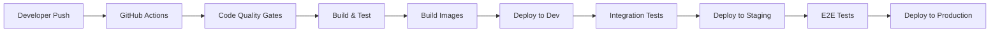

# CI/CD & Infrastructure as Code

Complete automation for building, testing, and deploying the Clarity Loop Backend to Google Cloud.

## Overview

Our CI/CD pipeline follows **modern 2025 best practices** with:

- **GitHub Actions** for CI/CD orchestration
- **Terraform** for Infrastructure as Code
- **Google Cloud Run** for serverless deployment
- **Artifact Registry** for container images
- **Cloud Build** for image building
- **Automated testing** at every stage
- **Canary deployments** for safety

## Pipeline Architecture



## Repository Structure

```
ci-cd/
├── README.md                    # This file
├── github-actions/             # GitHub Actions workflows
│   ├── ci.yml                  # Continuous Integration
│   ├── cd.yml                  # Continuous Deployment
│   └── security.yml            # Security scanning
├── terraform/                  # Infrastructure as Code
│   ├── modules/               # Reusable Terraform modules
│   ├── environments/          # Environment-specific configs
│   └── backend.tf             # Terraform state backend
├── docker/                    # Docker configurations
│   ├── api-gateway/          # API Gateway Dockerfile
│   ├── ml-service/           # ML Service Dockerfile
│   └── docker-compose.yml    # Local development
└── scripts/                   # Automation scripts
    ├── deploy.sh             # Deployment script
    ├── rollback.sh           # Rollback script
    └── health-check.sh       # Health check script
```

## Environment Strategy

### Environment Hierarchy

1. **Development** (`dev`)
   - Auto-deploys from `develop` branch
   - Uses emulators where possible
   - Minimal resource allocation
   - Short retention policies

2. **Staging** (`staging`)  
   - Auto-deploys from `main` branch
   - Production-like environment
   - Full Google Cloud services
   - Extensive E2E testing

3. **Production** (`prod`)
   - Manual approval required
   - Blue-green deployment
   - Full monitoring and alerting
   - HIPAA compliance validated

### Branch Strategy

```
main branch (protected)
├── develop branch (auto-deploy to dev)
├── feature/* branches (PR required)
└── release/* branches (staging deployment)
```

## GitHub Actions Workflows

### 1. Continuous Integration (`.github/workflows/ci.yml`)

Triggered on: Pull requests to `main` and `develop`

**Quality Gates:**

```yaml
jobs:
  code-quality:
    - ruff format --check
    - ruff check
    - mypy type checking
    - bandit security scan
    
  unit-tests:
    - pytest with coverage
    - Coverage must be > 90%
    
  integration-tests:
    - Docker Compose test environment
    - API integration tests
    - ML service validation
    
  security:
    - SAST with CodeQL
    - Dependency vulnerability scan
    - Secret scanning
```

### 2. Continuous Deployment (`.github/workflows/cd.yml`)

Triggered on: Push to `main` and `develop` branches

**Deployment Pipeline:**

```yaml
jobs:
  build:
    - Build Docker images
    - Push to Artifact Registry
    - Scan images for vulnerabilities
    
  deploy-dev:
    - Deploy to development environment
    - Run smoke tests
    - Update deployment status
    
  deploy-staging:
    - Deploy to staging (main branch only)
    - Run E2E test suite
    - Performance benchmarks
    
  deploy-production:
    - Manual approval required
    - Blue-green deployment
    - Canary traffic routing
    - Full monitoring validation
```

### 3. Security Scanning (`.github/workflows/security.yml`)

Triggered on: Schedule (daily) and security events

**Security Checks:**

- SAST (Static Application Security Testing)
- DAST (Dynamic Application Security Testing)  
- Dependency vulnerability scanning
- Infrastructure security validation
- HIPAA compliance checks

## Infrastructure as Code (Terraform)

### Module Structure

```hcl
# terraform/modules/clarity-backend/
├── main.tf                 # Main resources
├── variables.tf            # Input variables
├── outputs.tf             # Output values
├── versions.tf            # Provider versions
└── README.md              # Module documentation
```

### Core Infrastructure Modules

#### 1. Google Cloud Run Services

```hcl
module "api_gateway" {
  source = "./modules/cloud-run"
  
  service_name = "clarity-api-gateway"
  image        = var.api_gateway_image
  port         = 8000
  
  cpu_limit    = "2000m"
  memory_limit = "4Gi"
  
  min_instances = 0
  max_instances = 100
  
  environment_variables = {
    GOOGLE_CLOUD_PROJECT = var.project_id
    ENVIRONMENT         = var.environment
  }
}
```

#### 2. Pub/Sub Topics and Subscriptions

```hcl
module "messaging" {
  source = "./modules/pubsub"
  
  topics = [
    "healthkit-data-ingestion",
    "ml-processing-requests",
    "insight-generation"
  ]
  
  dead_letter_policy = {
    max_delivery_attempts = 5
    dead_letter_topic    = "dead-letter-queue"
  }
}
```

#### 3. Firestore and Storage

```hcl
module "databases" {
  source = "./modules/firestore"
  
  database_id = "clarity-${var.environment}"
  location    = var.region
  
  # Firestore indexes
  indexes = [
    {
      collection = "users"
      fields     = ["email", "created_at"]
    },
    {
      collection = "health_data"
      fields     = ["user_id", "timestamp", "data_type"]
    }
  ]
}
```

#### 4. Security and IAM

```hcl
module "security" {
  source = "./modules/iam"
  
  service_accounts = {
    api_gateway = {
      roles = [
        "roles/firestore.user",
        "roles/pubsub.publisher"
      ]
    }
    ml_service = {
      roles = [
        "roles/aiplatform.user",
        "roles/storage.objectViewer"
      ]
    }
  }
}
```

### Environment Configurations

#### Development Environment

```hcl
# terraform/environments/dev/terraform.tfvars
project_id = "clarity-loop-dev"
region     = "us-central1"

# Minimal resources for development
api_gateway_config = {
  cpu_limit      = "1000m"
  memory_limit   = "2Gi"
  min_instances  = 0
  max_instances  = 10
}

# Use emulators where possible
use_emulators = true
```

#### Production Environment  

```hcl
# terraform/environments/prod/terraform.tfvars
project_id = "clarity-loop-production"
region     = "us-central1"

# Production-grade resources
api_gateway_config = {
  cpu_limit      = "2000m"
  memory_limit   = "4Gi"
  min_instances  = 2
  max_instances  = 100
}

# Full Google Cloud services
use_emulators = false
backup_enabled = true
monitoring_enabled = true
```

## Docker Configuration

### Multi-stage Dockerfile (API Gateway)

```dockerfile
# docker/api-gateway/Dockerfile
FROM python:3.11-slim as builder

# Install uv for fast dependency management
COPY --from=ghcr.io/astral-sh/uv:latest /uv /bin/uv

# Create virtual environment
RUN uv venv /opt/venv
ENV PATH="/opt/venv/bin:$PATH"

# Install dependencies
COPY pyproject.toml uv.lock ./
RUN uv pip install --no-cache -r pyproject.toml

# Production stage
FROM python:3.11-slim as production

# Copy virtual environment
COPY --from=builder /opt/venv /opt/venv
ENV PATH="/opt/venv/bin:$PATH"

# Create non-root user
RUN groupadd -r appuser && useradd -r -g appuser appuser
USER appuser

# Copy application code
COPY --chown=appuser:appuser . /app
WORKDIR /app

# Health check
HEALTHCHECK --interval=30s --timeout=10s --start-period=5s --retries=3 \
  CMD curl -f http://localhost:8000/health || exit 1

# Run application
CMD ["uvicorn", "src.api_gateway.main:app", "--host", "0.0.0.0", "--port", "8000"]
```

### Docker Compose for Local Development

```yaml
# docker/docker-compose.yml
version: '3.8'

services:
  api-gateway:
    build:
      context: ..
      dockerfile: docker/api-gateway/Dockerfile
    ports:
      - "8000:8000"
    environment:
      - FIRESTORE_EMULATOR_HOST=firestore:8080
      - PUBSUB_EMULATOR_HOST=pubsub:8085
    depends_on:
      - firestore
      - pubsub

  ml-service:
    build:
      context: ..
      dockerfile: docker/ml-service/Dockerfile
    ports:
      - "8001:8001"
    environment:
      - VERTEX_AI_LOCATION=us-central1

  firestore:
    image: gcr.io/google.com/cloudsdktool/cloud-sdk:emulators
    command: gcloud emulators firestore start --host-port=0.0.0.0:8080
    ports:
      - "8080:8080"

  pubsub:
    image: gcr.io/google.com/cloudsdktool/cloud-sdk:emulators
    command: gcloud emulators pubsub start --host-port=0.0.0.0:8085
    ports:
      - "8085:8085"
```

## Deployment Scripts

### Deployment Script (`scripts/deploy.sh`)

```bash
#!/bin/bash
set -euo pipefail

ENVIRONMENT=${1:-dev}
IMAGE_TAG=${2:-latest}

echo "🚀 Deploying Clarity Loop Backend to ${ENVIRONMENT}"

# Build and push images
echo "📦 Building Docker images..."
docker build -t gcr.io/clarity-loop-${ENVIRONMENT}/api-gateway:${IMAGE_TAG} \
  -f docker/api-gateway/Dockerfile .

docker push gcr.io/clarity-loop-${ENVIRONMENT}/api-gateway:${IMAGE_TAG}

# Deploy infrastructure
echo "🏗️  Deploying infrastructure..."
cd terraform/environments/${ENVIRONMENT}
terraform init
terraform plan
terraform apply -auto-approve

# Deploy services
echo "🔄 Deploying services..."
gcloud run deploy clarity-api-gateway \
  --image gcr.io/clarity-loop-${ENVIRONMENT}/api-gateway:${IMAGE_TAG} \
  --platform managed \
  --region us-central1 \
  --project clarity-loop-${ENVIRONMENT}

# Health check
echo "🔍 Running health checks..."
./scripts/health-check.sh ${ENVIRONMENT}

echo "✅ Deployment complete!"
```

### Health Check Script (`scripts/health-check.sh`)

```bash
#!/bin/bash
set -euo pipefail

ENVIRONMENT=${1:-dev}
BASE_URL="https://clarity-api-gateway-${ENVIRONMENT}.a.run.app"

echo "🔍 Health checking ${ENVIRONMENT} environment..."

# Check API Gateway
echo "Checking API Gateway..."
curl -f "${BASE_URL}/health" || exit 1

# Check ML Service
echo "Checking ML Service..."
curl -f "${BASE_URL}/ml/health" || exit 1

# Check database connectivity
echo "Checking database..."
curl -f "${BASE_URL}/health/database" || exit 1

echo "✅ All health checks passed!"
```

## Release Management

### Versioning Strategy

- **Semantic Versioning**: `MAJOR.MINOR.PATCH`
- **Git Tags**: Automatically created on release
- **Release Notes**: Auto-generated from commits

### Release Process

1. **Feature Development**

   ```bash
   git checkout -b feature/new-feature
   # Develop feature
   git push origin feature/new-feature
   # Create PR to develop
   ```

2. **Release Preparation**

   ```bash
   git checkout -b release/1.2.0
   # Update version numbers
   # Update CHANGELOG.md
   git push origin release/1.2.0
   # Create PR to main
   ```

3. **Production Deployment**

   ```bash
   # Merge to main triggers staging deployment
   # Manual approval for production
   # Automatic rollback on failure
   ```

### Rollback Strategy

```bash
# Automatic rollback on health check failure
# Manual rollback command
./scripts/rollback.sh production 1.1.0

# Traffic routing rollback (instantaneous)
gcloud run services update-traffic clarity-api-gateway \
  --to-revisions=PREVIOUS=100 \
  --platform managed \
  --region us-central1
```

## Monitoring and Observability

### Deployment Metrics

- **Deployment Success Rate**: >99%
- **Deployment Duration**: <10 minutes
- **Rollback Time**: <2 minutes
- **Mean Time to Recovery**: <5 minutes

### Automated Alerts

- Deployment failures
- Health check failures  
- Performance degradation
- Security vulnerabilities

## Security Best Practices

### Secrets Management

- Google Secret Manager for production secrets
- GitHub Secrets for CI/CD credentials
- No secrets in code or Terraform files

### Image Security

- Distroless base images where possible
- Regular vulnerability scanning
- Signed container images

### Access Control

- Least privilege IAM roles
- Service account authentication
- Branch protection rules
- Required PR reviews

## Cost Optimization

### Resource Management

- Auto-scaling based on demand
- Preemptible instances for non-critical workloads
- Scheduled shutdowns for development environments

### Monitoring

- Cost alerts at 80% of budget
- Resource utilization dashboards
- Automated cleanup of unused resources

---

**Goal**: Zero-downtime deployments with full automation  
**Standard**: Deploy 10+ times per day safely  
**Recovery**: Sub-2-minute rollback capability
