# CI/CD & Infrastructure

Complete automation for building, testing, and deploying the Clarity Loop Backend to **AWS**.

## Overview

Our CI/CD pipeline follows **modern 2025 best practices** with:

- **GitHub Actions** for CI/CD orchestration
- **AWS ECS on Fargate** for serverless container deployment
- **AWS ECR** for container registry
- **AWS DynamoDB** for health data storage
- **AWS S3** for raw data storage
- **AWS Cognito** for authentication
- **Google Gemini API** for AI insights (via API calls)
- **Automated testing** at every stage

## Pipeline Architecture

```mermaid
flowchart TD
    subgraph Development ["🧑‍💻 DEVELOPMENT"]
        A[DEVELOPER PUSH<br/>Feature branch<br/>Code changes]
        B[GITHUB ACTIONS<br/>Automated triggers<br/>Pipeline start]
    end
    
    subgraph QualityGates ["🔍 QUALITY GATES"]
        C[CODE QUALITY<br/>Linting • Formatting<br/>Security scan]
        D[BUILD & TEST<br/>Unit tests<br/>Integration tests]
    end
    
    subgraph Deployment ["🚀 DEPLOYMENT"]
        E[BUILD IMAGES<br/>Docker containers<br/>ECR push]
        F[DEPLOY TO DEV<br/>Development env<br/>Smoke tests]
        G[DEPLOY TO STAGING<br/>Production-like<br/>E2E tests]
        H[DEPLOY TO PRODUCTION<br/>Manual approval<br/>Blue-green deploy]
    end
    
    A --> B
    B --> C
    C --> D
    D --> E
    E --> F
    F --> G
    G --> H
    
    classDef dev fill:#ff9900,stroke:#e65100,stroke-width:3px,color:white
    classDef quality fill:#4caf50,stroke:#1b5e20,stroke-width:3px,color:white
    classDef deploy fill:#2196f3,stroke:#0d47a1,stroke-width:3px,color:white
    
    class A,B dev
    class C,D quality
    class E,F,G,H deploy
```



## Repository Structure

```
ci-cd/
├── README.md                    # This file
├── github-actions/             # GitHub Actions workflows
│   ├── ci.yml                  # Continuous Integration
│   ├── cd.yml                  # Continuous Deployment
│   └── security.yml            # Security scanning
├── aws/                        # AWS Infrastructure
│   ├── ecs-task-definition.json  # ECS Task Definition
│   ├── cloudformation/         # CloudFormation templates
│   └── scripts/                # AWS deployment scripts
├── docker/                     # Docker configurations
│   ├── Dockerfile              # Main application Dockerfile
│   └── docker-compose.yml      # Local development
└── scripts/                    # Automation scripts
    ├── deploy.sh               # AWS deployment script
    ├── rollback.sh             # Rollback script
    └── health-check.sh         # Health check script
```

## AWS Infrastructure

### Core Services

1. **AWS ECS on Fargate**
   - Serverless container orchestration
   - Auto-scaling based on CPU/memory
   - Zero infrastructure management

2. **AWS ECR (Elastic Container Registry)**
   - Private Docker image repository
   - Vulnerability scanning
   - Image lifecycle policies

3. **AWS Application Load Balancer**
   - HTTPS termination
   - Health checks
   - Path-based routing

4. **AWS DynamoDB**
   - NoSQL database for health metrics
   - Auto-scaling read/write capacity
   - Point-in-time recovery

5. **AWS S3**
   - Raw health data storage
   - Server-side encryption
   - Lifecycle policies

6. **AWS Cognito**
   - User authentication
   - JWT token management
   - MFA support

7. **AWS SQS**
   - Message queuing for async processing
   - Dead letter queues
   - FIFO guarantees

8. **Google Gemini API**
   - AI-powered health insights
   - Natural language processing
   - Accessed via REST API calls

## Environment Strategy

### Environment Hierarchy

1. **Development** (`dev`)
   - Auto-deploys from `develop` branch
   - Uses LocalStack for AWS services
   - Minimal resource allocation
   - Short retention policies

2. **Staging** (`staging`)
   - Auto-deploys from `main` branch
   - Production-like environment
   - Full AWS services
   - Extensive E2E testing

3. **Production** (`prod`)
   - Manual approval required
   - Blue-green deployment
   - Full monitoring and alerting
   - HIPAA compliance validated

## Deployment Process

### Quick Deployment

```bash
# Deploy to production (AWS ECS)
./deploy.sh

# The script handles:
# 1. ECR login
# 2. Docker build & push
# 3. ECS task definition update
# 4. Service deployment
# 5. Health check validation
```

### Manual Deployment Steps

1. **Build and Push Docker Image**
   ```bash
   # Login to ECR
   aws ecr get-login-password --region us-east-1 | \
     docker login --username AWS --password-stdin 124355672559.dkr.ecr.us-east-1.amazonaws.com

   # Build image
   docker build -t clarity-backend:latest .

   # Tag and push
   docker tag clarity-backend:latest \
     124355672559.dkr.ecr.us-east-1.amazonaws.com/clarity-backend:latest
   
   docker push 124355672559.dkr.ecr.us-east-1.amazonaws.com/clarity-backend:latest
   ```

2. **Update ECS Service**
   ```bash
   # Register new task definition
   aws ecs register-task-definition \
     --cli-input-json file://ops/ecs-task-definition.json

   # Update service
   aws ecs update-service \
     --cluster clarity-backend-cluster \
     --service clarity-backend-service \
     --task-definition clarity-backend:latest
   ```

## Local Development

### Docker Compose Setup

```yaml
# docker-compose.yml
version: '3.8'

services:
  app:
    build: .
    ports:
      - "8000:8000"
    environment:
      - AWS_REGION=us-east-1
      - ENVIRONMENT=development
      - SKIP_EXTERNAL_SERVICES=true
    depends_on:
      - dynamodb-local
      - minio

  dynamodb-local:
    image: amazon/dynamodb-local:latest
    ports:
      - "8001:8000"
    command: "-jar DynamoDBLocal.jar -sharedDb -dbPath /data"

  minio:
    image: minio/minio:latest
    ports:
      - "9000:9000"
      - "9001:9001"
    environment:
      - MINIO_ROOT_USER=minioadmin
      - MINIO_ROOT_PASSWORD=minioadmin
    command: server /data --console-address ":9001"
```

### Running Locally

```bash
# Start all services
docker-compose up

# Run tests
make test

# Check coverage
make coverage

# Lint and format
make lint
```

## GitHub Actions Workflows

### Continuous Integration

```yaml
# .github/workflows/ci.yml
name: CI

on:
  pull_request:
    branches: [main, develop]

jobs:
  test:
    runs-on: ubuntu-latest
    steps:
      - uses: actions/checkout@v4
      
      - name: Set up Python
        uses: actions/setup-python@v4
        with:
          python-version: '3.11'
      
      - name: Install dependencies
        run: |
          pip install uv
          uv venv
          uv pip install -e ".[dev]"
      
      - name: Run tests
        run: |
          make test
          make coverage
      
      - name: Lint code
        run: make lint
```

### Continuous Deployment

```yaml
# .github/workflows/cd.yml
name: CD

on:
  push:
    branches: [main]

jobs:
  deploy:
    runs-on: ubuntu-latest
    steps:
      - uses: actions/checkout@v4
      
      - name: Configure AWS credentials
        uses: aws-actions/configure-aws-credentials@v4
        with:
          aws-access-key-id: ${{ secrets.AWS_ACCESS_KEY_ID }}
          aws-secret-access-key: ${{ secrets.AWS_SECRET_ACCESS_KEY }}
          aws-region: us-east-1
      
      - name: Deploy to AWS
        run: ./deploy.sh
```

## Monitoring and Observability

### Key Metrics

- **API Response Time**: <500ms p99
- **AI Inference Time**: <2s for health insights
- **Deployment Success Rate**: >99%
- **Uptime**: 99.9% SLA

### CloudWatch Dashboards

- API Gateway metrics
- ECS service health
- DynamoDB performance
- S3 access patterns
- Cognito authentication events

### Alerts

- API error rate > 1%
- ECS task failures
- DynamoDB throttling
- S3 access errors
- Authentication failures

## Security Best Practices

### Secrets Management

- AWS Secrets Manager for API keys (Gemini API)
- IAM roles for service authentication
- GitHub Secrets for CI/CD credentials
- No hardcoded secrets

### Network Security

- VPC with private subnets
- Security groups with minimal permissions
- AWS WAF for API protection
- TLS 1.3 everywhere

### Data Security

- Encryption at rest (S3, DynamoDB)
- Encryption in transit (TLS)
- Data sanitization for logs
- HIPAA compliance

## Cost Optimization

### Resource Management

- Fargate Spot for non-critical workloads
- DynamoDB on-demand billing
- S3 lifecycle policies
- Reserved capacity for production

### Monitoring

- AWS Cost Explorer dashboards
- Budget alerts at 80% threshold
- Resource tagging for cost allocation
- Regular cost optimization reviews

## Troubleshooting

### Common Issues

1. **ECS Task Failures**
   ```bash
   # Check task logs
   aws logs tail /ecs/clarity-backend --follow
   
   # Describe task
   aws ecs describe-tasks --cluster clarity-backend-cluster --tasks <task-arn>
   ```

2. **Database Connection Issues**
   ```bash
   # Test DynamoDB connection
   aws dynamodb list-tables --region us-east-1
   
   # Check IAM permissions
   aws iam get-role-policy --role-name clarity-backend-task-role
   ```

3. **Deployment Failures**
   ```bash
   # Check service events
   aws ecs describe-services --cluster clarity-backend-cluster --services clarity-backend-service
   
   # Manual rollback
   ./scripts/rollback.sh
   ```

---

**Goal**: Zero-downtime deployments with full AWS automation
**Standard**: Deploy safely with comprehensive testing
**Recovery**: Sub-2-minute rollback capability