# CLARITY Digital Twin Platform - System Overview

## Executive Summary

CLARITY processes Apple Health data using machine learning models to generate health insights and natural language explanations. The system combines a Pretrained Actigraphy Transformer (PAT) for temporal analysis with Google Gemini for conversational health insights.

### Core Functionality

**Input**: Apple Health exports (heart rate, sleep, activity, HRV)  
**Processing**: PAT transformer + Google Gemini AI  
**Output**: Health pattern analysis with natural language explanations

Example use case:
```
Input: 7 days of sleep and activity data
Analysis: Sleep efficiency trends, circadian rhythm analysis
Output: "Sleep efficiency decreased 15% this week due to irregular bedtimes"
```

## System Architecture

### High-Level Data Flow

```mermaid
journey
    title 🏃‍♂️ Health Data Journey: From Wearable to Insights
    section Data Collection
      Wear Device          : 5: User
      Generate Metrics     : 4: Apple Watch
      Export HealthKit     : 3: iPhone
    section Processing
      Upload to API        : 4: Client App
      Validate & Process   : 5: CLARITY
      AI Analysis          : 5: PAT + Gemini
    section Insights
      Generate Insights    : 5: CLARITY
      Deliver Results      : 4: Client App
      User Understanding   : 5: User
```



### Technical Architecture

```mermaid
graph TB
    subgraph Devices ["📱 Data Sources"]
        AW[Apple Watch<br/>⌚ Sensors]
        IP[iPhone<br/>📱 HealthKit]
        Export[HealthKit Export<br/>📋 JSON Data]
    end
    
    subgraph Gateway ["🚪 API Gateway"]
        LB[Load Balancer<br/>⚖️ AWS ALB]
        Auth[Authentication<br/>🔐 JWT + Cognito]
        Rate[Rate Limiting<br/>🚥 Request Control]
    end
    
    subgraph Backend ["🚀 FastAPI Backend"]
        API[API Controllers<br/>📡 REST Endpoints]
        Valid[Data Validation<br/>✅ Pydantic Schemas]
        Route[Request Routing<br/>🛤️ Endpoint Logic]
    end
    
    subgraph Processing ["🧠 AI/ML Pipeline"]
        Prep[Preprocessing<br/>⚙️ Data Cleaning]
        PAT[PAT Transformer<br/>🧬 Sleep Analysis]
        Gemini[Gemini AI<br/>💎 NL Generation]
        Fusion[Data Fusion<br/>🔗 Multi-modal]
    end
    
    subgraph Storage ["💾 Data Layer"]
        DDB[(DynamoDB<br/>🗄️ Health Records)]
        S3[(S3 Buckets<br/>📦 Raw Data)]
        Cache[(Redis Cache<br/>⚡ Fast Access)]
        Cognito[AWS Cognito<br/>👥 User Management]
    end
    
    subgraph Monitoring ["📊 Observability"]
        CW[CloudWatch<br/>📈 Logs & Metrics]
        Prom[Prometheus<br/>📊 Custom Metrics]
        Grafana[Grafana<br/>📉 Dashboards]
        Alerts[Alerting<br/>🚨 Incident Response]
    end
    
    subgraph Output ["🎯 Client Interface"]
        WS[WebSocket<br/>⚡ Real-time]
        REST[REST API<br/>📡 Request/Response]
        Insights[Health Insights<br/>🧠 AI Results]
    end
    
    %% Data Flow
    AW --> IP --> Export
    Export --> LB --> Auth --> Rate
    Rate --> API --> Valid --> Route
    Route --> Prep --> PAT
    Route --> Prep --> Gemini
    PAT --> Fusion
    Gemini --> Fusion
    Fusion --> DDB
    Prep --> S3
    DDB --> Cache
    Auth --> Cognito
    
    %% Monitoring Flow
    API --> CW
    Processing --> Prom
    Prom --> Grafana
    CW --> Alerts
    
    %% Output Flow
    DDB --> WS
    DDB --> REST
    REST --> Insights
    
    %% Styling - Bold colors with white text
    classDef device fill:#9c27b0,stroke:#4a148c,stroke-width:2px,color:white
    classDef gateway fill:#ff9900,stroke:#e65100,stroke-width:2px,color:white
    classDef backend fill:#2196f3,stroke:#0d47a1,stroke-width:2px,color:white
    classDef ai fill:#4caf50,stroke:#1b5e20,stroke-width:2px,color:white
    classDef storage fill:#ff5722,stroke:#bf360c,stroke-width:2px,color:white
    classDef monitor fill:#795548,stroke:#3e2723,stroke-width:2px,color:white
    classDef output fill:#607d8b,stroke:#263238,stroke-width:2px,color:white
    
    class AW,IP,Export device
    class LB,Auth,Rate gateway
    class API,Valid,Route backend
    class Prep,PAT,Gemini,Fusion ai
    class DDB,S3,Cache,Cognito storage
    class CW,Prom,Grafana,Alerts monitor
    class WS,REST,Insights output
```



## Core Components

### 1. Data Ingestion (`/healthkit/*` endpoints)
- **Purpose**: Receive and validate Apple HealthKit exports
- **Key Files**: `src/clarity/integrations/healthkit.py`, `src/clarity/api/v1/healthkit.py`
- **Data Types**: Heart rate, sleep, activity, HRV, respiratory rate, blood pressure
- **Processing**: Time-series alignment, outlier removal, normalization

### 2. PAT (Pretrained Actigraphy Transformer) 
- **Purpose**: Sleep and circadian rhythm analysis from movement data
- **Key Files**: `src/clarity/ml/pat_service.py`, `research/Pretrained-Actigraphy-Transformer/`
- **Input**: 7-day activity vectors (10,080 time points)
- **Output**: Sleep quality scores, circadian disruption detection
- **License**: CC BY-4.0 (Dartmouth College, Jacobson Lab)

### 3. Gemini AI Integration
- **Purpose**: Natural language health insight generation
- **Key Files**: `src/clarity/ml/gemini_service.py`, `src/clarity/api/v1/gemini_insights.py`
- **Capabilities**: 
  - Generate health summaries from time-series data
  - Create natural language explanations of health patterns
  - Provide contextual health recommendations
  - Process complex health data queries

### 4. Health Data Processing Pipeline
- **Purpose**: Transform raw HealthKit data into ML-ready features
- **Key Files**: `src/clarity/ml/processors/`, `src/clarity/integrations/apple_watch.py`
- **Features**:
  - **Temporal Alignment**: All data resampled to 1-minute intervals
  - **Outlier Detection**: Physiological bounds validation
  - **Signal Processing**: Butterworth filters for heart rate, median filters for respiratory rate
  - **Normalization**: Population-based z-scores using NHANES data

### 5. WebSocket Real-time Streaming
- **Purpose**: Live health data streaming and real-time communication
- **Key Files**: `src/clarity/api/v1/websocket/`
- **Use Cases**: Real-time activity monitoring, live data updates

## Data Models

### Input Data (HealthKit)
```python
{
  "heart_rate_samples": [
    {
      "timestamp": "2025-06-01T12:00:00Z",
      "value": 72,
      "unit": "bpm",
      "source": "apple_watch"
    }
  ],
  "sleep_samples": [...],
  "activity_samples": [...]
} 
```

### Processed Features (PAT Ready)
```python
{
  "actigraphy_sequence": [0.1, 0.3, 2.1, ...],  # 10,080 points
  "heart_rate_sequence": [1.2, 1.1, 1.4, ...],  # Normalized
  "sequence_length": 10080,
  "sampling_rate_minutes": 1,
  "statistics": {
    "activity_mean": 2.3,
    "zero_activity_percentage": 0.32
  }
}
```

### AI Insights Output
```python
{
  "summary": "Sleep efficiency trends show 15% decrease this week",
  "recommendations": ["Consider consistent bedtime routine"],
  "metrics": {
    "sleep_efficiency": 0.78,
    "circadian_stability": 0.65
  },
  "analysis_complete": True
}
```

## Performance Characteristics

### Scale
- **Concurrent Users**: Designed for high-throughput processing
- **Data Volume**: ~10MB per user per week (HealthKit export)
- **Processing**: Real-time for simple queries, <30s for ML analysis
- **Storage**: DynamoDB with auto-scaling

### Processing Accuracy
- **Heart Rate Processing**: Validated against clinical standards
- **Data Validation**: Multi-layer schema and physiological bounds checking
- **ML Pipeline**: Consistent preprocessing and feature extraction

### Availability
- **Infrastructure**: AWS ECS Fargate with auto-scaling
- **Health Checks**: Multi-layer monitoring (container, load balancer, application)
- **Graceful Degradation**: Core functions remain available during external service issues

## Security & Privacy

### Data Protection
- **Encryption**: AES-256 at rest, TLS 1.3 in transit
- **Access Control**: JWT tokens via AWS Cognito
- **Audit Logging**: All health data access logged
- **Data Residency**: Configurable by region

### Compliance
- **HIPAA Ready**: Infrastructure meets HIPAA technical safeguards
- **AWS Compliance**: Leverages AWS SOC 2 and other certifications
- **Data Controls**: Complete data export and deletion capabilities

### Privacy Implementation
- **Minimal Data**: Only necessary health metrics stored
- **User Control**: Granular data access and retention controls
- **Separation**: PII separated from health analytics data
- **Consent Management**: Configurable permissions for data types

## Current Status

### Production Ready
- **Tests**: 807/810 tests passing (99.6% success rate)
- **Coverage**: 57% (target: 85%)
- **API**: 44 endpoints, all core functionality operational
- **Infrastructure**: Complete AWS deployment with monitoring

### Development Focus
- **Test Coverage**: Increasing coverage to production standards
- **Performance**: Optimizing ML inference times
- **Documentation**: Comprehensive technical documentation
- **Integration**: Additional health data source support

### Roadmap
- **Enhanced ML**: Additional health pattern analysis models
- **Real-time Processing**: Improved streaming data capabilities
- **Extended Integrations**: Support for additional wearable devices
- **Research Platform**: Tools for health data research and analysis

## Getting Started

### Development Setup
```bash
git clone https://github.com/your-org/clarity-loop-backend.git
cd clarity-loop-backend
make install && make dev
```

### API Usage
1. Export Apple Health data
2. POST to `/api/v1/healthkit/upload`
3. Process data through ML pipeline
4. Retrieve insights via `/api/v1/insights/*`

### Integration
- Complete API documentation available in [API Reference](02-api-reference.md)
- WebSocket support for real-time applications
- Comprehensive error handling and status reporting

---

**Next**: Read [API Reference](02-api-reference.md) for detailed endpoint documentation 