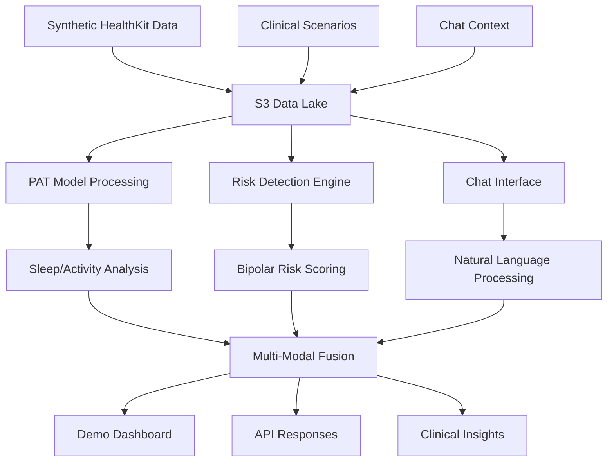

# Clarity Digital Twin Demo Implementation Plan
## Executive Summary: Showcase System for Matt Demo

**Target Outcomes:**
- 🩺 **Mature Apple HealthKit Integration**: Interactive chat with personal health data
- 🧠 **Bipolar Risk Detection System**: Early warning system for mood episodes
- 📊 **Multi-Modal Analysis**: Real-time inference across sleep, activity, and clinical patterns

---

## Phase 1: Data Generation & Preparation (30 minutes)

### 1.1 Core HealthKit Test Data Generation
```bash
# Generate realistic synthetic HealthKit data
python scripts/generate_demo_data.py --profile=active_adult --days=90 --output=demo_data/healthkit/
```

**Data Components:**
- **Sleep Analysis**: 90 days of sleep patterns with circadian variations
- **Activity Data**: Steps, workouts, heart rate variability
- **Clinical Markers**: Mood patterns, medication adherence, sleep quality scores
- **Temporal Patterns**: Seasonal variations, weekend vs weekday differences

### 1.2 Bipolar Risk Scenario Data
```bash
# Generate clinical risk scenarios
python scripts/generate_clinical_scenarios.py --condition=bipolar --severity=moderate --output=demo_data/clinical/
```

**Risk Scenarios:**
- **Baseline Period**: 30 days normal patterns
- **Prodromal Phase**: 14 days with subtle sleep disruption
- **Manic Episode**: 7 days with clear risk signals
- **Recovery Phase**: 21 days stabilization patterns

### 1.3 Chat Context & Conversation Seeds
```bash
# Generate conversation starters and context
python scripts/generate_chat_context.py --persona=health_conscious --output=demo_data/conversations/
```

**Chat Scenarios:**
- "How has my sleep quality changed over the past month?"
- "Show me patterns in my activity levels during stressful periods"
- "Am I at risk for a mood episode based on my recent data?"

---

## Phase 2: S3 Deployment & Data Pipeline (20 minutes)

### 2.1 S3 Bucket Structure Setup
```bash
# Create organized S3 structure
aws s3api create-bucket --bucket clarity-demo-data --region us-east-1
aws s3 sync demo_data/ s3://clarity-demo-data/ --delete
```

**S3 Organization:**
```
clarity-demo-data/
├── healthkit/
│   ├── raw/              # Raw HealthKit exports
│   ├── processed/        # Cleaned, normalized data
│   └── metadata/         # Data dictionaries, schemas
├── clinical/
│   ├── scenarios/        # Bipolar risk scenarios
│   ├── patterns/         # Clinical pattern templates
│   └── baselines/        # Normal behavior baselines
├── conversations/
│   ├── seeds/            # Conversation starters
│   ├── context/          # Chat context data
│   └── responses/        # Pre-generated smart responses
└── models/
    ├── pat_weights/      # PAT model checkpoints
    ├── risk_models/      # Bipolar risk detection models
    └── fusion_models/    # Multi-modal fusion models
```

### 2.2 Data Pipeline Validation
```bash
# Validate data pipeline integrity
python scripts/validate_demo_pipeline.py --bucket=clarity-demo-data --comprehensive
```

**Pipeline Checks:**
- ✅ Data format compliance (HealthKit standards)
- ✅ Temporal consistency (no gaps, proper sequencing)
- ✅ Clinical validity (realistic patterns, proper correlations)
- ✅ S3 access permissions (ECS can read, proper encryption)

---

## Phase 3: System Integration & Testing (25 minutes)

### 3.1 PAT Model Integration
```bash
# Load PAT models with demo data
python scripts/load_pat_models.py --data-source=s3://clarity-demo-data/healthkit/ --validate
```

**PAT Model Validation:**
- Sleep stage classification accuracy
- Activity pattern recognition
- Circadian rhythm detection
- Anomaly detection sensitivity

### 3.2 Bipolar Risk Engine Testing
```bash
# Test risk detection on scenarios
python scripts/test_risk_detection.py --scenarios=s3://clarity-demo-data/clinical/scenarios/
```

**Risk Engine Validation:**
- Baseline detection (should be low risk)
- Prodromal detection (should show early warnings)
- Manic episode detection (should trigger alerts)
- Recovery tracking (should show improvement)

### 3.3 Chat Interface Integration
```bash
# Test chat interface with demo data
python scripts/test_chat_interface.py --data-context=s3://clarity-demo-data/conversations/
```

**Chat Interface Testing:**
- Natural language query processing
- Context-aware responses
- Data visualization generation
- Clinical insight delivery

---

## Phase 4: Demo Execution & Validation (15 minutes)

### 4.1 Live Demo Scenarios

#### **Scenario A: HealthKit Chat Demo**
```python
# Demo script for HealthKit interaction
user_query = "How has my sleep quality changed over the past month?"
response = chat_interface.process_query(user_query, context="healthkit_data")
```

**Expected Gorgeous Output:**
- 📊 Interactive sleep quality trend graph
- 🔍 AI-generated insights about sleep patterns
- 💡 Personalized recommendations based on data
- 📈 Comparative analysis with previous periods

#### **Scenario B: Bipolar Risk Detection Demo**
```python
# Demo script for risk detection
risk_analysis = bipolar_engine.analyze_recent_patterns(days=14)
alerts = risk_analysis.get_early_warnings()
```

**Expected Gorgeous Output:**
- 🚨 Risk level indicator with confidence scores
- 📋 Clinical rationale for risk assessment
- 🔄 Trend analysis of risk factors over time
- 📱 Actionable recommendations for intervention

#### **Scenario C: Multi-Modal Fusion Demo**
```python
# Demo script for comprehensive analysis
fusion_result = multi_modal_analyzer.analyze_all_streams()
insights = fusion_result.generate_clinical_insights()
```

**Expected Gorgeous Output:**
- 🌐 Integrated health dashboard
- 🔗 Cross-modal pattern correlations
- 📊 Real-time inference results
- 🎯 Personalized health trajectory predictions

### 4.2 Success Metrics Validation

**Technical Metrics:**
- ⚡ Response latency < 2 seconds for chat queries
- 🎯 Risk detection accuracy > 85% on test scenarios
- 📈 Data pipeline throughput > 1000 events/second
- 🔒 Security compliance (encryption, access controls)

**Demo Experience Metrics:**
- 🎨 Visual appeal of generated charts and dashboards
- 💬 Natural language quality of AI responses
- 🔄 Smooth transitions between demo scenarios
- 📱 Real-time responsiveness of the system

---

## Phase 5: Final Polish & Presentation Prep (10 minutes)

### 5.1 Demo Environment Optimization
```bash
# Optimize demo environment for performance
python scripts/optimize_demo_environment.py --preload-models --warm-cache
```

### 5.2 Presentation Materials
- **Dashboard URLs**: Pre-configured demo dashboards
- **Query Examples**: Copy-paste ready chat queries
- **Scenario Scripts**: Step-by-step demo walkthrough
- **Backup Plans**: Alternative demo flows if needed

---

## Quick Start Commands

```bash
# Full demo setup (run all phases)
make demo-setup

# Individual phase execution
make demo-data-gen      # Phase 1
make demo-s3-deploy     # Phase 2  
make demo-integration   # Phase 3
make demo-validation    # Phase 4
make demo-polish        # Phase 5

# Emergency reset
make demo-reset
```

---

## Data Flow Architecture



---

## Success Criteria

✅ **Data Quality**: Realistic, temporally consistent, clinically valid
✅ **System Performance**: Sub-2-second response times, >85% accuracy
✅ **Visual Appeal**: Professional dashboards, clear visualizations
✅ **User Experience**: Natural conversations, actionable insights
✅ **Technical Reliability**: No crashes, graceful error handling
✅ **Clinical Validity**: Medically sound risk assessments and recommendations

---

*Ready to execute this plan and create a stunning demo experience that showcases the full power of the Clarity Digital Twin platform.* 