# CLARITY Digital Twin Documentation

**Research-grade health analytics platform** powered by foundation models trained on population-scale data.

Transform your Apple Health data into clinically-informed insights through cutting-edge AI.

## What Makes CLARITY Different

CLARITY isn't just another health app – it's a **research platform** built on peer-reviewed science:

### 🔬 **Foundation Model Approach**
- **PAT (Pretrained Actigraphy Transformer)**: First open-source foundation model for wearable data
- **Population Training**: 29,307 participants from NHANES 2003-2014 datasets
- **Transformer Architecture**: State-of-the-art temporal modeling for health patterns

### 📊 **Multi-Modal Intelligence**
- **Activity Analysis**: Movement patterns through population-normalized metrics
- **Sleep Intelligence**: REM/deep/light sleep staging and circadian assessment
- **Cardiovascular Monitoring**: HRV analysis and exercise response patterns
- **Respiratory Insights**: Breathing patterns and sleep-related irregularities

### 💬 **Clinical Context**
- **Natural Language Processing**: Google Gemini transforms metrics into conversations
- **Population Comparisons**: Your data vs. peer groups from national health surveys
- **Trend Analysis**: Week-over-week changes with clinical significance

## Real-World Data Pipeline

```mermaid
graph TB
    subgraph DataCollection ["📱 Data Collection"]
        A[Apple Watch<br/>Step counts, HR, Sleep<br/>HRV, Respiratory rate]
        B[HealthKit Export<br/>JSON validation<br/>Quality assessment]
    end
    
    subgraph Processing ["🧠 AI Processing"]
        C[Data Normalization<br/>NHANES population stats<br/>Z-score standardization]
        D[PAT Foundation Model<br/>7-day windows<br/>10,080 time points]
        E[Multi-Modal Fusion<br/>Cross-signal integration<br/>Holistic health state]
    end
    
    subgraph Intelligence ["💡 Intelligence Layer"]
        F[Clinical Metrics<br/>Sleep efficiency<br/>Circadian rhythm score]
        G[Natural Language<br/>Conversational insights<br/>Personalized recommendations]
        H[Risk Indicators<br/>Pattern anomalies<br/>Trend warnings]
    end
    
    A --> B --> C --> D --> E
    E --> F --> G --> H
    
    classDef collection fill:#e3f2fd,stroke:#1976d2,stroke-width:2px,color:black
    classDef processing fill:#f3e5f5,stroke:#7b1fa2,stroke-width:2px,color:black
    classDef intelligence fill:#e8f5e8,stroke:#388e3c,stroke-width:2px,color:black
    
    class A,B collection
    class C,D,E processing
    class F,G,H intelligence
```



## Documentation Structure

### 🏗️ **Architecture & System Design**
- **[01-overview.md](01-overview.md)** → System architecture, components, and data flow
- **[02-api-reference.md](02-api-reference.md)** → Complete API documentation with examples

### 🤖 **AI Models & Research** 
- **[03-ai-models.md](03-ai-models.md)** → PAT model details, training data, and performance

### 🔌 **Integrations & Data Sources**
- **[integrations/healthkit.md](integrations/healthkit.md)** → Apple HealthKit data processing
- **[integrations/gemini.md](integrations/gemini.md)** → Natural language generation

### 🚀 **Operations & Deployment**
- **[operations/deployment.md](operations/deployment.md)** → AWS ECS production deployment
- **[operations/monitoring.md](operations/monitoring.md)** → Observability and alerting

## Research Foundation

CLARITY is built on **peer-reviewed academic research**, not proprietary algorithms:

**Primary Research**: ["AI Foundation Models for Wearable Movement Data in Mental Health Research"](https://doi.org/10.48550/arXiv.2411.15240)

```mermaid
graph LR
    subgraph Research ["📚 Academic Foundation"]
        A[Dartmouth College<br/>Jacobson Lab<br/>Mental Health Research]
        B[NHANES 2003-2014<br/>29,307 participants<br/>National health survey]
        C[Actigraphy Data<br/>Movement patterns<br/>Sleep-wake cycles]
    end
    
    subgraph Model ["🧠 PAT Foundation Model"]
        D[Transformer Architecture<br/>Patch embeddings<br/>Temporal attention]
        E[Self-Supervised Learning<br/>Masked autoencoding<br/>Population patterns]
        F[Transfer Learning<br/>Fine-tuning capability<br/>Individual adaptation]
    end
    
    subgraph Application ["💡 CLARITY Platform"]
        G[Sleep Quality Analysis<br/>Circadian assessment<br/>Activity fragmentation]
        H[Population Comparisons<br/>Peer group metrics<br/>Percentile rankings]
        I[Clinical Context<br/>Health significance<br/>Actionable insights]
    end
    
    A --> B --> C --> D --> E --> F --> G --> H --> I
    
    classDef research fill:#ffecb3,stroke:#f57c00,stroke-width:2px,color:black
    classDef model fill:#e1f5fe,stroke:#0288d1,stroke-width:2px,color:black
    classDef application fill:#e8f5e8,stroke:#388e3c,stroke-width:2px,color:black
    
    class A,B,C research
    class D,E,F model
    class G,H,I application
```



### Key Research Citations

**Primary Model**:
- Ruan, F.Y., Zhang, A., Oh, J., Jin, S., & Jacobson, N.C. (2024). *AI Foundation Models for Wearable Movement Data in Mental Health Research*. arXiv:2411.15240

**Training Data**:
- NHANES (National Health and Nutrition Examination Survey) 2003-2014 cycles
- 29,307 participants with actigraphy data
- Population-representative sample of US adults

## Platform Capabilities

### **Sleep Intelligence**
- **Sleep Efficiency**: Time asleep vs. time in bed (target: >85%)
- **Sleep Onset Latency**: Time to fall asleep (normal: <15 minutes)
- **Wake After Sleep Onset**: Minutes awake during sleep (normal: <30 minutes)  
- **Sleep Stages**: REM, deep, light sleep proportions and timing
- **Circadian Rhythm**: 24-hour pattern regularity and phase alignment

### **Activity Intelligence**
- **Step Pattern Analysis**: Daily/weekly movement consistency
- **Activity Fragmentation**: Movement bout length and frequency
- **Energy Expenditure**: Active vs. passive calorie burn patterns
- **Exercise Recognition**: Workout intensity and recovery patterns

### **Cardiovascular Intelligence**
- **Heart Rate Variability**: Autonomic nervous system balance
- **Resting Heart Rate Trends**: Fitness and recovery indicators
- **Exercise Response**: Heart rate adaptation to physical activity
- **Blood Pressure Patterns**: Episodic measurements and trends

### **Natural Language Intelligence**
Transform complex metrics into conversational insights:

**Example Output**:
> *"Your sleep efficiency averaged 89% this week, which is excellent compared to your age group. The consistent 11 PM bedtime is supporting strong circadian rhythm alignment. However, your activity fragmentation score suggests more frequent movement breaks during the day could improve overall metabolic health."*

## Implementation Examples

### Data Processing Pipeline
```python
# Real implementation from the codebase
from clarity.ml.pat_service import ActigraphyInput, get_pat_service
from clarity.ml.preprocessing import HealthDataPreprocessor

# Process Apple Health data
preprocessor = HealthDataPreprocessor()
actigraphy_points = preprocessor.convert_health_metrics_to_actigraphy(health_metrics)

# PAT analysis (7-day window)
pat_service = await get_pat_service()
actigraphy_input = ActigraphyInput(
    user_id=user_id,
    data_points=actigraphy_points,
    sampling_rate=1.0,  # 1 sample per minute
    duration_hours=168   # 1 week
)

analysis = await pat_service.analyze_actigraphy(actigraphy_input)
# Returns: sleep_efficiency, circadian_score, depression_risk, etc.
```

### Multi-Modal Analysis
```python
# Fusion of multiple health signals
from clarity.ml.analysis_pipeline import HealthAnalysisPipeline

pipeline = HealthAnalysisPipeline()
results = await pipeline.process_health_data(user_id, health_metrics)

# Results include:
# - PAT activity analysis (128-dim embedding)
# - Cardiovascular features (HRV, resting HR)
# - Respiratory patterns (breathing rate, SpO2)
# - Sleep stage analysis (REM/deep/light percentages)
# - Fused health state vector
```

## Getting Started

### **For Developers**
1. **[Quick Start Guide](../README.md#quick-start)** → Set up development environment
2. **[API Documentation](02-api-reference.md)** → Integrate with CLARITY platform
3. **[Architecture Overview](01-overview.md)** → Understand system design

### **For Researchers**
1. **[AI Models Documentation](03-ai-models.md)** → PAT model specifications
2. **[Research Citations](#research-foundation)** → Academic references
3. **[Data Processing Pipeline](#real-world-data-pipeline)** → Technical implementation

### **For Operations**
1. **[Deployment Guide](operations/deployment.md)** → AWS ECS production setup
2. **[Monitoring Guide](operations/monitoring.md)** → Observability configuration
3. **[Security Guide](operations/security.md)** → HIPAA-ready infrastructure

## Important Disclaimers

⚠️ **Research Platform**: CLARITY is designed for health insights and research applications  
⚠️ **Not Medical Device**: Not FDA approved, not for medical diagnosis or treatment  
⚠️ **Educational Use**: Consult healthcare providers for medical decisions  
⚠️ **Data Privacy**: All processing follows privacy-first design principles

## Community & Support

- **GitHub Issues**: Bug reports and feature requests
- **Documentation**: Comprehensive technical specifications
- **Research Collaboration**: Open to academic partnerships
- **Model Licensing**: PAT models under CC BY-4.0 (properly attributed)

---

**Built with**: Python 3.11+, FastAPI, PyTorch, AWS, Apple HealthKit  
**Research**: Dartmouth College Jacobson Lab  
**License**: Apache 2.0 (platform), CC BY-4.0 (PAT models) 