# CLARITY Digital Twin Platform - Documentation

Technical documentation for the CLARITY health data processing backend.

## Overview

CLARITY is a FastAPI-based platform that processes Apple Health data using machine learning models to extract health patterns and generate natural language insights. The system combines a Pretrained Actigraphy Transformer (PAT) for temporal analysis with Google Gemini for conversational health explanations.

## System Architecture

```mermaid
flowchart TB
    subgraph Client ["📱 Client Layer"]
        Mobile[Mobile Apps]
        Web[Web Interface]
        SDK[SDK/Libraries]
    end
    
    subgraph API ["🚀 API Gateway Layer"]
        FastAPI[FastAPI Backend]
        Auth[Authentication]
        Valid[Validation]
        Rate[Rate Limiting]
    end
    
    subgraph Processing ["🧠 AI/ML Processing"]
        PAT[PAT Transformer<br/>Sleep Analysis]
        Gemini[Gemini AI<br/>Insights]
        Pipeline[Analysis Pipeline]
    end
    
    subgraph Storage ["💾 Data Infrastructure"]
        DDB[(DynamoDB<br/>Health Data)]
        S3[(S3<br/>Raw Files)]
        Cognito[AWS Cognito<br/>User Auth]
    end
    
    subgraph Infrastructure ["☁️ AWS Infrastructure"]
        ECS[ECS Fargate]
        ALB[Load Balancer]
        CW[CloudWatch]
        VPC[VPC/Security]
    end
    
    Client --> API
    API --> Processing
    Processing --> Storage
    Storage --> Infrastructure
    
    classDef client fill:#9c27b0,stroke:#4a148c,stroke-width:2px,color:white
    classDef api fill:#ff9900,stroke:#e65100,stroke-width:2px,color:white
    classDef ml fill:#4caf50,stroke:#1b5e20,stroke-width:2px,color:white
    classDef storage fill:#2196f3,stroke:#0d47a1,stroke-width:2px,color:white
    classDef infra fill:#ff5722,stroke:#bf360c,stroke-width:2px,color:white
    
    class Mobile,Web,SDK client
    class FastAPI,Auth,Valid,Rate api
    class PAT,Gemini,Pipeline ml
    class DDB,S3,Cognito storage
    class ECS,ALB,CW,VPC infra
```



**Core Stack**: Python 3.11+, FastAPI, AWS (DynamoDB/Cognito/ECS), PyTorch, Transformers

## Quick Navigation

### Core Documentation

```mermaid
mindmap
  root((📚 Documentation))
    🏗️ System Overview
      Architecture
      Components
      Data Flow
      Performance
    📡 API Reference
      44 Endpoints
      Authentication
      Request/Response
      Error Handling
    🧠 AI Models
      PAT Transformer
      Gemini Integration
      Performance Metrics
      Deployment
    🍎 HealthKit Integration
      Data Pipeline
      Processing
      Supported Metrics
      Troubleshooting
```



1. **[System Overview](01-overview.md)** 
   - Technical architecture and components
   - Data flow and processing pipeline
   - Performance characteristics and metrics
   - Current development status

2. **[API Reference](02-api-reference.md)**
   - Complete endpoint documentation (44 endpoints)
   - Authentication and authorization
   - Request/response schemas
   - Error handling and status codes

3. **[AI Models & Machine Learning](03-ai-models.md)**
   - PAT (Pretrained Actigraphy Transformer) details
   - Google Gemini integration
   - Model performance and validation
   - Deployment and monitoring

4. **[Apple HealthKit Integration](integrations/healthkit.md)**
   - Data processing pipeline
   - Supported metrics and data types
   - Performance benchmarks
   - Troubleshooting guide

### Key Components


- **Data Ingestion**: HealthKit JSON processing and validation
- **PAT Analysis**: 7-day temporal pattern analysis using transformers
- **Gemini Integration**: Natural language insight generation
- **Real-time API**: WebSocket support for live data streaming
- **AWS Infrastructure**: Production-ready cloud deployment

## Performance Metrics

```mermaid
xychart-beta
    title "📊 System Performance Overview"
    x-axis [Tests, Coverage, Endpoints, Uptime, Response]
    y-axis "Percentage/Count" 0 --> 100
    bar [99.6, 57, 44, 99.9, 95]
```



| Component | Status |
|-----------|--------|
| **Tests** | 807/810 passing (99.6%) |
| **Coverage** | 57% (target: 85%) |
| **API Endpoints** | 44 total, sub-second response times |
| **Infrastructure** | AWS ECS with auto-scaling |
| **AI Models** | PAT + Gemini integration operational |

## Development Setup

```bash
# Setup
git clone https://github.com/your-org/clarity-loop-backend.git
cd clarity-loop-backend
make install

# Configure
cp .env.example .env  # Add API keys

# Run
make dev
curl http://localhost:8000/health
```

## Production Deployment

```mermaid
sequenceDiagram
    participant Dev as 👨‍💻 Developer
    participant GH as 📦 GitHub
    participant CI as ⚙️ CI/CD
    participant AWS as ☁️ AWS
    participant Monitor as 📊 Monitoring
    
    Dev->>GH: Push Code
    GH->>CI: Trigger Build
    CI->>CI: Run Tests<br/>Build Images
    CI->>AWS: Deploy to ECS
    AWS->>Monitor: Health Checks
    Monitor-->>Dev: Deployment Status ✅
    
    Note over CI,AWS: Zero-downtime deployment<br/>Auto-scaling enabled
```



**AWS ECS Fargate** with:
- Auto-scaling containers
- Zero-downtime deployments
- CloudWatch monitoring
- Prometheus metrics

```bash
./deploy.sh production
aws logs tail /aws/ecs/clarity-backend --follow
```

## API Overview

**44 endpoints** across 7 areas:

```mermaid
pie title 🚀 API Endpoint Distribution
    "Authentication (7)" : 7
    "Health Data (10)" : 10
    "HealthKit (4)" : 4
    "AI Insights (6)" : 6
    "PAT Analysis (5)" : 5
    "WebSocket (3)" : 3
    "System (9)" : 9
```



- **Authentication** (7) - AWS Cognito integration
- **Health Data** (10) - CRUD operations for health metrics
- **HealthKit** (4) - Apple Health data processing
- **AI Insights** (6) - Gemini analysis and chat
- **PAT Analysis** (5) - Transformer model inference
- **WebSocket** (3) - Real-time data streaming
- **System** (9) - Health checks and monitoring

## AI Models

### PAT (Pretrained Actigraphy Transformer)

```mermaid
timeline
    title 🧠 PAT Model Pipeline
    
    section Data Input
        7-day Window    : 10,080 time points
                       : 1-minute intervals
                       : Continuous monitoring
    
    section Processing
        Preprocessing   : Outlier removal
                       : Signal normalization
                       : Temporal alignment
        
        Transformer     : Multi-head attention
                       : Positional encoding
                       : Pattern recognition
    
    section Output
        Sleep Analysis  : Quality scores
                       : Efficiency metrics
                       : Circadian patterns
```



- **Input**: 10,080-point vectors (7 days × 1-minute intervals)
- **Purpose**: Sleep and circadian rhythm analysis
- **License**: CC BY-4.0 (Dartmouth College)

### Google Gemini
- **Purpose**: Natural language health insights
- **Input**: Processed health metrics + context
- **Output**: Conversational explanations

## Security & Compliance

```mermaid
flowchart LR
    subgraph Security ["🔐 Security Layers"]
        Auth[JWT Authentication]
        Encrypt[End-to-End Encryption]
        HIPAA[HIPAA Compliance]
    end
    
    subgraph Privacy ["🛡️ Privacy Controls"]
        Control[User Data Control]
        Retention[Configurable Retention]
        Audit[Audit Logging]
    end
    
    subgraph Infrastructure ["🏗️ Infrastructure"]
        AWS[AWS Security]
        Network[Network Isolation]
        Monitor[24/7 Monitoring]
    end
    
    Auth --> Control
    Encrypt --> Retention
    HIPAA --> Audit
    
    Control --> AWS
    Retention --> Network
    Audit --> Monitor
    
    classDef security fill:#ffebee,stroke:#d32f2f
    classDef privacy fill:#e8f5e8,stroke:#388e3c
    classDef infra fill:#e3f2fd,stroke:#1976d2
    
    class Auth,Encrypt,HIPAA security
    class Control,Retention,Audit privacy
    class AWS,Network,Monitor infra
```



- **Authentication**: JWT via AWS Cognito
- **Encryption**: End-to-end for health data
- **HIPAA Ready**: AWS infrastructure with audit logging
- **Privacy**: User-controlled data retention

## Documentation Structure

### Core Platform
- [System Overview](01-overview.md) - Technical architecture
- [API Reference](02-api-reference.md) - Complete endpoint docs
- [AI Models](03-ai-models.md) - ML pipeline details

### Integrations
- [Apple HealthKit](integrations/healthkit.md) - Data integration
- [Authentication](integrations/auth.md) - AWS Cognito setup
- [WebSockets](integrations/websockets.md) - Real-time connections

### Operations
- [Deployment](operations/deployment.md) - Production setup
- [Monitoring](operations/monitoring.md) - System health
- [Security](operations/security.md) - HIPAA compliance

## Current Status

```mermaid
gitgraph
    commit id: "Initial Setup"
    commit id: "Core API (44 endpoints)"
    commit id: "AWS Migration"
    commit id: "PAT Integration"
    commit id: "Gemini AI"
    branch testing
    commit id: "807/810 Tests ✅"
    commit id: "57% Coverage"
    checkout main
    merge testing
    commit id: "Production Ready 🚀"
    branch future
    commit id: "Enhanced ML"
    commit id: "Real-time Features"
```

- **Backend**: Production-ready with comprehensive test suite
- **AWS Migration**: Complete infrastructure deployment
- **AI Integration**: PAT and Gemini models operational
- **Coverage**: Increasing from 57% to 85% target
- **Documentation**: Comprehensive technical docs

## License

Apache License 2.0. PAT models under CC BY-4.0.

---

*Updated: January 2024* 