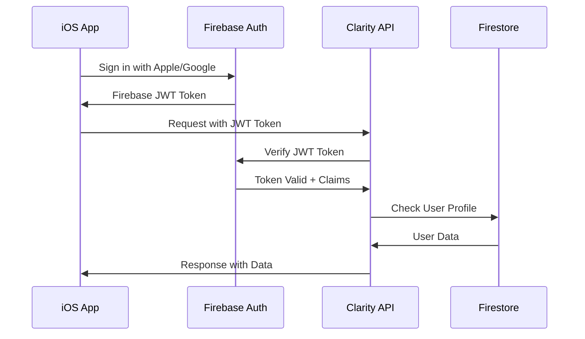

# Authentication API

This document provides comprehensive documentation for authentication endpoints and flows in the Clarity Loop Backend API.

## Overview

The authentication system is built on Firebase Authentication with custom claims for role-based access control (RBAC). All API endpoints require valid Firebase JWT tokens, except for public endpoints like health checks.

## Authentication Flow

### 1. Client Authentication


### 2. Token Lifecycle
- **Initial Token**: 1-hour expiration
- **Refresh Token**: 30-day expiration (renewable)
- **Custom Claims**: Updated on profile changes
- **Session Management**: Tracked in Firestore

## Authentication Endpoints

### Verify Token

Verify a Firebase authentication token and return user information.

#### Request
```http
POST /v1/auth/token/verify
Content-Type: application/json
Authorization: Bearer <firebase-jwt-token>
```

```json
{
  "token": "eyJhbGciOiJSUzI1NiIsImtpZCI6...",
  "include_claims": true
}
```

#### Response
```json
{
  "success": true,
  "data": {
    "user_id": "firebase_uid_12345",
    "email": "user@example.com",
    "email_verified": true,
    "display_name": "John Doe",
    "custom_claims": {
      "roles": ["patient", "premium_user"],
      "permissions": ["read:health_data", "write:health_data"],
      "subscription_tier": "premium",
      "data_retention_period": "5_years"
    },
    "token_info": {
      "issued_at": "2024-01-20T14:30:00Z",
      "expires_at": "2024-01-20T15:30:00Z",
      "issuer": "https://securetoken.google.com/clarity-loop-backend"
    }
  },
  "metadata": {
    "request_id": "req_auth_001",
    "timestamp": "2024-01-20T14:30:00Z",
    "processing_time_ms": 45
  }
}
```

#### Error Responses
```json
{
  "error": {
    "code": "INVALID_TOKEN",
    "message": "Firebase token is invalid or expired",
    "details": {
      "token_status": "expired",
      "expired_at": "2024-01-20T13:30:00Z"
    },
    "request_id": "req_auth_001"
  }
}
```

### Refresh Token

Refresh an expired or near-expiring authentication token.

#### Request
```http
POST /v1/auth/token/refresh
Content-Type: application/json
Authorization: Bearer <firebase-jwt-token>
```

```json
{
  "refresh_token": "refresh_token_string",
  "grant_type": "refresh_token"
}
```

#### Response
```json
{
  "success": true,
  "data": {
    "access_token": "new_jwt_token",
    "token_type": "Bearer",
    "expires_in": 3600,
    "refresh_token": "new_refresh_token",
    "custom_claims": {
      "roles": ["patient", "premium_user"],
      "permissions": ["read:health_data", "write:health_data"]
    }
  }
}
```

### Get User Profile

Retrieve the authenticated user's profile information.

#### Request
```http
GET /v1/auth/user/profile
Authorization: Bearer <firebase-jwt-token>
```

#### Response
```json
{
  "success": true,
  "data": {
    "user_id": "firebase_uid_12345",
    "profile": {
      "email": "user@example.com",
      "display_name": "John Doe",
      "photo_url": "https://example.com/photo.jpg",
      "date_of_birth": "1990-01-15",
      "timezone": "America/New_York",
      "preferred_units": "metric"
    },
    "authentication": {
      "provider": "apple.com",
      "last_login": "2024-01-20T14:30:00Z",
      "login_count": 45,
      "account_created": "2023-06-15T10:00:00Z"
    },
    "permissions": {
      "roles": ["patient", "premium_user"],
      "data_access": ["read:health_data", "write:health_data"],
      "subscription": {
        "tier": "premium",
        "expires": "2024-12-31T23:59:59Z",
        "features": ["advanced_insights", "data_export", "extended_retention"]
      }
    },
    "privacy_settings": {
      "data_sharing": true,
      "research_participation": false,
      "anonymous_analytics": true
    }
  }
}
```

### Logout

Invalidate the current authentication session.

#### Request
```http
DELETE /v1/auth/logout
Authorization: Bearer <firebase-jwt-token>
```

```json
{
  "revoke_all_sessions": false,
  "delete_refresh_tokens": true
}
```

#### Response
```json
{
  "success": true,
  "data": {
    "message": "Successfully logged out",
    "sessions_revoked": 1,
    "logout_timestamp": "2024-01-20T14:30:00Z"
  }
}
```

## Custom Claims Management

### Claim Structure
```json
{
  "custom_claims": {
    "roles": ["patient", "clinician", "researcher", "admin"],
    "permissions": [
      "read:health_data",
      "write:health_data",
      "read:insights",
      "export:data",
      "admin:users"
    ],
    "subscription_tier": "free|basic|premium|enterprise",
    "data_retention_period": "1_year|5_years|indefinite",
    "features": ["advanced_insights", "data_export", "api_access"],
    "organization": "clinic_id_123",
    "provider_permissions": {
      "can_view_patients": true,
      "can_edit_clinical_notes": true,
      "patient_list": ["patient_id_1", "patient_id_2"]
    }
  }
}
```

### Role Permissions Matrix

| Role | Read Health Data | Write Health Data | View Insights | Export Data | Admin Functions |
|------|------------------|-------------------|---------------|-------------|-----------------|
| **Patient** | Own data only | Own data only | Own insights | Own data | None |
| **Clinician** | Assigned patients | Clinical notes | Patient insights | Patient data | None |
| **Researcher** | Anonymized data | None | Aggregate insights | Research datasets | None |
| **Admin** | All data | System config | All insights | All data | Full access |

### Claim Validation
```python
from functools import wraps
from fastapi import HTTPException, Depends
from typing import List, Optional

def require_permissions(required_permissions: List[str]):
    """Decorator to require specific permissions for endpoint access"""
    def decorator(func):
        @wraps(func)
        async def wrapper(*args, **kwargs):
            # Get user from JWT token
            user = kwargs.get('current_user')
            if not user:
                raise HTTPException(status_code=401, detail="Authentication required")
            
            # Check if user has required permissions
            user_permissions = user.custom_claims.get('permissions', [])
            missing_permissions = set(required_permissions) - set(user_permissions)
            
            if missing_permissions:
                raise HTTPException(
                    status_code=403, 
                    detail=f"Missing permissions: {list(missing_permissions)}"
                )
            
            return await func(*args, **kwargs)
        return wrapper
    return decorator

# Usage example
@require_permissions(['read:health_data'])
async def get_health_data(user_id: str, current_user: User = Depends(get_current_user)):
    # Endpoint implementation
    pass
```

## Security Implementation

### Token Validation Process
```python
import jwt
from google.auth.transport import requests
from google.oauth2 import id_token
import asyncio

class FirebaseTokenValidator:
    def __init__(self, project_id: str):
        self.project_id = project_id
        self.audience = project_id
        self.issuer = f"https://securetoken.google.com/{project_id}"
    
    async def validate_token(self, token: str) -> dict:
        """Validate Firebase JWT token"""
        try:
            # Verify the token against Google's public keys
            decoded_token = id_token.verify_firebase_token(
                token, 
                requests.Request(),
                audience=self.audience
            )
            
            # Additional validation
            self._validate_token_claims(decoded_token)
            
            return decoded_token
            
        except ValueError as e:
            raise TokenValidationError(f"Invalid token: {str(e)}")
    
    def _validate_token_claims(self, token: dict):
        """Validate token claims"""
        # Check issuer
        if token.get('iss') != self.issuer:
            raise TokenValidationError("Invalid token issuer")
        
        # Check audience
        if token.get('aud') != self.audience:
            raise TokenValidationError("Invalid token audience")
        
        # Check expiration
        import time
        if token.get('exp', 0) < time.time():
            raise TokenValidationError("Token expired")
        
        # Check issued at time (not too old)
        if token.get('iat', 0) < time.time() - 3600:
            raise TokenValidationError("Token too old")
```

### Rate Limiting for Auth Endpoints

#### Rate Limits
- **Token Verification**: 100 requests/minute per user
- **Token Refresh**: 10 requests/minute per user
- **Profile Access**: 60 requests/minute per user
- **Logout**: 10 requests/minute per user

#### Implementation
```python
from fastapi import HTTPException
from slowapi import Limiter, _rate_limit_exceeded_handler
from slowapi.util import get_remote_address
from slowapi.errors import RateLimitExceeded

limiter = Limiter(key_func=get_remote_address)

@app.post("/v1/auth/token/verify")
@limiter.limit("100/minute")
async def verify_token(request: Request, token_data: TokenVerifyRequest):
    # Implementation
    pass

@app.post("/v1/auth/token/refresh")
@limiter.limit("10/minute")
async def refresh_token(request: Request, refresh_data: TokenRefreshRequest):
    # Implementation
    pass
```

## Error Handling

### Authentication Error Codes

| Code | HTTP Status | Description | Resolution |
|------|-------------|-------------|------------|
| `INVALID_TOKEN` | 401 | Token is malformed or invalid | Obtain new token |
| `TOKEN_EXPIRED` | 401 | Token has expired | Refresh token |
| `INSUFFICIENT_PERMISSIONS` | 403 | User lacks required permissions | Contact administrator |
| `ACCOUNT_DISABLED` | 403 | User account is disabled | Contact support |
| `TOKEN_REVOKED` | 401 | Token has been revoked | Re-authenticate |
| `RATE_LIMIT_EXCEEDED` | 429 | Too many auth requests | Wait and retry |

### Error Response Format
```json
{
  "error": {
    "code": "TOKEN_EXPIRED",
    "message": "The provided authentication token has expired",
    "details": {
      "expired_at": "2024-01-20T13:30:00Z",
      "current_time": "2024-01-20T14:30:00Z",
      "token_age_seconds": 3600
    },
    "request_id": "req_auth_001",
    "timestamp": "2024-01-20T14:30:00Z",
    "suggested_action": "refresh_token"
  }
}
```

## Client Integration Examples

### iOS Swift Integration
```swift
import FirebaseAuth
import Foundation

class ClarityAuthManager {
    private let baseURL = "https://api.clarityloop.com/v1"
    
    func verifyTokenWithAPI() async throws -> UserProfile {
        guard let user = Auth.auth().currentUser else {
            throw AuthError.notAuthenticated
        }
        
        // Get fresh Firebase token
        let idToken = try await user.getIDToken()
        
        // Verify with Clarity API
        let request = TokenVerifyRequest(
            token: idToken,
            includeClaims: true
        )
        
        let response: TokenVerifyResponse = try await apiRequest(
            endpoint: "/auth/token/verify",
            method: .POST,
            body: request,
            token: idToken
        )
        
        return response.data
    }
    
    func refreshToken() async throws -> String {
        guard let user = Auth.auth().currentUser else {
            throw AuthError.notAuthenticated
        }
        
        // Force refresh Firebase token
        let freshToken = try await user.getIDToken(forcingRefresh: true)
        
        return freshToken
    }
}
```

### Error Handling
```swift
enum AuthError: Error, LocalizedError {
    case notAuthenticated
    case tokenExpired
    case insufficientPermissions(missing: [String])
    case accountDisabled
    case networkError(underlying: Error)
    
    var errorDescription: String? {
        switch self {
        case .notAuthenticated:
            return "User is not authenticated"
        case .tokenExpired:
            return "Authentication token has expired"
        case .insufficientPermissions(let missing):
            return "Missing permissions: \(missing.joined(separator: ", "))"
        case .accountDisabled:
            return "Account has been disabled"
        case .networkError(let error):
            return "Network error: \(error.localizedDescription)"
        }
    }
}
```

## Testing Authentication

### Test Token Generation
```python
# For testing purposes only
import jwt
from datetime import datetime, timedelta

def generate_test_token(user_id: str, custom_claims: dict = None) -> str:
    """Generate test JWT token for development/testing"""
    
    now = datetime.utcnow()
    payload = {
        'iss': 'https://securetoken.google.com/test-project',
        'aud': 'test-project',
        'auth_time': int(now.timestamp()),
        'user_id': user_id,
        'sub': user_id,
        'iat': int(now.timestamp()),
        'exp': int((now + timedelta(hours=1)).timestamp()),
        'email': f"{user_id}@test.com",
        'email_verified': True,
        'firebase': {
            'identities': {
                'email': [f"{user_id}@test.com"]
            },
            'sign_in_provider': 'custom'
        }
    }
    
    if custom_claims:
        payload.update(custom_claims)
    
    # Use test secret (never use in production)
    return jwt.encode(payload, 'test-secret', algorithm='HS256')
```

### Authentication Test Cases
```python
import pytest
from httpx import AsyncClient

@pytest.mark.asyncio
async def test_verify_valid_token():
    """Test token verification with valid token"""
    token = generate_test_token("test_user_123")
    
    async with AsyncClient(app=app, base_url="http://test") as client:
        response = await client.post(
            "/v1/auth/token/verify",
            json={"token": token},
            headers={"Authorization": f"Bearer {token}"}
        )
    
    assert response.status_code == 200
    data = response.json()
    assert data["success"] is True
    assert data["data"]["user_id"] == "test_user_123"

@pytest.mark.asyncio
async def test_verify_expired_token():
    """Test token verification with expired token"""
    # Generate expired token
    expired_token = generate_expired_test_token("test_user_123")
    
    async with AsyncClient(app=app, base_url="http://test") as client:
        response = await client.post(
            "/v1/auth/token/verify",
            json={"token": expired_token},
            headers={"Authorization": f"Bearer {expired_token}"}
        )
    
    assert response.status_code == 401
    data = response.json()
    assert data["error"]["code"] == "TOKEN_EXPIRED"
```

This comprehensive authentication documentation provides all the necessary information for implementing and integrating with the Clarity Loop Backend authentication system.
