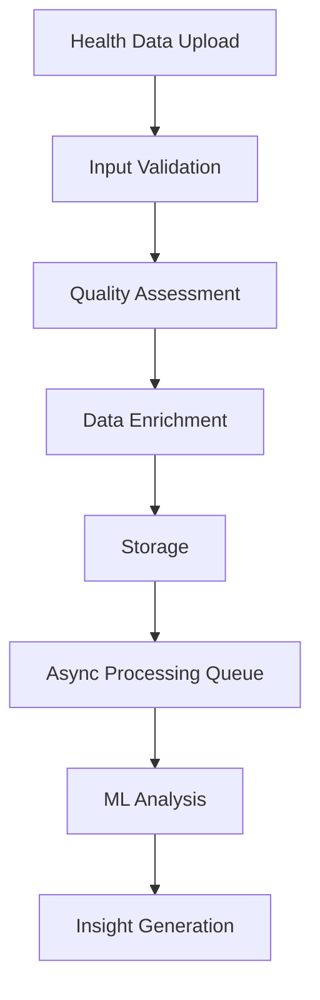

# Health Data API

This document provides comprehensive documentation for health data endpoints in the Clarity Loop Backend API.

## Overview

The Health Data API enables iOS and watchOS applications to upload, retrieve, and manage health data from HealthKit. The API is designed for high-throughput, real-time health data processing with advanced validation and quality assessment.

## Core Concepts

### Data Types Supported
- **Heart Rate**: BPM measurements with context
- **Activity**: Steps, distance, calories, workouts
- **Sleep**: Sleep stages, quality metrics, duration
- **Biometrics**: Height, weight, body composition
- **Workout Sessions**: Detailed exercise tracking
- **Health Records**: Clinical data and vitals

### Data Quality Assessment
All uploaded health data undergoes automatic quality assessment:
- **Physiological Validation**: Range checking against normal human values
- **Temporal Consistency**: Logical timestamp relationships
- **Sensor Reliability**: Data source and confidence scoring
- **Anomaly Detection**: Statistical outlier identification

### Processing Pipeline


## Health Data Endpoints

### Upload Health Data Batch

Upload a batch of health data from HealthKit for processing.

#### Request
```http
POST /v1/health/data/upload
Content-Type: application/json
Authorization: Bearer <firebase-jwt-token>
```

```json
{
  "session_info": {
    "session_id": "session_20240120_143000",
    "device_info": {
      "device_type": "apple_watch_series_9",
      "os_version": "watchOS 10.2",
      "app_version": "1.2.0"
    },
    "sync_timestamp": "2024-01-20T14:30:00Z",
    "data_source": "healthkit"
  },
  "heart_rate_data": [
    {
      "timestamp": "2024-01-20T14:30:00Z",
      "value": 72,
      "context": "active",
      "confidence": 0.95,
      "source": {
        "device": "Apple Watch",
        "sensor": "photoplethysmography"
      }
    },
    {
      "timestamp": "2024-01-20T14:31:00Z",
      "value": 75,
      "context": "active",
      "confidence": 0.93
    }
  ],
  "activity_data": [
    {
      "timestamp": "2024-01-20T14:30:00Z",
      "steps": 120,
      "distance_meters": 85.5,
      "active_energy_calories": 12.3,
      "activity_type": "walking",
      "confidence": 0.98
    }
  ],
  "sleep_data": [
    {
      "start_time": "2024-01-19T23:00:00Z",
      "end_time": "2024-01-20T07:00:00Z",
      "stages": [
        {
          "start_time": "2024-01-19T23:00:00Z",
          "end_time": "2024-01-19T23:30:00Z",
          "stage": "awake",
          "confidence": 0.92
        },
        {
          "start_time": "2024-01-19T23:30:00Z",
          "end_time": "2024-01-20T01:00:00Z",
          "stage": "light",
          "confidence": 0.88
        }
      ],
      "quality_metrics": {
        "total_sleep_time": 7.5,
        "sleep_efficiency": 0.89,
        "awakenings": 2,
        "restlessness_score": 0.15
      }
    }
  ],
  "workout_data": [
    {
      "start_time": "2024-01-20T14:00:00Z",
      "end_time": "2024-01-20T14:45:00Z",
      "workout_type": "running",
      "total_distance": 5000.0,
      "total_energy_burned": 320.5,
      "average_heart_rate": 145,
      "max_heart_rate": 165,
      "samples": [
        {
          "timestamp": "2024-01-20T14:05:00Z",
          "heart_rate": 142,
          "pace": 6.2,
          "distance": 520.0
        }
      ]
    }
  ]
}
```

#### Response (Immediate Acknowledgment)
```json
{
  "success": true,
  "data": {
    "upload_id": "upload_20240120_143000_001",
    "session_id": "session_20240120_143000",
    "status": "received",
    "processing_job_id": "job_20240120_143000_001",
    "estimated_processing_time": "30-120 seconds",
    "data_summary": {
      "heart_rate_samples": 2,
      "activity_samples": 1,
      "sleep_sessions": 1,
      "workout_sessions": 1,
      "total_data_points": 5
    },
    "quality_assessment": {
      "overall_score": 0.92,
      "issues": [],
      "warnings": [
        "Heart rate variance slightly higher than typical"
      ]
    }
  },
  "metadata": {
    "request_id": "req_health_001",
    "timestamp": "2024-01-20T14:30:00Z",
    "processing_time_ms": 180
  }
}
```

#### Validation Errors
```json
{
  "error": {
    "code": "VALIDATION_ERROR",
    "message": "Health data validation failed",
    "details": {
      "field": "heart_rate_data[0].value",
      "value": 300,
      "constraint": "Heart rate must be between 30-220 BPM",
      "data_quality_issues": [
        {
          "type": "physiological_anomaly",
          "field": "heart_rate_data[0].value",
          "message": "Heart rate value outside normal human range",
          "severity": "error"
        }
      ]
    },
    "request_id": "req_health_001"
  }
}
```

### Get Processing Status

Check the status of a health data processing job.

#### Request
```http
GET /v1/health/data/processing/{job_id}
Authorization: Bearer <firebase-jwt-token>
```

#### Response
```json
{
  "success": true,
  "data": {
    "job_id": "job_20240120_143000_001",
    "status": "completed",
    "progress": {
      "stage": "insight_generation",
      "percentage": 100,
      "current_step": "narrative_creation",
      "steps_completed": 5,
      "total_steps": 5
    },
    "timing": {
      "started_at": "2024-01-20T14:30:05Z",
      "completed_at": "2024-01-20T14:31:45Z",
      "total_processing_time": 100.5
    },
    "results": {
      "session_id": "session_20240120_143000",
      "insights_generated": true,
      "insight_id": "insight_20240120_daily",
      "data_quality_score": 0.92,
      "anomalies_detected": 0
    },
    "metrics": {
      "data_processed": {
        "heart_rate_samples": 2,
        "activity_samples": 1,
        "sleep_sessions": 1
      },
      "ml_processing": {
        "model_version": "actigraphy_v2.1",
        "inference_time": 15.3,
        "confidence_score": 0.94
      }
    }
  }
}
```

### Get Health Data Sessions

Retrieve a list of health data sessions for the authenticated user.

#### Request
```http
GET /v1/health/data/sessions?start_date=2024-01-15&end_date=2024-01-20&limit=20&offset=0
Authorization: Bearer <firebase-jwt-token>
```

#### Query Parameters
- `start_date` (optional): Filter sessions from this date (ISO 8601)
- `end_date` (optional): Filter sessions to this date (ISO 8601)
- `data_types` (optional): Comma-separated list (heart_rate,activity,sleep)
- `limit` (optional): Number of sessions to return (default: 20, max: 100)
- `offset` (optional): Pagination offset (default: 0)
- `quality_min` (optional): Minimum data quality score (0.0-1.0)

#### Response
```json
{
  "success": true,
  "data": {
    "sessions": [
      {
        "session_id": "session_20240120_143000",
        "start_time": "2024-01-20T14:30:00Z",
        "end_time": "2024-01-20T15:30:00Z",
        "data_types": ["heart_rate", "activity", "sleep"],
        "data_summary": {
          "heart_rate_samples": 60,
          "activity_samples": 12,
          "sleep_duration": 8.5
        },
        "quality_score": 0.92,
        "processing_status": "completed",
        "insights_available": true,
        "device_info": {
          "device_type": "apple_watch_series_9",
          "os_version": "watchOS 10.2"
        }
      }
    ],
    "pagination": {
      "total_sessions": 150,
      "page": 1,
      "per_page": 20,
      "total_pages": 8,
      "has_next": true,
      "next_offset": 20
    }
  }
}
```

### Get Specific Health Session

Retrieve detailed data for a specific health session.

#### Request
```http
GET /v1/health/data/session/{session_id}
Authorization: Bearer <firebase-jwt-token>
```

#### Response
```json
{
  "success": true,
  "data": {
    "session_info": {
      "session_id": "session_20240120_143000",
      "user_id": "user_12345",
      "start_time": "2024-01-20T14:30:00Z",
      "end_time": "2024-01-20T15:30:00Z",
      "data_source": "healthkit",
      "processing_status": "completed"
    },
    "heart_rate_data": {
      "samples": [
        {
          "timestamp": "2024-01-20T14:30:00Z",
          "value": 72,
          "context": "active",
          "confidence": 0.95
        }
      ],
      "statistics": {
        "min": 65,
        "max": 85,
        "average": 72.5,
        "median": 71.0,
        "standard_deviation": 4.2
      }
    },
    "activity_data": {
      "samples": [
        {
          "timestamp": "2024-01-20T14:30:00Z",
          "steps": 120,
          "distance_meters": 85.5,
          "active_energy_calories": 12.3
        }
      ],
      "totals": {
        "total_steps": 8750,
        "total_distance": 6200.5,
        "total_calories": 320.7
      }
    },
    "quality_assessment": {
      "overall_score": 0.92,
      "component_scores": {
        "heart_rate": 0.95,
        "activity": 0.88,
        "sleep": 0.93
      },
      "issues": [],
      "recommendations": [
        "Consider wearing device more consistently during sleep"
      ]
    }
  }
}
```

### Export Health Data

Export health data in various formats for user download or sharing.

#### Request
```http
POST /v1/health/data/export
Content-Type: application/json
Authorization: Bearer <firebase-jwt-token>
```

```json
{
  "export_format": "json",
  "date_range": {
    "start_date": "2024-01-01",
    "end_date": "2024-01-31"
  },
  "data_types": ["heart_rate", "activity", "sleep"],
  "include_raw_data": true,
  "include_insights": true,
  "anonymize": false,
  "compression": "gzip"
}
```

#### Response (Async Job)
```json
{
  "success": true,
  "data": {
    "export_job_id": "export_20240120_143000_001",
    "status": "queued",
    "estimated_completion": "2024-01-20T14:35:00Z",
    "export_size_estimate": "2.3 MB",
    "data_points_estimate": 15000
  }
}
```

### Delete Health Session

Delete a specific health data session and all associated data.

#### Request
```http
DELETE /v1/health/data/session/{session_id}
Authorization: Bearer <firebase-jwt-token>
```

```json
{
  "confirm_deletion": true,
  "reason": "user_request",
  "delete_insights": true
}
```

#### Response
```json
{
  "success": true,
  "data": {
    "session_id": "session_20240120_143000",
    "deletion_timestamp": "2024-01-20T14:30:00Z",
    "items_deleted": {
      "health_data_points": 150,
      "insights": 3,
      "ml_artifacts": 5
    },
    "audit_log_id": "audit_deletion_001"
  }
}
```

## Data Validation Rules

### Heart Rate Validation
```python
from pydantic import BaseModel, validator
from typing import Optional, List
from datetime import datetime

class HeartRateData(BaseModel):
    timestamp: datetime
    value: int
    context: Optional[str] = None
    confidence: float
    
    @validator('value')
    def validate_heart_rate(cls, v):
        if v < 30 or v > 220:
            raise ValueError('Heart rate must be between 30-220 BPM')
        return v
    
    @validator('confidence')
    def validate_confidence(cls, v):
        if v < 0.0 or v > 1.0:
            raise ValueError('Confidence must be between 0.0 and 1.0')
        return v
    
    @validator('context')
    def validate_context(cls, v):
        if v and v not in ['resting', 'active', 'exercise', 'recovery']:
            raise ValueError('Invalid heart rate context')
        return v
```

### Activity Data Validation
```python
class ActivityData(BaseModel):
    timestamp: datetime
    steps: Optional[int] = None
    distance_meters: Optional[float] = None
    active_energy_calories: Optional[float] = None
    activity_type: Optional[str] = None
    
    @validator('steps')
    def validate_steps(cls, v):
        if v is not None and (v < 0 or v > 1000):  # Per minute
            raise ValueError('Steps per minute must be between 0-1000')
        return v
    
    @validator('distance_meters')
    def validate_distance(cls, v):
        if v is not None and (v < 0 or v > 5000):  # Per minute
            raise ValueError('Distance per minute must be between 0-5000 meters')
        return v
    
    @validator('active_energy_calories')
    def validate_calories(cls, v):
        if v is not None and (v < 0 or v > 50):  # Per minute
            raise ValueError('Calories per minute must be between 0-50')
        return v
```

### Sleep Data Validation
```python
class SleepStage(BaseModel):
    start_time: datetime
    end_time: datetime
    stage: str
    confidence: float
    
    @validator('stage')
    def validate_stage(cls, v):
        valid_stages = {'awake', 'light', 'deep', 'rem'}
        if v not in valid_stages:
            raise ValueError(f'Sleep stage must be one of: {valid_stages}')
        return v
    
    @validator('end_time')
    def validate_duration(cls, v, values):
        if 'start_time' in values:
            duration = v - values['start_time']
            if duration.total_seconds() < 60:  # Minimum 1 minute
                raise ValueError('Sleep stage duration must be at least 1 minute')
            if duration.total_seconds() > 14400:  # Maximum 4 hours
                raise ValueError('Sleep stage duration cannot exceed 4 hours')
        return v
```

## Data Quality Assessment

### Quality Scoring Algorithm
```python
class DataQualityAssessor:
    """Assess health data quality using multiple criteria"""
    
    def assess_heart_rate_quality(self, heart_rate_data: List[HeartRateData]) -> float:
        """Assess heart rate data quality"""
        if not heart_rate_data:
            return 0.0
        
        quality_factors = []
        
        # 1. Value consistency
        values = [hr.value for hr in heart_rate_data]
        variance = np.var(values)
        consistency_score = max(0, 1 - (variance / 1000))  # Normalize variance
        quality_factors.append(consistency_score * 0.3)
        
        # 2. Temporal consistency
        timestamps = [hr.timestamp for hr in heart_rate_data]
        time_gaps = [(timestamps[i+1] - timestamps[i]).total_seconds() 
                    for i in range(len(timestamps)-1)]
        avg_gap = np.mean(time_gaps)
        temporal_score = 1.0 if avg_gap <= 60 else max(0, 1 - (avg_gap - 60) / 240)
        quality_factors.append(temporal_score * 0.2)
        
        # 3. Confidence scores
        confidence_score = np.mean([hr.confidence for hr in heart_rate_data])
        quality_factors.append(confidence_score * 0.3)
        
        # 4. Physiological plausibility
        plausibility_score = self._assess_physiological_plausibility(values)
        quality_factors.append(plausibility_score * 0.2)
        
        return sum(quality_factors)
    
    def _assess_physiological_plausibility(self, values: List[int]) -> float:
        """Check if heart rate patterns are physiologically plausible"""
        if len(values) < 2:
            return 1.0
        
        # Check for impossible rapid changes
        max_change = max(abs(values[i] - values[i-1]) for i in range(1, len(values)))
        if max_change > 50:  # >50 BPM change per minute is unlikely
            return 0.5
        
        # Check for sustained extreme values
        extreme_count = sum(1 for v in values if v < 40 or v > 180)
        extreme_ratio = extreme_count / len(values)
        if extreme_ratio > 0.3:
            return 0.6
        
        return 1.0
```

### Quality Issues Detection
```python
class QualityIssueDetector:
    """Detect and classify data quality issues"""
    
    def detect_issues(self, health_data: dict) -> List[dict]:
        """Detect quality issues in health data"""
        issues = []
        
        # Heart rate issues
        if 'heart_rate_data' in health_data:
            hr_issues = self._detect_heart_rate_issues(health_data['heart_rate_data'])
            issues.extend(hr_issues)
        
        # Activity issues
        if 'activity_data' in health_data:
            activity_issues = self._detect_activity_issues(health_data['activity_data'])
            issues.extend(activity_issues)
        
        return issues
    
    def _detect_heart_rate_issues(self, hr_data: List[dict]) -> List[dict]:
        """Detect heart rate specific issues"""
        issues = []
        
        for i, hr in enumerate(hr_data):
            # Extreme values
            if hr['value'] < 35 or hr['value'] > 200:
                issues.append({
                    'type': 'extreme_value',
                    'severity': 'warning',
                    'field': f'heart_rate_data[{i}].value',
                    'value': hr['value'],
                    'message': 'Heart rate value is outside typical range'
                })
            
            # Low confidence
            if hr['confidence'] < 0.7:
                issues.append({
                    'type': 'low_confidence',
                    'severity': 'info',
                    'field': f'heart_rate_data[{i}].confidence',
                    'value': hr['confidence'],
                    'message': 'Low confidence measurement'
                })
        
        return issues
```

## Binary Label Derivation for Test Fixtures (PAT Research-Based)

When creating synthetic test data or fixtures, apply these binary classification rules derived from PAT research (pp 23-25):

#### Depression Classification
- **Rule**: PHQ-9 score ≥ 10
- **Implementation**: Sum all PHQ-9 questionnaire responses; label as depression if total ≥ 10
- **Test fixture usage**: Generate synthetic users with known PHQ-9 scores to validate depression detection

#### Sleep Abnormality Classification  
- **Rule**: Daily sleep duration > 12 hours OR < 5 hours
- **Implementation**: Calculate average daily sleep from HealthKit sleep analysis data
- **Test fixture usage**: Create sleep data with various durations to test abnormality detection

#### Sleep Disorder Classification
- **Rule**: Self-reported sleep disorder diagnosis flag in health records
- **Implementation**: Check user health profile for sleep disorder diagnosis boolean
- **Test fixture usage**: Generate user profiles with known sleep disorder status

#### Implementation Example
```python
def create_test_fixtures_with_labels():
    """Create synthetic test data with known ground truth labels"""
    
    # Depression test case
    depression_user = {
        "phq9_responses": [2, 2, 3, 1, 2, 1, 1, 1, 1],  # Sum = 14 ≥ 10 → Depression
        "expected_label": {"depression": True}
    }
    
    # Sleep abnormality test case  
    sleep_abnormal_user = {
        "daily_sleep_hours": [3.5, 4.0, 3.8, 4.2],  # All < 5h → Sleep abnormality
        "expected_label": {"sleep_abnormality": True}
    }
    
    # Normal control case
    healthy_user = {
        "phq9_responses": [0, 1, 0, 0, 1, 0, 0, 0, 1],  # Sum = 3 < 10 → No depression
        "daily_sleep_hours": [7.5, 8.0, 7.8, 8.2],     # 5h ≤ sleep ≤ 12h → Normal
        "expected_label": {"depression": False, "sleep_abnormality": False}
    }
    
    return [depression_user, sleep_abnormal_user, healthy_user]
```

## Rate Limiting and Quotas

### Upload Rate Limits
- **Individual Uploads**: 100 per hour per user
- **Batch Size**: Maximum 1000 data points per upload
- **Total Data**: 10MB per hour per user
- **Concurrent Uploads**: 5 simultaneous uploads per user

### Query Rate Limits
- **Session Queries**: 300 per hour per user
- **Export Requests**: 10 per day per user
- **Status Checks**: 1000 per hour per user

## Error Handling

### Common Error Scenarios

#### Data Validation Errors
```json
{
  "error": {
    "code": "DATA_VALIDATION_ERROR",
    "message": "Health data contains validation errors",
    "details": {
      "validation_errors": [
        {
          "field": "heart_rate_data[0].value",
          "error": "Value must be between 30-220",
          "provided_value": 300
        }
      ],
      "quality_issues": [
        {
          "type": "physiological_anomaly",
          "field": "heart_rate_data[0].value",
          "message": "Heart rate value outside normal human range",
          "severity": "error"
        }
      ]
    }
  }
}
```

#### Processing Errors
```json
{
  "error": {
    "code": "PROCESSING_ERROR",
    "message": "Health data processing failed",
    "details": {
      "job_id": "job_20240120_143000_001",
      "stage": "ml_analysis",
      "error_type": "model_inference_error",
      "retry_available": true,
      "estimated_retry_time": "2024-01-20T14:35:00Z"
    }
  }
}
```

This comprehensive health data API documentation provides all the necessary information for implementing robust health data upload, processing, and retrieval functionality.
