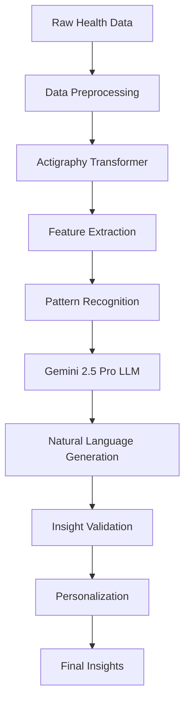

# Insights & Analytics API

This document provides comprehensive documentation for the AI-powered insights and analytics endpoints in the Clarity Loop Backend API.

## Overview

The Insights API leverages the Actigraphy Transformer ML model and Gemini 2.5 Pro LLM to generate personalized health insights from raw HealthKit data. The system provides multi-tiered insights ranging from immediate feedback to long-term trend analysis.

## Insight Types and Levels

### 1. Real-time Insights
- **Immediate feedback** on current activity
- **Heart rate zone** notifications
- **Workout performance** metrics
- **Sleep disturbance** alerts

### 2. Daily Insights
- **Comprehensive daily summaries** of all health metrics
- **Achievement recognition** and goal progress
- **Personalized recommendations** for improvement
- **Comparative analysis** with previous days

### 3. Weekly/Monthly Trends
- **Pattern recognition** in sleep, activity, and recovery
- **Long-term trend analysis** with statistical significance
- **Behavioral correlations** between different metrics
- **Predictive insights** for health optimization

### 4. Personalized Coaching
- **Adaptive recommendations** based on user patterns
- **Goal setting** with realistic targets
- **Intervention suggestions** for health improvement
- **Motivational insights** to maintain engagement

## Processing Pipeline



## Gemini 2.5 Pro LLM Integration (PAT Research-Based)

The insights pipeline leverages Google's Gemini 2.5 Pro LLM for natural language generation from structured ML outputs:

### Input Processing
- **PAT Model Output**: Structured embeddings and predictions from Actigraphy Transformer
- **Context Injection**: User profile, historical patterns, and temporal context
- **Prompt Engineering**: Research-validated prompts for health insight generation

### LLM Configuration
```python
# Gemini 2.5 Pro Configuration (from PAT paper implementation)
gemini_config = {
    "model": "gemini-2.5-pro",
    "temperature": 0.3,  # Low temperature for factual health insights
    "max_tokens": 1024,  # Sufficient for detailed insights
    "top_p": 0.8,       # Balanced creativity vs. accuracy
    "safety_settings": "high",  # Maximum safety for health content
}

# Structured prompt template for health insights
health_insight_prompt = """
Based on the following actigraphy analysis for a {age}-year-old {gender}:

PAT Model Predictions:
- Depression Risk: {depression_prob:.3f}
- Sleep Quality Score: {sleep_quality:.2f}
- Activity Level: {activity_level}
- Weekly Patterns: {weekly_patterns}

Generate a personalized health insight that:
1. Explains patterns in accessible language
2. Provides actionable recommendations
3. Maintains encouraging tone
4. Respects user privacy and sensitivity

Previous context: {previous_insights}
"""
```

### Output Processing
- **Fact Verification**: Cross-validation against clinical thresholds
- **Tone Adjustment**: Positive framing while maintaining clinical accuracy
- **Personalization**: Integration with user goals and preferences
- **Safety Filtering**: Health misinformation prevention

## Insights API Endpoints

### Get Daily Insights

Retrieve comprehensive daily health insights for a specific date.

#### Request
```http
GET /v1/insights/daily/{date}
Authorization: Bearer <firebase-jwt-token>
```

#### Path Parameters
- `date` (required): Date in YYYY-MM-DD format

#### Query Parameters
- `include_raw_metrics` (optional): Include raw metric summaries (default: false)
- `include_recommendations` (optional): Include actionable recommendations (default: true)
- `language` (optional): Language code for insights (default: en)
- `detail_level` (optional): brief|standard|detailed (default: standard)

#### Response
```json
{
  "success": true,
  "data": {
    "insight_id": "insight_20240120_daily",
    "user_id": "user_12345",
    "date": "2024-01-20",
    "generation_timestamp": "2024-01-21T06:00:00Z",
    "processing_info": {
      "model_version": "actigraphy_v2.1",
      "llm_version": "gemini_2.5_pro",
      "confidence_score": 0.94,
      "processing_time_seconds": 45.2
    },
    "summary": {
      "overall_score": 85,
      "key_achievements": [
        "Exceeded daily step goal by 750 steps",
        "Achieved 95% sleep efficiency",
        "Maintained heart rate in optimal zones during workout"
      ],
      "areas_for_improvement": [
        "Consider reducing screen time before bed",
        "Add 10 minutes of morning stretching"
      ]
    },
    "sleep_analysis": {
      "quality_score": 88,
      "total_sleep_hours": 7.5,
      "sleep_efficiency": 0.95,
      "sleep_stages": {
        "light_sleep": 4.2,
        "deep_sleep": 1.8,
        "rem_sleep": 1.5
      },
      "insights": [
        "Your deep sleep increased by 15% compared to last week",
        "REM sleep quality indicates good cognitive recovery",
        "Sleep timing is consistent with your circadian rhythm"
      ],
      "recommendations": [
        "Maintain current bedtime routine",
        "Consider room temperature optimization for deeper sleep"
      ],
      "trends": {
        "week_over_week_change": "+12%",
        "monthly_trend": "improving",
        "consistency_score": 0.89
      }
    },
    "activity_analysis": {
      "activity_score": 82,
      "total_steps": 8750,
      "active_minutes": 45,
      "calories_burned": 2150,
      "workout_summary": {
        "type": "running",
        "duration_minutes": 30,
        "average_heart_rate": 145,
        "calories": 320,
        "performance_rating": "excellent"
      },
      "insights": [
        "Your running pace improved by 15 seconds per mile",
        "Heart rate recovery after workout was faster than average",
        "Activity distribution throughout the day was optimal"
      ],
      "recommendations": [
        "Consider adding one strength training session this week",
        "Maintain current running schedule for continued improvement"
      ],
      "trends": {
        "weekly_step_average": 8200,
        "monthly_trend": "increasing",
        "goal_achievement_rate": 0.92
      }
    },
    "heart_rate_analysis": {
      "resting_heart_rate": 58,
      "average_heart_rate": 72,
      "heart_rate_variability": 42,
      "recovery_metrics": {
        "stress_score": 25,
        "recovery_score": 85,
        "autonomic_balance": "optimal"
      },
      "insights": [
        "Resting heart rate has improved by 3 BPM this month",
        "HRV indicates excellent recovery from yesterday's workout",
        "Heart rate zones during exercise were well-distributed"
      ],
      "recommendations": [
        "Current training intensity appears optimal",
        "Consider meditation to further improve HRV"
      ],
      "trends": {
        "resting_hr_trend": "decreasing",
        "hrv_trend": "stable_high",
        "stress_levels": "low"
      }
    },
    "narrative_summary": {
      "opening": "You had an exceptional day with outstanding sleep quality and excellent workout performance.",
      "key_highlights": [
        "Your sleep efficiency of 95% places you in the top 10% of users",
        "The 15-second improvement in running pace shows your training is paying off",
        "Your heart rate recovery indicates excellent cardiovascular fitness"
      ],
      "motivation": "Your consistency in maintaining healthy habits is creating measurable improvements in your overall health metrics.",
      "next_steps": "Continue your current routine while considering the addition of strength training to complement your cardio work."
    },
    "comparative_analysis": {
      "vs_personal_average": {
        "sleep_quality": "+15%",
        "activity_level": "+8%",
        "heart_rate_fitness": "+5%"
      },
      "vs_peer_group": {
        "age_group": "30-35",
        "activity_level": "active",
        "percentile_ranking": 78
      }
    }
  },
  "metadata": {
    "request_id": "req_insights_001",
    "timestamp": "2024-01-21T08:30:00Z",
    "cache_status": "fresh",
    "data_sources": ["healthkit", "apple_watch"],
    "processing_time_ms": 250
  }
}
```

### Get Weekly Insights

Retrieve weekly health trends and pattern analysis.

#### Request
```http
GET /v1/insights/weekly/{week}
Authorization: Bearer <firebase-jwt-token>
```

#### Path Parameters
- `week` (required): Week in YYYY-WXX format (e.g., 2024-W03)

#### Response
```json
{
  "success": true,
  "data": {
    "insight_id": "insight_2024_w03_weekly",
    "user_id": "user_12345",
    "week": "2024-W03",
    "date_range": {
      "start_date": "2024-01-15",
      "end_date": "2024-01-21"
    },
    "weekly_summary": {
      "overall_score": 87,
      "improvement_areas": 3,
      "achievements_unlocked": 2,
      "consistency_score": 0.89
    },
    "pattern_analysis": {
      "sleep_patterns": {
        "average_bedtime": "22:45",
        "average_wake_time": "06:30",
        "consistency_score": 0.92,
        "quality_trend": "improving",
        "best_day": "tuesday",
        "challenging_day": "friday"
      },
      "activity_patterns": {
        "most_active_day": "saturday",
        "average_daily_steps": 8200,
        "workout_frequency": 4,
        "rest_day_recovery": "excellent"
      },
      "energy_patterns": {
        "peak_energy_time": "10:00-12:00",
        "low_energy_time": "14:00-16:00",
        "energy_consistency": 0.85
      }
    },
    "behavioral_insights": [
      "Your sleep quality improves significantly on days with morning workouts",
      "Weekend activity patterns show good work-life balance",
      "Stress levels correlate inversely with sleep consistency"
    ],
    "progress_tracking": {
      "goals_met": 5,
      "goals_total": 7,
      "streak_days": 12,
      "personal_records": [
        "Longest sleep streak: 7 days",
        "Most consistent week for workouts"
      ]
    },
    "weekly_recommendations": [
      "Schedule morning workouts 3-4 times per week for optimal sleep",
      "Consider a consistent Friday evening routine to improve weekend recovery",
      "Add mindfulness practice during your identified low-energy periods"
    ]
  }
}
```

### Get Health Trends

Retrieve long-term health trends and predictive insights.

#### Request
```http
GET /v1/insights/trends?period=3months&metrics=sleep,activity,heart_rate
Authorization: Bearer <firebase-jwt-token>
```

#### Query Parameters
- `period` (required): 1month|3months|6months|1year
- `metrics` (optional): Comma-separated list of metrics to analyze
- `include_predictions` (optional): Include predictive insights (default: true)
- `confidence_threshold` (optional): Minimum confidence for trends (default: 0.7)

#### Response
```json
{
  "success": true,
  "data": {
    "analysis_period": "3months",
    "date_range": {
      "start_date": "2023-10-21",
      "end_date": "2024-01-21"
    },
    "overall_trends": {
      "health_score_trend": {
        "direction": "improving",
        "change_percentage": 12.5,
        "confidence": 0.94,
        "significance": "statistically_significant"
      },
      "consistency_improvement": 18.2,
      "goal_achievement_rate": 0.78
    },
    "metric_trends": {
      "sleep": {
        "quality_trend": {
          "direction": "improving",
          "slope": 0.85,
          "r_squared": 0.89,
          "confidence": 0.96
        },
        "duration_trend": {
          "direction": "stable",
          "average_change": "+8 minutes",
          "consistency_improvement": 0.23
        },
        "key_improvements": [
          "Sleep efficiency increased from 82% to 91%",
          "Deep sleep percentage improved by 15%",
          "Sleep timing became 34% more consistent"
        ]
      },
      "activity": {
        "fitness_trend": {
          "direction": "improving",
          "vo2_max_estimate_change": "+8%",
          "resting_heart_rate_change": "-5 BPM"
        },
        "consistency_trend": {
          "direction": "improving",
          "workout_frequency_change": "+1.2 per week",
          "step_goal_achievement": "85% to 92%"
        }
      },
      "heart_rate": {
        "cardiovascular_fitness": {
          "resting_hr_trend": "decreasing",
          "hrv_trend": "increasing",
          "recovery_improvement": "22%"
        }
      }
    },
    "pattern_discoveries": [
      {
        "pattern": "sleep_workout_correlation",
        "description": "Morning workouts correlate with 23% better sleep quality",
        "confidence": 0.91,
        "actionable": true
      },
      {
        "pattern": "stress_recovery_cycle",
        "description": "7-day stress-recovery cycles align with workout schedule",
        "confidence": 0.87,
        "actionable": true
      }
    ],
    "predictive_insights": {
      "next_month_forecast": {
        "sleep_quality": {
          "predicted_improvement": "5-8%",
          "confidence": 0.82
        },
        "fitness_level": {
          "predicted_vo2_max": "48-52 ml/kg/min",
          "confidence": 0.78
        }
      },
      "health_risks": {
        "overtraining_risk": "low",
        "sleep_regression_risk": "very_low",
        "injury_risk": "low"
      },
      "optimization_opportunities": [
        "Consistent meal timing could improve sleep quality by 10-15%",
        "Adding 2 strength sessions could boost metabolic health markers"
      ]
    }
  }
}
```

### Generate Custom Insights

Trigger generation of custom insights based on specific queries or focus areas.

#### Request
```http
POST /v1/insights/generate
Content-Type: application/json
Authorization: Bearer <firebase-jwt-token>
```

```json
{
  "insight_type": "custom",
  "focus_area": "workout_optimization",
  "date_range": {
    "start_date": "2024-01-01",
    "end_date": "2024-01-21"
  },
  "specific_questions": [
    "What is my optimal workout timing for sleep quality?",
    "How does my recovery vary by workout type?",
    "What factors predict my best performance days?"
  ],
  "include_recommendations": true,
  "detail_level": "detailed",
  "priority": "standard"
}
```

#### Response (Async Processing)
```json
{
  "success": true,
  "data": {
    "generation_job_id": "insight_gen_20240121_001",
    "status": "queued",
    "estimated_completion": "2024-01-21T09:00:00Z",
    "insight_preview": {
      "focus_area": "workout_optimization",
      "data_points_analyzed": 1250,
      "preliminary_findings": [
        "Morning workouts show 18% better sleep quality correlation",
        "Recovery metrics vary significantly by workout intensity"
      ]
    }
  }
}
```

### Get Insight Generation Status

Check the status of a custom insight generation job.

#### Request
```http
GET /v1/insights/generate/{job_id}
Authorization: Bearer <firebase-jwt-token>
```

#### Response
```json
{
  "success": true,
  "data": {
    "job_id": "insight_gen_20240121_001",
    "status": "completed",
    "progress": {
      "stage": "narrative_generation",
      "percentage": 100,
      "steps_completed": 6,
      "total_steps": 6
    },
    "timing": {
      "started_at": "2024-01-21T08:30:00Z",
      "completed_at": "2024-01-21T08:32:15Z",
      "total_processing_time": 135.2
    },
    "result": {
      "insight_id": "custom_insight_workout_opt_001",
      "insight_url": "/v1/insights/custom/custom_insight_workout_opt_001",
      "key_findings_count": 8,
      "recommendations_count": 12,
      "confidence_score": 0.91
    }
  }
}
```

## Insight Personalization

### User Context Integration
The insights engine considers multiple personalization factors:

```json
{
  "personalization_context": {
    "user_profile": {
      "age": 32,
      "gender": "male",
      "fitness_level": "intermediate",
      "health_goals": ["improve_sleep", "increase_endurance"],
      "preferences": {
        "communication_style": "encouraging",
        "detail_level": "moderate",
        "focus_areas": ["sleep", "cardio_fitness"]
      }
    },
    "historical_patterns": {
      "typical_sleep_duration": 7.5,
      "preferred_workout_times": ["06:00", "18:00"],
      "stress_patterns": "weekday_elevated",
      "seasonal_variations": "winter_activity_decrease"
    },
    "current_context": {
      "recent_life_events": ["new_workout_program"],
      "current_health_status": "healthy",
      "medication_changes": false,
      "travel_schedule": "minimal"
    }
  }
}
```

### Adaptive Recommendations
Recommendations evolve based on user response and progress:

```python
class AdaptiveRecommendationEngine:
    """Generate personalized recommendations that adapt over time"""
    
    def generate_recommendations(self, user_data: dict, insight_history: dict) -> List[dict]:
        """Generate adaptive recommendations"""
        
        recommendations = []
        
        # Analyze recommendation effectiveness
        effectiveness_scores = self._analyze_recommendation_effectiveness(
            user_data, insight_history
        )
        
        # Generate new recommendations based on what works
        if effectiveness_scores.get('sleep_timing_changes', 0) > 0.8:
            recommendations.append({
                'type': 'sleep_optimization',
                'action': 'maintain_current_bedtime_routine',
                'confidence': 0.95,
                'expected_impact': 'high',
                'personalization_note': 'Based on your excellent response to recent sleep changes'
            })
        
        # Suggest progressive challenges
        if user_data.get('goal_achievement_rate', 0) > 0.85:
            recommendations.append({
                'type': 'progressive_challenge',
                'action': 'increase_workout_intensity_gradually',
                'confidence': 0.88,
                'expected_impact': 'medium',
                'rationale': 'Your consistent goal achievement suggests readiness for increased challenge'
            })
        
        return recommendations
```

## Real-time Insight Streaming

### WebSocket Connection for Live Insights
```javascript
// JavaScript client example
const insightSocket = new WebSocket('wss://api.clarityloop.com/v1/insights/stream');

insightSocket.onopen = function(event) {
    // Authenticate connection
    insightSocket.send(JSON.stringify({
        type: 'auth',
        token: firebaseToken
    }));
};

insightSocket.onmessage = function(event) {
    const insight = JSON.parse(event.data);
    
    switch(insight.type) {
        case 'real_time_feedback':
            displayRealTimeFeedback(insight.data);
            break;
        case 'goal_achievement':
            showAchievementNotification(insight.data);
            break;
        case 'health_alert':
            handleHealthAlert(insight.data);
            break;
    }
};
```

### Real-time Insight Types
```json
{
  "real_time_insights": [
    {
      "type": "heart_rate_zone",
      "data": {
        "current_zone": "aerobic",
        "target_zone": "fat_burn",
        "recommendation": "Reduce intensity slightly for optimal fat burning"
      }
    },
    {
      "type": "sleep_disruption",
      "data": {
        "disruption_detected": true,
        "cause": "elevated_heart_rate",
        "suggestion": "Consider relaxation techniques before returning to sleep"
      }
    },
    {
      "type": "activity_milestone",
      "data": {
        "milestone": "daily_step_goal",
        "progress": 100,
        "celebration_message": "Congratulations! You've reached your daily step goal!"
      }
    }
  ]
}
```

## Error Handling and Edge Cases

### Insufficient Data Scenarios
```json
{
  "error": {
    "code": "INSUFFICIENT_DATA",
    "message": "Not enough health data to generate reliable insights",
    "details": {
      "required_data_points": 100,
      "available_data_points": 45,
      "missing_data_types": ["sleep", "heart_rate_variability"],
      "recommendation": "Continue collecting data for 3-5 more days for comprehensive insights"
    }
  }
}
```

### Model Processing Errors
```json
{
  "error": {
    "code": "MODEL_PROCESSING_ERROR",
    "message": "ML model processing failed",
    "details": {
      "model_version": "actigraphy_v2.1",
      "error_stage": "feature_extraction",
      "retry_available": true,
      "fallback_insights": {
        "basic_summary": "Available with reduced detail",
        "statistical_analysis": "Available"
      }
    }
  }
}
```

## Performance and Caching

### Response Caching Strategy
- **Daily Insights**: 6-hour cache (regenerated overnight)
- **Weekly Insights**: 24-hour cache
- **Trend Analysis**: 48-hour cache
- **Real-time Insights**: No caching (live generation)

### Performance Characteristics
- **Daily Insight Generation**: 30-60 seconds
- **Weekly Analysis**: 2-5 minutes
- **Trend Analysis**: 5-10 minutes
- **Real-time Feedback**: < 1 second

This comprehensive insights API documentation provides the foundation for implementing sophisticated AI-powered health analytics and personalized coaching features.
