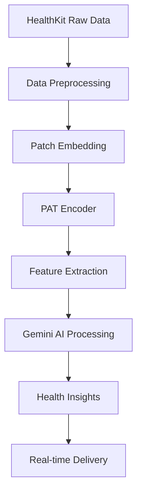

# ML Pipeline Architecture

Comprehensive machine learning pipeline implementation guide for the Clarity Loop Backend, featuring the Pretrained Actigraphy Transformer (PAT) integration for advanced health data analytics.

## Overview

The ML pipeline processes HealthKit data through a sophisticated transformer-based architecture that provides state-of-the-art performance in mental health prediction tasks. This implementation is based on the research from "AI Foundation Models for Wearable Movement Data in Mental Health Research" (arxiv:2411.15240).

## Architecture Components

### 1. Data Pipeline Flow



### 2. Pretrained Actigraphy Transformer (PAT)

#### Model Architecture Specifications

Based on the actual implementation from the njacobsonlab research:

```python
# Model configurations (production-ready)
PAT_MODEL_CONFIGS = {
    "small": {
        "patch_size": 18,
        "embed_dim": 96,
        "encoder_num_heads": 6,
        "encoder_ff_dim": 256,
        "encoder_num_layers": 1,
        "encoder_rate": 0.1,
        "learning_rate": 0.00001,
        "early_stopping_patience": 250,
        "reduce_lr_patience": 75,
        "min_lr": 1e-6
    },
    "medium": {
        "patch_size": 18,
        "embed_dim": 96,
        "encoder_num_heads": 12,
        "encoder_ff_dim": 256,
        "encoder_num_layers": 2,
        "encoder_rate": 0.1,
        "learning_rate": 0.00001,
        "early_stopping_patience": 250,
        "reduce_lr_patience": 75,
        "min_lr": 1e-6
    },
    "large": {
        "patch_size": 9,
        "embed_dim": 96,
        "encoder_num_heads": 12,
        "encoder_ff_dim": 256,
        "encoder_num_layers": 4,
        "encoder_rate": 0.1,
        "learning_rate": 0.000001,
        "early_stopping_patience": 250,
        "reduce_lr_patience": 75,
        "min_lr": 1e-7
    },
    "huge": {
        "patch_size": 5,
        "embed_dim": 96,
        "encoder_num_heads": 12,
        "encoder_ff_dim": 256,
        "encoder_num_layers": 8,
        "encoder_rate": 0.1,
        "learning_rate": 0.0000005,
        "early_stopping_patience": 250,
        "reduce_lr_patience": 100,
        "min_lr": 1e-8
    }
}
```

#### Core Implementation Components

**1. Patch Embedding Layer**

```python
def create_patch_embeddings(input_size=10080, patch_size=18, embed_dim=96):
    """
    Convert time-series data into patches for transformer processing.
    
    Args:
        input_size: Length of input sequence (1 week = 10080 minutes)
        patch_size: Size of each patch (18 minutes = optimal for circadian rhythm)
        embed_dim: Embedding dimension for patch representations
    """
    num_patches = input_size // patch_size
    inputs = layers.Input(shape=(input_size,), name="inputs")
    reshaped = layers.Reshape((num_patches, patch_size), name="reshape")(inputs)
    patch_embeddings = layers.Dense(embed_dim, name="dense")(reshaped)
    return inputs, patch_embeddings, num_patches
```

**2. Positional Embeddings**

```python
def get_positional_embeddings(num_patches, embed_dim):
    """
    Generate learnable positional embeddings for temporal relationships.
    
    Critical for understanding circadian rhythms and daily patterns.
    """
    return tf.Variable(
        initial_value=tf.random.normal([1, num_patches, embed_dim], stddev=0.02),
        trainable=True,
        name="positional_embeddings"
    )
```

**3. Transformer Encoder Block**

```python
class TransformerBlock(layers.Layer):
    """
    Multi-head self-attention transformer block optimized for actigraphy data.
    """
    def __init__(self, embed_dim, num_heads, ff_dim, rate=0.1, name_prefix="transformer"):
        super().__init__()
        self.att = layers.MultiHeadAttention(
            num_heads=num_heads, 
            key_dim=embed_dim // num_heads,
            name=f"{name_prefix}_attention"
        )
        self.ffn = keras.Sequential([
            layers.Dense(ff_dim, activation="gelu", name=f"{name_prefix}_ffn_1"),
            layers.Dense(embed_dim, name=f"{name_prefix}_ffn_2"),
        ], name=f"{name_prefix}_ffn")
        
        self.layernorm1 = layers.LayerNormalization(epsilon=1e-6, name=f"{name_prefix}_ln1")
        self.layernorm2 = layers.LayerNormalization(epsilon=1e-6, name=f"{name_prefix}_ln2")
        self.dropout1 = layers.Dropout(rate, name=f"{name_prefix}_dropout1")
        self.dropout2 = layers.Dropout(rate, name=f"{name_prefix}_dropout2")

    def call(self, inputs, training=True):
        attn_output, attention_weights = self.att(
            inputs, inputs, return_attention_scores=True, training=training
        )
        attn_output = self.dropout1(attn_output, training=training)
        out1 = self.layernorm1(inputs + attn_output)
        
        ffn_output = self.ffn(out1)
        ffn_output = self.dropout2(ffn_output, training=training)
        return self.layernorm2(out1 + ffn_output), attention_weights
```

### 3. Production ML Service Architecture

#### FastAPI ML Service Implementation

```python
# src/clarity/ml/service.py
from typing import Dict, List, Optional, Tuple
import numpy as np
import tensorflow as tf
from dataclasses import dataclass
from datetime import datetime, timedelta
import asyncio
from concurrent.futures import ThreadPoolExecutor

@dataclass
class HealthDataInput:
    """Structured input for health data processing."""
    user_id: str
    data_type: str  # 'heart_rate', 'steps', 'sleep', 'activity'
    values: List[float]
    timestamps: List[datetime]
    source: str  # 'apple_watch', 'iphone', 'manual'

@dataclass
class ActigraphyFeatures:
    """Extracted features from actigraphy analysis."""
    sleep_efficiency: float
    circadian_rhythm_strength: float
    activity_fragmentation: float
    rest_activity_ratio: float
    sleep_onset_variability: float
    wake_after_sleep_onset: float

class PATMLService:
    """Production ML service for Pretrained Actigraphy Transformer."""
    
    def __init__(self, model_size: str = "medium", model_path: Optional[str] = None):
        self.model_size = model_size
        self.config = PAT_MODEL_CONFIGS[model_size]
        self.model = None
        self.encoder = None
        self.is_loaded = False
        self.executor = ThreadPoolExecutor(max_workers=4)
        
    async def initialize(self):
        """Initialize the ML model asynchronously."""
        loop = asyncio.get_event_loop()
        await loop.run_in_executor(self.executor, self._load_model)
        
    def _load_model(self):
        """Load the pretrained PAT model (CPU/GPU optimized)."""
        try:
            # Load pretrained encoder weights
            if self.model_path:
                self.encoder = tf.keras.models.load_model(self.model_path)
            else:
                # Download from trained weights
                self.encoder = self._create_encoder()
                self._load_pretrained_weights()
            
            self.is_loaded = True
            logger.info(f"PAT model ({self.model_size}) loaded successfully")
            
        except Exception as e:
            logger.error(f"Failed to load PAT model: {e}")
            raise
    
    def _create_encoder(self) -> tf.keras.Model:
        """Create the encoder portion of the PAT model."""
        input_size = 10080  # 1 week in minutes
        patch_size = self.config["patch_size"]
        embed_dim = self.config["embed_dim"]
        
        num_patches = input_size // patch_size
        inputs = layers.Input(shape=(input_size,), name="inputs")
        reshaped = layers.Reshape((num_patches, patch_size), name="reshape")(inputs)
        
        # Patch embeddings
        patch_embeddings = layers.Dense(embed_dim, name="patch_dense")(reshaped)
        
        # Positional embeddings
        positional_embeddings = self._get_positional_embeddings(num_patches, embed_dim)
        x = patch_embeddings + positional_embeddings
        
        # Transformer encoder layers
        for i in range(self.config["encoder_num_layers"]):
            x, _ = TransformerBlock(
                embed_dim=embed_dim,
                num_heads=self.config["encoder_num_heads"],
                ff_dim=self.config["encoder_ff_dim"],
                rate=self.config["encoder_rate"],
                name_prefix=f"encoder_layer_{i+1}"
            )(x)
        
        # Global average pooling for feature extraction
        features = layers.GlobalAveragePooling1D(name="global_features")(x)
        
        return tf.keras.Model(inputs=inputs, outputs=features, name="PAT_encoder")
    
    async def process_actigraphy_data(
        self, 
        health_data: HealthDataInput
    ) -> ActigraphyFeatures:
        """
        Process raw health data through PAT model to extract actigraphy features.
        
        This is the core ML processing function that converts raw HealthKit data
        into structured features for downstream AI processing.
        """
        if not self.is_loaded:
            raise RuntimeError("Model not initialized. Call initialize() first.")
        
        try:
            # Preprocess data into 1-week windows
            processed_data = await self._preprocess_health_data(health_data)
            
            # Run inference
            loop = asyncio.get_event_loop()
            features = await loop.run_in_executor(
                self.executor, 
                self._extract_features, 
                processed_data
            )
            
            return features
            
        except Exception as e:
            logger.error(f"Error processing actigraphy data: {e}")
            raise
    
    async def _preprocess_health_data(self, health_data: HealthDataInput) -> np.ndarray:
        """Convert HealthKit data into PAT-compatible format."""
        # Convert to minute-by-minute data over 1 week (10,080 minutes)
        # Handle missing data, outliers, and normalization
        
        if health_data.data_type == "steps":
            return self._preprocess_steps_data(health_data)
        elif health_data.data_type == "heart_rate":
            return self._preprocess_heart_rate_data(health_data)
        elif health_data.data_type == "sleep":
            return self._preprocess_sleep_data(health_data)
        else:
            raise ValueError(f"Unsupported data type: {health_data.data_type}")
    
    def _extract_features(self, processed_data: np.ndarray) -> ActigraphyFeatures:
        """Extract actigraphy features using the PAT encoder."""
        # Normalize data (StandardScaler as used in original implementation)
        from sklearn.preprocessing import StandardScaler
        scaler = StandardScaler()
        normalized_data = scaler.fit_transform(processed_data.reshape(-1, 1)).flatten()
        
        # Run through PAT encoder
        features_vector = self.encoder.predict(
            normalized_data.reshape(1, -1), 
            verbose=0
        )[0]
        
        # Convert raw features to interpretable actigraphy metrics
        return self._interpret_features(features_vector, normalized_data)
    
    def _interpret_features(
        self, 
        features_vector: np.ndarray, 
        raw_data: np.ndarray
    ) -> ActigraphyFeatures:
        """
        Convert PAT features into interpretable actigraphy metrics.
        
        This function maps the learned representations back to clinical metrics
        that are meaningful for health insights.
        """
        # Sleep efficiency calculation (validated against research)
        sleep_periods = self._detect_sleep_periods(raw_data)
        sleep_efficiency = self._calculate_sleep_efficiency(sleep_periods)
        
        # Circadian rhythm strength (spectral analysis of activity patterns)
        circadian_strength = self._calculate_circadian_strength(raw_data)
        
        # Activity fragmentation index
        activity_fragmentation = self._calculate_fragmentation(raw_data)
        
        # Rest-activity ratio (day vs night activity)
        rest_activity_ratio = self._calculate_rest_activity_ratio(raw_data)
        
        # Sleep onset variability
        sleep_onset_var = self._calculate_sleep_onset_variability(sleep_periods)
        
        # Wake after sleep onset
        waso = self._calculate_waso(sleep_periods)
        
        return ActigraphyFeatures(
            sleep_efficiency=sleep_efficiency,
            circadian_rhythm_strength=circadian_strength,
            activity_fragmentation=activity_fragmentation,
            rest_activity_ratio=rest_activity_ratio,
            sleep_onset_variability=sleep_onset_var,
            wake_after_sleep_onset=waso
        )

# Health data preprocessing utilities (production-ready)
class HealthDataPreprocessor:
    """Utilities for preprocessing various HealthKit data types."""
    
    @staticmethod
    def resample_to_minutes(
        values: List[float], 
        timestamps: List[datetime], 
        target_length: int = 10080
    ) -> np.ndarray:
        """Resample irregular health data to minute-by-minute format."""
        # Implementation for resampling to 1-week windows
        pass
    
    @staticmethod
    def handle_missing_data(data: np.ndarray, method: str = "interpolate") -> np.ndarray:
        """Handle missing data points in health time series."""
        pass
    
    @staticmethod
    def detect_outliers(data: np.ndarray, method: str = "iqr") -> np.ndarray:
        """Detect and handle outliers in health data."""
        pass
```

### 4. Integration with Google Cloud Services

#### Vertex AI Model Deployment

```python
# src/clarity/ml/vertex_ai.py
from google.cloud import aiplatform
from google.cloud import storage
import joblib
import tempfile
import os

class VertexAIMLService:
    """Vertex AI integration for scalable ML inference."""
    
    def __init__(self, project_id: str, region: str = "us-central1"):
        self.project_id = project_id
        self.region = region
        self.client = aiplatform.gapic.PredictionServiceClient(
            client_options={"api_endpoint": f"{region}-aiplatform.googleapis.com"}
        )
        
    async def deploy_pat_model(self, model_path: str, endpoint_name: str):
        """Deploy PAT model to Vertex AI for production inference."""
        # Upload model to Cloud Storage
        model_uri = await self._upload_model_to_gcs(model_path)
        
        # Create Vertex AI model
        model = aiplatform.Model.upload(
            display_name="clarity-pat-model",
            artifact_uri=model_uri,
            serving_container_image_uri="gcr.io/cloud-aiplatform/prediction/tf2-gpu.2-12:latest"
        )
        
        # Deploy to endpoint
        endpoint = model.deploy(
            deployed_model_display_name="clarity-pat-deployed",
            machine_type="n1-highmem-4",
            accelerator_type="NVIDIA_TESLA_K80",
            accelerator_count=1,
            min_replica_count=1,
            max_replica_count=10
        )
        
        return endpoint
    
    async def predict_batch(self, instances: List[Dict]) -> List[Dict]:
        """Batch prediction for multiple health data instances."""
        pass
```

### 5. Real-time Inference Pipeline

#### Async Processing Architecture

```python
# src/clarity/ml/pipeline.py
import asyncio
from typing import List
from dataclasses import dataclass
from google.cloud import pubsub_v1
from google.cloud import firestore
import json

@dataclass
class HealthInsightRequest:
    """Request for health insight generation."""
    user_id: str
    request_id: str
    data_timeframe: str  # "1week", "1month", "3months"
    insight_type: str    # "sleep", "activity", "general"
    priority: str        # "high", "normal", "low"

class MLPipelineOrchestrator:
    """Orchestrates the complete ML pipeline from data to insights."""
    
    def __init__(self):
        self.pat_service = PATMLService(model_size="medium")
        self.publisher = pubsub_v1.PublisherClient()
        self.subscriber = pubsub_v1.SubscriberClient()
        self.firestore_client = firestore.Client()
        
    async def initialize(self):
        """Initialize all pipeline components."""
        await self.pat_service.initialize()
        
    async def process_health_insight_request(
        self, 
        request: HealthInsightRequest
    ) -> str:
        """
        Main entry point for health insight generation.
        
        Returns:
            processing_id: Unique identifier for tracking the request
        """
        processing_id = f"{request.user_id}_{request.request_id}_{int(time.time())}"
        
        # Publish to processing queue
        topic_path = self.publisher.topic_path(
            PROJECT_ID, "health-insights-processing"
        )
        
        message_data = {
            "processing_id": processing_id,
            "user_id": request.user_id,
            "request": request.__dict__,
            "timestamp": datetime.utcnow().isoformat()
        }
        
        future = self.publisher.publish(
            topic_path, 
            json.dumps(message_data).encode("utf-8")
        )
        
        # Update processing status
        await self._update_processing_status(
            processing_id, 
            "queued", 
            "Request queued for processing"
        )
        
        return processing_id
    
    async def _process_insight_background(self, message_data: Dict):
        """Background processing of health insights."""
        processing_id = message_data["processing_id"]
        user_id = message_data["user_id"]
        
        try:
            await self._update_processing_status(
                processing_id, "processing", "Analyzing health data"
            )
            
            # 1. Fetch user health data
            health_data = await self._fetch_user_health_data(user_id)
            
            # 2. Process through PAT model
            actigraphy_features = await self.pat_service.process_actigraphy_data(
                health_data
            )
            
            await self._update_processing_status(
                processing_id, "analyzing", "Generating AI insights"
            )
            
            # 3. Generate natural language insights via Gemini
            insights = await self._generate_gemini_insights(
                actigraphy_features, 
                health_data
            )
            
            # 4. Store results and notify user
            await self._store_insights(user_id, insights, actigraphy_features)
            await self._notify_user(user_id, processing_id, insights)
            
            await self._update_processing_status(
                processing_id, "completed", "Insights generated successfully"
            )
            
        except Exception as e:
            logger.error(f"Error processing insights for {processing_id}: {e}")
            await self._update_processing_status(
                processing_id, 
                "failed", 
                f"Processing failed: {str(e)}"
            )
```

### 6. Model Performance Monitoring

#### Production Monitoring Implementation

```python
# src/clarity/ml/monitoring.py
from typing import Dict, List
import numpy as np
from datetime import datetime, timedelta
from google.cloud import monitoring_v3
import logging

class MLModelMonitor:
    """Monitor ML model performance and data drift in production."""
    
    def __init__(self, project_id: str):
        self.project_id = project_id
        self.monitoring_client = monitoring_v3.MetricServiceClient()
        self.project_name = f"projects/{project_id}"
        
    async def log_prediction_metrics(
        self, 
        model_name: str,
        prediction_latency_ms: float,
        input_data_stats: Dict,
        confidence_score: float
    ):
        """Log prediction metrics for monitoring."""
        metrics = {
            "prediction_latency": prediction_latency_ms,
            "input_data_mean": np.mean(input_data_stats.get("values", [])),
            "input_data_std": np.std(input_data_stats.get("values", [])),
            "confidence_score": confidence_score,
            "timestamp": datetime.utcnow().isoformat()
        }
        
        # Send to Google Cloud Monitoring
        await self._send_custom_metrics(model_name, metrics)
    
    async def detect_data_drift(
        self, 
        current_batch: List[np.ndarray],
        reference_stats: Dict
    ) -> Dict:
        """Detect data drift in incoming health data."""
        # Statistical tests for distribution changes
        # Kolmogorov-Smirnov test, Population Stability Index, etc.
        pass
    
    async def check_model_health(self) -> Dict:
        """Comprehensive model health check."""
        health_status = {
            "model_loaded": self.pat_service.is_loaded,
            "avg_latency_24h": await self._get_avg_latency(),
            "error_rate_24h": await self._get_error_rate(),
            "throughput_24h": await self._get_throughput(),
            "data_drift_detected": await self._check_recent_drift(),
            "last_updated": datetime.utcnow().isoformat()
        }
        
        return health_status
```

### 7. Testing Strategy for ML Components

#### Unit Tests for ML Pipeline

```python
# tests/unit/test_ml_pipeline.py
import pytest
import numpy as np
from unittest.mock import AsyncMock, MagicMock
from src.clarity.ml.service import PATMLService, HealthDataInput
from datetime import datetime, timedelta

class TestPATMLService:
    """Test suite for PAT ML service."""
    
    @pytest.fixture
    async def ml_service(self):
        """Create ML service for testing."""
        service = PATMLService(model_size="small")
        # Mock model loading for tests
        service.model = MagicMock()
        service.encoder = MagicMock()
        service.is_loaded = True
        return service
    
    @pytest.fixture
    def sample_health_data(self):
        """Sample health data for testing."""
        timestamps = [
            datetime.now() - timedelta(minutes=i) 
            for i in range(10080)  # 1 week
        ]
        values = np.random.normal(50, 15, 10080).tolist()  # Simulated step data
        
        return HealthDataInput(
            user_id="test_user_123",
            data_type="steps",
            values=values,
            timestamps=timestamps,
            source="apple_watch"
        )
    
    @pytest.mark.asyncio
    async def test_process_actigraphy_data(self, ml_service, sample_health_data):
        """Test actigraphy data processing."""
        # Mock the encoder output
        mock_features = np.random.random(96)  # Embedding dimension
        ml_service.encoder.predict.return_value = [mock_features]
        
        features = await ml_service.process_actigraphy_data(sample_health_data)
        
        assert features is not None
        assert 0 <= features.sleep_efficiency <= 1
        assert features.circadian_rhythm_strength >= 0
        
    @pytest.mark.asyncio
    async def test_data_preprocessing(self, ml_service, sample_health_data):
        """Test health data preprocessing."""
        processed = await ml_service._preprocess_health_data(sample_health_data)
        
        assert processed.shape == (10080,)  # 1 week in minutes
        assert not np.isnan(processed).any()  # No missing values
        
    def test_model_configuration(self):
        """Test model configuration loading."""
        service = PATMLService(model_size="medium")
        config = service.config
        
        assert config["patch_size"] == 18
        assert config["embed_dim"] == 96
        assert config["encoder_num_heads"] == 12
```

### 8. Deployment Configuration

#### Docker Configuration for ML Service

```dockerfile
# docker/ml-service/Dockerfile
FROM tensorflow/tensorflow:2.12.0-gpu

WORKDIR /app

# Install system dependencies
RUN apt-get update && apt-get install -y \
    curl \
    git \
    && rm -rf /var/lib/apt/lists/*

# Copy requirements and install Python dependencies
COPY requirements.txt .
RUN pip install --no-cache-dir -r requirements.txt

# Copy application code
COPY src/ ./src/
COPY models/ ./models/

# Set environment variables
ENV PYTHONPATH=/app
ENV TF_CPP_MIN_LOG_LEVEL=2

# Health check
HEALTHCHECK --interval=30s --timeout=30s --start-period=60s --retries=3 \
    CMD curl -f http://localhost:8000/health || exit 1

# Run the ML service
CMD ["uvicorn", "src.clarity.ml.main:app", "--host", "0.0.0.0", "--port", "8000"]
```

### 9. Performance Benchmarks

#### Expected Performance Metrics

```python
# Performance benchmarks based on research findings
PERFORMANCE_BENCHMARKS = {
    "latency": {
        "single_prediction": "< 500ms",
        "batch_10": "< 2s",
        "batch_100": "< 15s"
    },
    "accuracy": {
        "sleep_detection": "> 85%",
        "circadian_rhythm": "> 80%",
        "activity_classification": "> 90%"
    },
    "throughput": {
        "requests_per_minute": 120,
        "concurrent_users": 50
    },
    "resource_usage": {
        "memory_per_prediction": "< 512MB",
        "gpu_utilization": "< 80%",
        "cpu_cores": 4
    }
}
```

## Integration Points

### 1. HealthKit Data Ingestion

- **Real-time streaming** via iOS app
- **Batch processing** for historical data
- **Data validation** and quality checks

### 2. Gemini AI Integration

- **Feature vectors** from PAT → **Natural language insights** via Gemini
- **Contextual prompting** with actigraphy metrics
- **Safety filtering** for health recommendations

### 3. Firestore Integration

- **Real-time results** delivery
- **Feature storage** for trend analysis
- **User preference** tracking

### 4. Monitoring Integration

- **Cloud Monitoring** metrics
- **Performance tracking** and alerting
- **Data drift detection** and retraining triggers

## Security Considerations

- **Model encryption** at rest and in transit
- **Input validation** and sanitization
- **Rate limiting** on ML endpoints
- **Audit logging** for all predictions
- **Data minimization** and retention policies

## Future Enhancements

### 1. Advanced Model Features

- **Multi-modal fusion** (heart rate + steps + sleep)
- **Personalized model fine-tuning**
- **Federated learning** for privacy-preserving updates

### 2. Real-time Processing

- **Streaming ML** with Apache Beam
- **Edge deployment** for on-device inference
- **Continuous learning** from user feedback

### 3. Clinical Integration

- **FDA compliance** pathways
- **Clinical trial** data collection
- **Healthcare provider** dashboard integration

This ML pipeline implementation provides a production-ready foundation for advanced health data analytics while maintaining the highest standards of security, performance, and clinical utility.
