# CLARITY-AI Production Deployment Guide

## Enterprise-grade AWS ECS deployment with zero-downtime updates

## 🚀 **Quick Start Deployment**

### Prerequisites

#### Required AWS Services

- **ECS Fargate** - Container orchestration
- **ECR** - Container registry  
- **DynamoDB** - Health data storage
- **Cognito** - User authentication
- **S3** - File storage
- **CloudWatch** - Logging & monitoring

#### Required Permissions

```json
{
  "Version": "2012-10-17",
  "Statement": [
    {
      "Effect": "Allow",
      "Action": [
        "ecs:*",
        "ecr:*",
        "dynamodb:*",
        "s3:*",
        "cognito-idp:*",
        "logs:*"
      ],
      "Resource": "*"
    }
  ]
}
```

### 1. **Environment Setup**

#### Production Environment Variables

```bash
export AWS_REGION=us-east-1
export ECR_REPOSITORY=clarity-backend
export CLUSTER_NAME=clarity-backend-cluster
export SERVICE_NAME=clarity-backend-service
```

#### Secrets Configuration

```bash
# Set these in GitHub Secrets for CI/CD
AWS_ACCESS_KEY_ID=<your-key>
AWS_SECRET_ACCESS_KEY=<your-secret>
GEMINI_API_KEY=<your-gemini-key>
```

### 2. **Deploy Infrastructure**

#### Create ECS Cluster

```bash
aws ecs create-cluster \
  --cluster-name $CLUSTER_NAME \
  --capacity-providers FARGATE \
  --default-capacity-provider-strategy capacityProvider=FARGATE,weight=1
```

#### Create ECR Repository

```bash
aws ecr create-repository \
  --repository-name $ECR_REPOSITORY \
  --region $AWS_REGION
```

#### Create Task Execution Role

```bash
aws iam create-role \
  --role-name ecsTaskExecutionRole \
  --assume-role-policy-document file://ops/ecs-execution-role-policy.json

aws iam attach-role-policy \
  --role-name ecsTaskExecutionRole \
  --policy-arn arn:aws:iam::aws:policy/service-role/AmazonECSTaskExecutionRolePolicy
```

### 3. **Deploy Application**

#### Manual Deployment

```bash
# Build and push image
docker build -t $ECR_REPOSITORY .
aws ecr get-login-password --region $AWS_REGION | docker login --username AWS --password-stdin <account>.dkr.ecr.$AWS_REGION.amazonaws.com
docker tag $ECR_REPOSITORY:latest <account>.dkr.ecr.$AWS_REGION.amazonaws.com/$ECR_REPOSITORY:latest
docker push <account>.dkr.ecr.$AWS_REGION.amazonaws.com/$ECR_REPOSITORY:latest

# Deploy to ECS
aws ecs create-service \
  --cluster $CLUSTER_NAME \
  --service-name $SERVICE_NAME \
  --task-definition ops/ecs-task-definition.json \
  --desired-count 2 \
  --launch-type FARGATE \
  --network-configuration "awsvpcConfiguration={subnets=[subnet-xxx],securityGroups=[sg-xxx],assignPublicIp=ENABLED}"
```

#### Automated Deployment (Recommended)

```bash
# Push to main branch triggers automatic deployment
git push origin main
```

## 🔄 **CI/CD Pipeline**

### **GitHub Actions Workflow**

#### Trigger Events

- Push to `main` → **Production deployment**
- Push to `develop` → **Development deployment**
- Pull requests → **Quality gates only**

#### Pipeline Stages

```mermaid
flowchart TD
    subgraph QualityGates ["🔍 QUALITY GATES"]
        A[LINT & FORMAT<br/>Ruff, Black, Import sorting]
        B[UNIT TESTS<br/>pytest with coverage]
        C[TYPE CHECKING<br/>MyPy strict mode]
        D[SECURITY SCAN<br/>Bandit, Safety, Trivy]
    end
    
    subgraph Build ["🏗️ BUILD & TEST"]
        E[DOCKER BUILD<br/>Multi-stage optimization]
        F[INTEGRATION TESTS<br/>Redis, DynamoDB local]
        G[ML MODEL TESTS<br/>PAT & Gemini validation]
    end
    
    subgraph Deploy ["🚀 DEPLOYMENT"]
        H[ECR PUSH<br/>Tagged container images]
        I[ECS DEPLOY<br/>Rolling update strategy]
        J[HEALTH CHECK<br/>Service stability wait]
        K[DOCUMENTATION<br/>GitHub Pages deploy]
    end
    
    A --> B
    B --> C
    C --> D
    D --> E
    E --> F
    F --> G
    G --> H
    H --> I
    I --> J
    J --> K
    
    classDef quality fill:#ff9900,stroke:#e65100,stroke-width:3px,color:white
    classDef build fill:#4caf50,stroke:#1b5e20,stroke-width:3px,color:white
    classDef deploy fill:#2196f3,stroke:#0d47a1,stroke-width:3px,color:white
    
    class A,B,C,D quality
    class E,F,G build
    class H,I,J,K deploy
```



#### Quality Gates

- **Code Coverage**: >90% required
- **Security Scan**: Zero high/critical vulnerabilities
- **Type Safety**: MyPy strict mode passing
- **Performance**: <2 second API response time

## 🛡️ **Security & Monitoring**

### **Security Features**

- **Container Security**: Non-root user, minimal base image
- **Network Security**: VPC with private subnets
- **Data Encryption**: At rest (DynamoDB/S3) and in transit (TLS 1.3)
- **Access Control**: IAM roles with least privilege
- **Vulnerability Scanning**: Trivy security scanning

### **Monitoring Stack**

- **Health Checks**: `/health` endpoint every 30 seconds
- **Logging**: CloudWatch with structured JSON logs
- **Metrics**: CPU, memory, request latency tracking
- **Alerts**: Slack/email notifications for critical issues

### **Performance Characteristics**

- **Container Resources**: 1 vCPU, 4GB RAM
- **Auto Scaling**: 2-10 instances based on CPU/memory
- **Response Time**: <500ms P95 for health endpoints
- **Availability**: 99.9% uptime SLA

## 🔄 **Rollback Procedures**

### **Automated Rollback**

```bash
# Rollback to previous task definition
aws ecs update-service \
  --cluster $CLUSTER_NAME \
  --service $SERVICE_NAME \
  --task-definition clarity-backend:PREVIOUS
```

### **Manual Rollback**

```bash
# Rollback to specific version
aws ecs update-service \
  --cluster $CLUSTER_NAME \
  --service $SERVICE_NAME \
  --task-definition clarity-backend:42

# Monitor rollback
./ops/monitor-deployment.sh
```

## 🐛 **Troubleshooting**

### **Common Issues**

#### Container Won't Start

```bash
# Check task logs
aws logs tail /ecs/clarity-backend --follow

# Check task definition
aws ecs describe-tasks --cluster $CLUSTER_NAME --tasks <task-arn>
```

#### Health Check Failures

```bash
# Test health endpoint directly
curl -f http://<container-ip>:8000/health

# Check application logs
aws logs filter-log-events --log-group-name /ecs/clarity-backend --filter-pattern "ERROR"
```

#### Performance Issues

```bash
# Check resource utilization
aws cloudwatch get-metric-statistics \
  --namespace AWS/ECS \
  --metric-name CPUUtilization \
  --dimensions Name=ServiceName,Value=$SERVICE_NAME \
  --start-time 2025-01-01T00:00:00Z \
  --end-time 2025-01-01T23:59:59Z \
  --period 300 \
  --statistics Average
```

## 📊 **Environment Configuration**

### **Production Environment**

- **Cluster**: `clarity-backend-cluster`
- **Service**: `clarity-backend-service`
- **Desired Count**: 2 instances
- **Load Balancer**: Application Load Balancer with health checks
- **Auto Scaling**: Target 70% CPU utilization

### **Development Environment**

- **Cluster**: `clarity-backend-dev`
- **Service**: `clarity-backend-dev-service`
- **Desired Count**: 1 instance
- **Load Balancer**: None (direct container access)
- **Auto Scaling**: Disabled

## 🔗 **Related Documentation**

- **[Monitoring Guide](monitoring.md)** → Observability and alerting
- **[Security Guide](security.md)** → HIPAA compliance and data protection
- **[API Reference](../02-api-reference.md)** → Endpoint documentation
- **[Architecture Overview](../01-overview.md)** → System design

---

**Production Status**: ✅ Ready for deployment  
**Last Updated**: January 2025  
**Maintained By**: CLARITY-AI Platform Team
