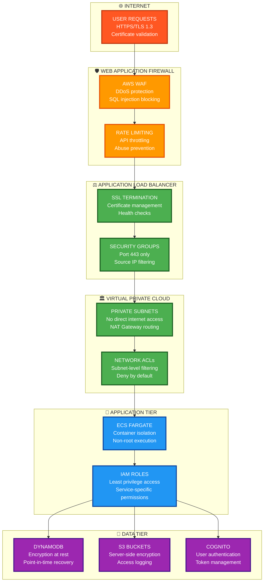

# CLARITY-AI Security & Compliance

## HIPAA-ready infrastructure with enterprise-grade security

## 🛡️ **Security Overview**

### **Compliance Standards**

- **HIPAA** - Health Insurance Portability and Accountability Act
- **SOC 2 Type II** - AWS infrastructure compliance
- **ISO 27001** - Information security management
- **GDPR** - General Data Protection Regulation (EU)

### **Security Architecture**



## 🔐 **Authentication & Authorization**

### **AWS Cognito Integration**

#### User Pool Configuration

```json
{
  "UserPoolId": "us-east-1_1G5jYI8FO",
  "ClientId": "66qdivmqgs1oqmmo0b5r9d9hjo",
  "Policies": {
    "PasswordPolicy": {
      "MinimumLength": 12,
      "RequireUppercase": true,
      "RequireLowercase": true,
      "RequireNumbers": true,
      "RequireSymbols": true,
      "TemporaryPasswordValidityDays": 1
    }
  },
  "MfaConfiguration": "OPTIONAL",
  "AccountRecoverySetting": {
    "RecoveryMechanisms": [
      {
        "Priority": 1,
        "Name": "verified_email"
      }
    ]
  }
}
```

#### JWT Token Validation

```python
# FastAPI dependency for secure endpoints
@app.dependency
async def verify_token(token: str = Depends(oauth2_scheme)):
    try:
        # Validate JWT signature with Cognito public keys
        payload = jwt.decode(
            token, 
            cognito_public_keys, 
            algorithms=["RS256"],
            audience=COGNITO_CLIENT_ID
        )
        return payload
    except JWTError:
        raise HTTPException(
            status_code=401,
            detail="Invalid authentication credentials"
        )
```

### **Role-Based Access Control (RBAC)**

#### User Roles

- **Patient** - Own health data access only
- **Clinician** - Patient data with consent
- **Researcher** - Anonymized aggregate data
- **Admin** - System configuration access

#### Permission Matrix

```python
PERMISSIONS = {
    "patient": [
        "read:own_health_data",
        "create:health_data",
        "update:own_profile"
    ],
    "clinician": [
        "read:patient_health_data",
        "create:clinical_notes",
        "read:insights"
    ],
    "researcher": [
        "read:anonymized_data",
        "create:research_queries"
    ],
    "admin": [
        "read:system_metrics",
        "update:system_config",
        "manage:users"
    ]
}
```

## 🔒 **Data Encryption**

### **Encryption at Rest**

#### DynamoDB Encryption

```bash
# Enable customer-managed KMS encryption
aws dynamodb put-item \
  --table-name clarity-health-data \
  --item '{
    "UserId": {"S": "user123"},
    "HealthData": {"S": "encrypted_data"}
  }' \
  --server-side-encryption-specification '{
    "Enabled": true,
    "SSEType": "KMS",
    "KMSMasterKeyId": "arn:aws:kms:us-east-1:account:key/key-id"
  }'
```

#### S3 Bucket Encryption

```json
{
  "Rules": [
    {
      "ApplyServerSideEncryptionByDefault": {
        "SSEAlgorithm": "aws:kms",
        "KMSMasterKeyID": "arn:aws:kms:us-east-1:account:key/key-id"
      },
      "BucketKeyEnabled": true
    }
  ]
}
```

### **Encryption in Transit**

#### TLS Configuration

```nginx
# Application Load Balancer SSL Policy
ssl_protocols TLSv1.3;
ssl_ciphers 'ECDHE-ECDSA-AES256-GCM-SHA384:ECDHE-RSA-AES256-GCM-SHA384';
ssl_prefer_server_ciphers on;
ssl_session_cache shared:SSL:10m;
ssl_session_timeout 10m;

# HSTS header
add_header Strict-Transport-Security "max-age=31536000; includeSubDomains" always;
```

#### API Client Configuration

```python
# Enforce TLS 1.3 for all external API calls
import ssl
import httpx

ssl_context = ssl.create_default_context()
ssl_context.minimum_version = ssl.TLSVersion.TLSv1_3

async with httpx.AsyncClient(verify=ssl_context) as client:
    response = await client.get("https://api.external-service.com/data")
```

## 🔍 **Security Monitoring**

### **Security Event Logging**

#### CloudTrail Configuration

```json
{
  "TrailName": "clarity-security-audit",
  "S3BucketName": "clarity-security-logs",
  "IncludeGlobalServiceEvents": true,
  "IsLogging": true,
  "EventSelectors": [
    {
      "ReadWriteType": "All",
      "IncludeManagementEvents": true,
      "DataResources": [
        {
          "Type": "AWS::DynamoDB::Table",
          "Values": ["arn:aws:dynamodb:*:*:table/clarity-health-data"]
        },
        {
          "Type": "AWS::S3::Object",
          "Values": ["arn:aws:s3:::clarity-health-uploads/*"]
        }
      ]
    }
  ]
}
```

#### Security Metrics

```python
# Custom security metrics
SECURITY_METRICS = {
    "failed_login_attempts": "Count of failed authentication attempts",
    "unauthorized_api_calls": "Count of 401/403 responses",
    "data_access_events": "Count of health data access events",
    "admin_actions": "Count of administrative actions",
    "token_validation_failures": "Count of invalid JWT tokens"
}
```

### **Intrusion Detection**

#### AWS GuardDuty Integration

```bash
# Enable GuardDuty for threat detection
aws guardduty create-detector \
  --enable \
  --finding-publishing-frequency FIFTEEN_MINUTES
```

#### Custom Security Rules

```python
# Real-time security monitoring
async def security_middleware(request: Request, call_next):
    # Log all data access attempts
    if "/health-data/" in str(request.url):
        await log_security_event({
            "event_type": "data_access",
            "user_id": request.headers.get("user-id"),
            "ip_address": request.client.host,
            "timestamp": datetime.utcnow(),
            "resource": str(request.url)
        })
    
    # Rate limiting per user
    user_id = request.headers.get("user-id")
    if user_id and await is_rate_limited(user_id):
        raise HTTPException(status_code=429, detail="Rate limit exceeded")
    
    response = await call_next(request)
    return response
```

## 🏥 **HIPAA Compliance**

### **Technical Safeguards**

#### Access Control

- Unique user identification (Cognito User Pools)
- Automatic logoff after 30 minutes inactivity
- Encryption for data at rest and in transit

#### Audit Controls

- Comprehensive logging of all data access
- CloudTrail for API-level auditing
- Regular access log reviews

#### Integrity Controls

- Electronic signature validation
- Data integrity checks via checksums
- Version control for data modifications

#### Person or Entity Authentication

- Multi-factor authentication available
- Strong password requirements
- Session token expiration

#### Transmission Security

- TLS 1.3 encryption for all communications
- VPN access for administrative functions
- Network segmentation and firewalls

### **Administrative Safeguards**

#### Security Officer

- Designated security officer responsible for HIPAA compliance
- Regular security training for all team members
- Incident response procedures

#### Access Management

- Workforce access procedures
- Information access management
- Security awareness training

#### Contingency Plan

- Data backup procedures
- Disaster recovery plan
- Emergency access procedures

### **Physical Safeguards**

**AWS Data Center Security:**

- 24/7 physical security monitoring
- Biometric access controls
- Environmental controls
- Media destruction procedures

## 🚨 **Incident Response**

### **Security Incident Classification**

**Critical (SEV-1):**

- Data breach or unauthorized access
- Malware/ransomware detection
- System compromise
- **Response Time**: Immediate (15 minutes)

**High (SEV-2):**

- Failed authentication spikes
- Suspicious API activity
- DDoS attacks
- **Response Time**: 1 hour

**Medium (SEV-3):**

- Security configuration changes
- Failed security scans
- **Response Time**: 4 hours

### **Incident Response Process**

**Detection → Assessment → Containment → Eradication → Recovery → Lessons Learned**

**Security Incident Response Team:**

- **Incident Commander** - Platform Engineering Lead
- **Security Lead** - CISO or Security Engineer
- **Communications Lead** - Product Manager
- **Legal/Compliance** - Legal counsel for HIPAA notifications

### **Breach Notification Procedures**

**HIPAA Breach Notification Timeline:**

- **60 days** - Notification to affected individuals
- **60 days** - Notification to HHS Office for Civil Rights
- **Next business day** - Media notification (if >500 individuals affected)

**Notification Template:**

```
Subject: Important Security Notification - CLARITY-AI Platform

Dear [Patient Name],

We are writing to inform you of a security incident that may have affected 
your personal health information. On [DATE], we discovered [INCIDENT DESCRIPTION].

What Information Was Involved:
- [List specific data types]

What We Are Doing:
- [Response actions taken]

What You Can Do:
- [Recommended actions for patients]

Contact Information:
- Email: security@clarity-ai.com
- Phone: 1-800-XXX-XXXX
```

## 🔧 **Security Configuration**

### **Container Security**

**Dockerfile Security Best Practices:**

```dockerfile
# Use minimal base image
FROM python:3.11-slim

# Create non-root user
RUN groupadd -r clarity && useradd -r -g clarity clarity

# Install only necessary packages
RUN apt-get update && apt-get install -y --no-install-recommends \
    curl && \
    rm -rf /var/lib/apt/lists/*

# Set working directory and copy files with proper ownership
WORKDIR /app
COPY --chown=clarity:clarity . .

# Switch to non-root user
USER clarity

# Health check with security in mind
HEALTHCHECK --interval=30s --timeout=10s --start-period=60s --retries=3 \
    CMD curl -f http://localhost:8000/health || exit 1
```

**Security Context:**

```json
{
  "securityContext": {
    "runAsNonRoot": true,
    "runAsUser": 1000,
    "runAsGroup": 1000,
    "readOnlyRootFilesystem": true,
    "allowPrivilegeEscalation": false,
    "capabilities": {
      "drop": ["ALL"]
    }
  }
}
```

### **Network Security**

**Security Groups:**

```json
{
  "SecurityGroupRules": [
    {
      "IpProtocol": "tcp",
      "FromPort": 443,
      "ToPort": 443,
      "CidrIp": "0.0.0.0/0",
      "Description": "HTTPS inbound"
    },
    {
      "IpProtocol": "tcp",
      "FromPort": 8000,
      "ToPort": 8000,
      "SourceSecurityGroupId": "sg-alb-clarity",
      "Description": "Application port from ALB only"
    }
  ]
}
```

**VPC Configuration:**

```bash
# Create VPC with private subnets
aws ec2 create-vpc --cidr-block 10.0.0.0/16
aws ec2 create-subnet --vpc-id vpc-xxx --cidr-block 10.0.1.0/24  # Private
aws ec2 create-subnet --vpc-id vpc-xxx --cidr-block 10.0.2.0/24  # Private
aws ec2 create-subnet --vpc-id vpc-xxx --cidr-block 10.0.101.0/24  # Public (NAT)
```

### **Environment Variables Security**

**Secrets Management:**

```python
# Use AWS Secrets Manager for sensitive configuration
import boto3

def get_secret(secret_name: str) -> str:
    client = boto3.client('secretsmanager', region_name='us-east-1')
    response = client.get_secret_value(SecretId=secret_name)
    return response['SecretString']

# Application configuration
GEMINI_API_KEY = get_secret("clarity/gemini-api-key")
DATABASE_PASSWORD = get_secret("clarity/database-password")
```

## 🧪 **Security Testing**

### **Vulnerability Scanning**

**Container Image Scanning:**

```bash
# Trivy security scan in CI/CD
trivy image --severity HIGH,CRITICAL clarity-backend:latest
```

**Dependency Scanning:**

```bash
# Check for known vulnerabilities
safety check --json --output safety-report.json
bandit -r src/ -f json -o bandit-report.json
```

### **Penetration Testing**

**Annual Penetration Testing:**

- External penetration testing by certified firm
- API security testing
- Infrastructure vulnerability assessment
- Social engineering assessment

**Security Code Review:**

- Static application security testing (SAST)
- Dynamic application security testing (DAST)
- Interactive application security testing (IAST)

## 📋 **Security Checklist**

### **Deployment Security**

- [ ] TLS 1.3 enforced for all communications
- [ ] All data encrypted at rest with customer-managed keys
- [ ] IAM roles follow least privilege principle
- [ ] Security groups deny by default
- [ ] CloudTrail logging enabled
- [ ] GuardDuty threat detection active
- [ ] Regular security patches applied
- [ ] Container images scanned for vulnerabilities
- [ ] Secrets stored in AWS Secrets Manager
- [ ] Network segmentation implemented

### **Application Security**

- [ ] Input validation on all endpoints
- [ ] SQL injection protection
- [ ] Cross-site scripting (XSS) prevention
- [ ] Cross-site request forgery (CSRF) protection
- [ ] Rate limiting implemented
- [ ] Authentication required for all data access
- [ ] Authorization checks on every request
- [ ] Audit logging for all data access
- [ ] Session timeout configured
- [ ] Password complexity requirements

---

**Security Status**: ✅ HIPAA Compliant  
**Last Security Audit**: December 2024  
**Next Penetration Test**: June 2025  
**Compliance Officer**: <security@clarity-ai.com>
